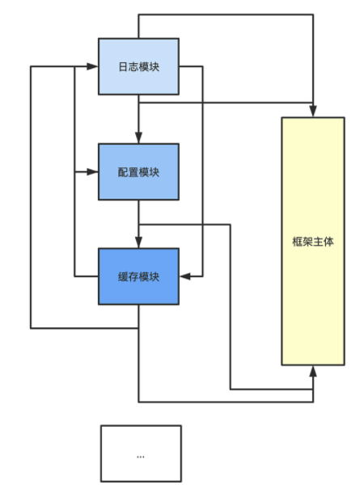

# Web Framework Document

> Web 框架文档

## 从零开发框架？

### web 框架与业务环境

如何选择或者打造一款称手的 Web 应用框架呢？这是在日常工作中经常遇到的问 题。 

因为不管什么语言，在 Web 领域，总有很多款开发框架，真的可以说是日新月异， GitHub 上的 Go Web 框架现在已经有 41 款了。


进入了一个思维误区：没有把框架放到特定场景上讨论，这个特定场景，就是**开发团队的业务环境**。 

- 比如，如果一个人负责一个小的外包项目，那可以说所有框架都差不多；
- 如果是 2～3 个服务端人员的初创团队，用的框架要承担的工作大概率是提升开发效率，那就要选择功能更强大、易用性更好的框架；
- 等团队再大一些，框架所承担的职责就更多了，往往得更多考虑性能、扩展性，或者定制自己的框架。

### 聊聊 Web 框架 

所有框架都有倾向性，基本可以分为两个大类：一类是**追求运行性能**，一类是**追求开发效率**。 

- 追求性能的框架往往很简洁，包含的东西也很少，一个路由一个 MVC 就完事了，比如 Gin 框架；
- 另外一类框架追求开发效率，封装得非常好，很多功能会让你惊叹，能省很多事，最典型的就是 Beego 框架。 

在 Web 领域，特别是中小型项目，开发效率往往才是业务的第一需求。一个产品拥有的市场机会总是转瞬即逝的，抢占市场都是靠更快的开发速度和迭代速 度。

所以，在任何领域做到第一名的产品基本上都有一个共性：**开发、迭代速度快**。

所以作为开发必备的框架，在提效上尤为重要。这就要求好的框架要能**区分清楚业务团队和架构团队的边界**，什么应该是写业务的人负责的？什么应该是做架构的人负责的? 

写架构的同学，做好框架的底层封装。而写业务的同学可以从底层实现中释放出来，专注于业务逻辑，遇到任何底层问题，在框架中都有简单易用的封装可用，框架中的每一个类、每一个服务接口都在告诉你，要完成这个功能，只需要这样使用，无需更多的操作。 

总而言之，框架是为加速业务发展而生的，它需要兼顾业务的开发效率和底层的性能效率，而这两者在 Go 这门语言出现后得到了很好地结合。

### Go Web 框架 

在 Go 出现之前，PHP 和 Java 基本上是 Web 领域的主流，特别是 PHP， 是当时各种公司建站的首选。

其实 PHP 和 HTML 的契合性是好于 Go 的，尤其在快速编写动态网页的时候，因为它可嵌入 HTML 的特性，于是建立 Web 站就变成了一件非常容易的事。

但是这几年，Web 领域越来越流行前后端分离，Web 后端开发慢慢从繁杂的 HTML 渲染中解放出来了，开始把研发注意力放在如何建立数据模型（接口设计）、如何搭建更稳定可扩展的服务（分布式）上。

在这个大趋势下，Go 在 Web 领域可以说是大放异彩。 Go 真的很好地平衡了开发和性能。 

- 比方说，Go 语言中的 Goroutine 设计，提供了“一个请求一个协程”的请求模型，对比 PHP 的“一个请求一个进程”的模型，能有效提升后端的资源占用和调度负载；
- 另外，Go 的 Runtime 机制让运行程序不再依赖各种的环境和库，将 Web 服务的部署和搭建变得简单高效；
- 而 Go 提供的交叉编译、数据结构、channel 等语言级别特性，都让“处理 Web 请求”这个事情变得非常简单。 

所以这几年，Go 在各个领域，比如云原生、游戏、微服务、区块链等等，优势也越发明显。 

这也是为什么选择 Golang 来搭建 Web 框架的原因，一方面看好 Golang 的市场前 景，另一方面 Golang 确实让 Web 开发变得越来越有效率。

### 为什么要从零开发 

决定好用什么语言了，就得关注怎么学了。

好框架能提升开发效率，那要了解 Web 框 架，为什么又鼓励从零开发呢？这不是自相矛盾了，自己造轮子能比用现成的快吗？ 

首先，对程序员来说，了解一个东西最好的办法就是去实现它。只有自己搭建一个新的框架，才能掌握 Web 服务的本质。 可选框架这么多，新框架也层出不穷，不可能也没有必要完全掌握所有框架。

如果只学怎么用框架，按照文档“按部就班”，是永远不可能真正做到掌握框架的。 但是只要开始动手做一个框架，就能站在框架作者的角度，遇到作者开发时遇到的问题，思考作者开发时选择的方案，从本质上理解清楚这些框架都在做些什么、为什么这么设计，之后在工作中遇到类似问题的时候，也会清楚这个问题为什么会出现，解决也就不在话下了。 

其次，从零开发作为一种学习方法，并不意味着在工作中要从零搭建框架。 从作者的角度了解清楚框架本质后，再思考工作中实际要用的框架，就会发现，它有自己的倾向性，有自己的设计感，并不是每个设计都能满足需求。

那么框架用久 了，就要思考，如果需要一个能满足想法的框架，它应该是什么样子的？有怎样的设计？ 

举个例子，框架就像大楼的地基，而业务就像是房子。房子的形态可以是各异的，随业务不同任由发挥，但建房子之前必须打造好自己的地基，这期间当然可以参考前人的方案、经验、实施策略，让自己的框架地基更牢靠。 这样，新的业务需求来了，就能快速搭出房子解决问题，而要讲的就是在 Web 领域所打造的地基，也是可以深度参与的一个实战项目。 

### 学习路径 

最终目标是使用 Golang 开发出一个属于自己的工业级 Web 框架，而在具体的学习上， 设置了四个关卡。


- 实战第一关：会分析 Web 框架的本质，从最底层的 Go 的 HTTP 库开始讲起，如 何基于 HTTP 库建立 server、如何搭建路由、如何增加中间件等等，从而搭建出一个 Web 框架最核心的设计部分。 
- 实战第二关：框架核心搭建好了，会基于具体业务场景重新思考：设计框架的目标到底是什么? 框架的设计感和要解决的问题在哪里? 框架的倾向性是什么? 如果要搭建出一个“一切皆服务”的框架应该如何设计。 思考清楚后，会用 Gin 框架集成实战第一关自研的 Web 框架的核心，要知道，站在 巨人的肩膀上，才能有更广阔的视野，然后一步步实现框架核心的功能服务。 
- 实战第三关：将为这个框架增加不同的周边功能，在添加功能时，会先讨论目前社区中的标准做法是什么样的，有没有更好的设计，最终把这些标准做法融合到框架中。 
- 实战第四关：现在框架已经基本搭建完成了，会用这个框架应用开发一个统计管理后台，使用 vue-element-admin 来做前端封面，再结合框架开发具体的统计展示和计算业务。 

通关不易，所以每一讲都会依次讲解实现过程和细节，阐述每个设计的思路和原 理，同时也会将个人在 Golang 领域的一些学习技巧和小方法分享。

最后，解说代码的时候，可能会有些枯燥，会画图帮助理解。关键代码也都增加了注释。


## net/http：Server 结构

之前介绍了整个课程的设计思路，也是搭建 Web 框架的学习路径，会先基于标 准库搭建起 Server，然后一步一步增加控制器、路由、中间件，最后完善封装和重启，在整章学完后，就能建立起一套自己的 Web 框架了。 

用官方提供的 net/http 标准库搭建一个 Web Server，是一件非常简单的事。

在面试的时候也发现，不少同学，在怎么搭怎么用的问题上，回答的非常溜，但是再追问一句为什么这个 Server 这么设计，涉及的 net/http 实现原理是什么? 一概不知。

这其实是非常危险的。实际工作中，会因为不了解底层原理，想当然的认为它的使用方式，直接导致在代码编写、应用调优的时候出现各种问题。 

所以今天，想从最底层的 HTTP 协议开始，搞清楚 Web Server 本质，通过 net/http 代码库梳理 HTTP 服务的主流程脉络，先知其所以然，再搭建框架的 Server 结构。 

之后，会基于分析的整个 HTTP 服务主流程原理继续开发。

### Web Server 的本质 

既然要搭 Web Server，那也先简单介绍一下，维基百科上是这么解释的，Web Server 是一个通过 HTTP 协议处理 Web 请求的计算机系统。

HTTP 协议，在 OSI 网络体系结构中，是基于 TCP/IP 之上第七层应用层的协议，全称叫做超文本传输协议。

啥意思？就是说 HTTP 协议传输的都是文本字符，只是这些字符是有规则排列的。这些字符的排列规则，就是一种约定，也就是协议。这个协议还有一个专门 的描述文档，就是 **RFC 2616**。 

对于 HTTP 协议，无论是请求还是响应，传输的消息体都可以分为两个部分：HTTP 头部 和 HTTP Body 体。头部描述的一般是和业务无关但与传输相关的信息，比如请求地址、 编码格式、缓存时长等；Body 里面主要描述的是与业务相关的信息。


Web Server 的本质，实际上就是接收、解析 HTTP 请求传输的文本字符，理解这些文本字符的指令，然后进行计算，再将返回值组织成 HTTP 响应的文本字符，通过 TCP 网络传输回去。 

理解了 Web Server 干的事情，接下来继续看看在语言层面怎么实现。

### 一定要用标准库吗 

对 Web Server 来说，**Golang 提供了 net 库和 net/http 库，分别对应 OSI 的 TCP 层和 HTTP 层**，它们两个负责的就是 HTTP 的接收和解析。 

一般会使用 net/http 库解析 HTTP 消息体。但是可能会有人问，如果想实现 Web 服务，可不可以不用 net/http 库呢？比如直接用 net 库，逐字读取消息体，然后自己解析获取的传输字符。 

答案是可以的，如果有兼容其它协议、追求极致性能的需求，而且有把握能按照 HTTP 的 RFC 标准进行解析，那完全可以自己封装一个 HTTP 库。 

其实在一些大厂中确实是这么做的，每当有一些通用的协议需求，比如一个服务既要支持 HTTP，又要支持 Protocol Buffers，又或者想要支持自定义的协议，那么他们就可能抛弃 HTTP 库，甚至抛弃 net 库，直接自己进行网络事件驱动，解析 HTTP 协议。

有个开源库，叫 FastHTTP，它就是抛弃标准库 net/http 来实现的。作者为了追求极高的 HTTP 性能，自己封装了网络事件驱动，解析了 HTTP 协议。

但是现在绝大部分的 Web 框架，都是基于 net/http 标准库的。原因主要有两点：

- 第一是**相信官方开源的力量**。自己实现 HTTP 协议的解析，不一定会比标准库实现得更好，即使当前标准库有一些不足之处，也都相信，随着开源贡献者越来越多，标准库也会最终达到完美。 
- 第二是 **Web 服务架构的变化**。随着容器化、Kubernetes 等技术的兴起，业界逐渐达成共识，单机并发性能并不是评判 Web 服务优劣的唯一标准了，易用性、扩展性也是底层库需要考量的。

所以总体来说，net/http 标准库，作为官方开源库，其易用性和扩展性都经过开源社区和 Golang 官方的认证，是目前构建 Web Server 首选的 HTTP 协议库。 

用 net/http 来创建一个 HTTP 服务，其实很简单，下面是官方文档里的例子。做了些注释，帮助理解。

```go
package main

import (
	"fmt"
	"html"
	"log"
	"net/http"
)

func main() {
	// 创建一个Foo路由和处理函数
	http.Handle("/foo", fooHandler)

	// 创建一个bar路由和处理函数
	http.HandleFunc("/bar", func(w http.ResponseWriter, r *http.Request) {
		fmt.Fprintf(w, "Hello, %q", html.EscapeString(r.URL.Path))
	})

	// 监听8080端口
	log.Fatal(http.ListenAndServe(":8080", nil))
}
```

是不是代码足够简单？一共就 5 行，但往前继续推进之前，想先问几个问题，这五行代码做了什么，为什么就能启动一个 HTTP 服务，具体的逻辑是什么样的？ 

要回答这些问题，就要深入理解 net/http 标准库。要不然，只会简单调用，却不知道原理，后面哪里出了问题，或者想调优，就无从下手了。

所以，先来看看 net/http 标准库，从代码层面搞清楚整个 HTTP 服务的主流程原理， 最后再基于原理讲实现。 

### net/http 标准库怎么学

想要在 net/http 标准库纷繁复杂的代码层级和调用中，弄清楚主流程不是一件容易事。要快速熟悉一个标准库，就得找准方法。 

这里教一个快速掌握代码库的技巧：库函数 > 结构定义 > 结构函数。 简单来说，就是在阅读一个代码库的时候，不应该从上到下阅读整个代码文档，而应该先阅读整个代码库提供的对外库函数（function），再读这个库提供的结构 （struct/class），最后再阅读每个结构函数（method）。


为什么要这么学呢？因为这种阅读思路和代码库作者的思路是一致的。 首先搞清楚这个库要提供什么功能（提供什么样的对外函数），然后为了提供这些功能， 要把整个库分为几个核心模块（结构），最后每个核心模块，应该提供什么样的能力 （具体的结构函数）来满足需求。 

#### 库函数（功能）

按照这个思路，来阅读 net/http 库，先看提供的对外库函数是为了实现哪些功能。这 里顺带补充说明一下，课程对应的 Golang 源码的版本是 1.15.5，可以在 01 分支 的 coredemo/go.mod里看到。 

直接通过 `go doc net/http | grep "^func"` 命令行能查询出 net/http 库所有的 对外库函数：

```go
func CanonicalHeaderKey(s string) string
func DetectContentType(data []byte) string
func Error(w ResponseWriter, error string, code int)
func Get(url string) (resp *Response, err error)
func Handle(pattern string, handler Handler)
func HandleFunc(pattern string, handler func(ResponseWriter, *Request))
func Head(url string) (resp *Response, err error)
func ListenAndServe(addr string, handler Handler) error
func ListenAndServeTLS(addr, certFile, keyFile string, handler Handler) error
func MaxBytesReader(w ResponseWriter, r io.ReadCloser, n int64) io.ReadCloser
func NewRequest(method, url string, body io.Reader) (*Request, error)
func NewRequestWithContext(ctx context.Context, method, url string, body io.Re
func NotFound(w ResponseWriter, r *Request)
func ParseHTTPVersion(vers string) (major, minor int, ok bool)
func ParseTime(text string) (t time.Time, err error)
func Post(url, contentType string, body io.Reader) (resp *Response, err error)
func PostForm(url string, data url.Values) (resp *Response, err error)
func ProxyFromEnvironment(req *Request) (*url.URL, error)
func ProxyURL(fixedURL *url.URL) func(*Request) (*url.URL, error)
func ReadRequest(b *bufio.Reader) (*Request, error)
func ReadResponse(r *bufio.Reader, req *Request) (*Response, error)
func Redirect(w ResponseWriter, r *Request, url string, code int)
func Serve(l net.Listener, handler Handler) error
func ServeContent(w ResponseWriter, req *Request, name string, modtime time.Ti
func ServeFile(w ResponseWriter, r *Request, name string)
func ServeTLS(l net.Listener, handler Handler, certFile, keyFile string) error
func SetCookie(w ResponseWriter, cookie *Cookie)
func StatusText(code int) string
```

在这个库提供的方法中，**去掉一些 New 和 Set 开头的函数**，因为从命名上可以看 出，这些函数是对某个对象或者属性的设置。 

剩下的函数大致可以分成三类：

- 为服务端提供创建 HTTP 服务的函数，名字中一般包含 Serve 字样，比如 Serve、 ServeFile、ListenAndServe 等。 
- 为客户端提供调用 HTTP 服务的类库，与 HTTP 的 method 同名，比如 Get、Post、 Head 等。 
- 提供中转代理的一些函数，比如 ProxyURL、ProxyFromEnvironment 等。

现在研究的是，如何创建一个 HTTP 服务，所以关注包含 Serve 字样的函数就可以 了。

```go
// 通过监听的URL地址和控制器函数来创建HTTP服务
func ListenAndServe(addr string, handler Handler) error{}

// 通过监听的URL地址和控制器函数来创建HTTPS服务
func ListenAndServeTLS(addr, certFile, keyFile string, handler Handler) error{}

// 通过net.Listener结构和控制器函数来创建HTTP服务
func Serve(l net.Listener, handler Handler) error{}

// 通过net.Listener结构和控制器函数来创建HTTPS服务
func ServeTLS(l net.Listener, handler Handler, certFile, keyFile string) error{}
```

#### 结构定义（模块） 

然后，过一遍这个库提供的所有 struct，看看核心模块有哪些，同样使用 go doc:

```sh
go doc net/http | grep "^type"|grep struct
```

可以看到整个库最核心的几个结构：

```go
type Client struct{ ... }
type Cookie struct{ ... }
type ProtocolError struct{ ... }
type PushOptions struct{ ... }
type Request struct{ ... }
type Response struct{ ... }
type ServeMux struct{ ... }
type Server struct{ ... }
type Transport struct{ ... }
```

看结构的名字或者 go doc 查看结构说明文档，能逐渐了解它们的功能：

- Client 负责构建 HTTP 客户端； 
- Server 负责构建 HTTP 服务端； 
- ServerMux 负责 HTTP 服务端路由； 
- Transport、Request、Response、Cookie 负责客户端和服务端传输对应的不同模块。

现在通过库方法（function）和结构体（struct），对整个库的结构和功能有大致印象了。

整个库承担了两部分功能，一部分是构建 HTTP 客户端，一部分是构建 HTTP 服务 端。 

构建的 HTTP 服务端除了提供真实服务之外，也能提供代理中转服务，它们分别由 Client 和 Server 两个数据结构负责。除了这两个最重要的数据结构之外，HTTP 协议的每个部分，比如请求、返回、传输设置等都有具体的数据结构负责。 

#### 结构函数（能力）

下面从具体的需求出发，来阅读具体的结构函数（method）。 

当前的需求是创建 HTTP 服务，开头举了一个最简单的例子：

```go
// 创建一个Foo路由和处理函数
http.Handle("/foo", fooHandler)

// 创建一个bar路由和处理函数
http.HandleFunc("/bar", func(w http.ResponseWriter, r *http.Request) {
  fmt.Fprintf(w, "Hello, %q", html.EscapeString(r.URL.Path))
})

// 监听8080端口
log.Fatal(http.ListenAndServe(":8080", nil))
```

跟着 http.ListenAndServe 这个函数来理一下 net/http 创建服务的主流程逻辑。

阅读具体的代码逻辑用 go doc 命令明显就不够了，需要两个东西： 

- 一个是可以灵活进行**代码跳转的 IDE**，VS Code 和 GoLand 都是非常好的工具。以现在要查看的 http.ListenAndServe 这个函数为例，可以从上面的例子代码中，直接通过 IDE 跳转到这个函数的源码中阅读，有一个能灵活跳转的 IDE 工具是非常必要的。 
- 另一个是可以方便记录代码流程的笔记，这里是使用**思维导图**。 

具体方法是将要分析的代码从入口处一层层记录下来，每个函数，只记录其核心代 码，然后对每个核心代码一层层解析。记得把思维导图的结构设置为右侧分布，这样更直观。 

比如下面这张图，就是解析部分 HTTP 库服务端画的代码分析图。


这张图看上去层级复杂，不过不用担心，对照着思维导图，一层一层阅读，讲解每 一层的逻辑，看清楚代码背后的设计思路。 

先顺着 http.ListenAndServe 的脉络读。 

##### http.ListenAndServe

第一层，http.ListenAndServe 本质是通过创建一个 Server 数据结构，调用 server.ListenAndServe 对外提供服务，这一层完全是比较简单的封装，目的是，将Server 结构创建服务的方法 ListenAndServe ，直接作为库函数对外提供，增加库的易用 性。


##### server.ListenAndServe

进入到第二层，创建服务的方法 ListenAndServe 先定义了监听信息 net.Listen，然后调用 Serve 函数。 

##### Server.Serve

而在第三层 Serve 函数中，用了一个 for 循环，通过 l.Accept不断接收从客户端传进来 的请求连接。

当接收到了一个新的请求连接的时候，通过 srv.NewConn创建了一个连接结构（http.conn），并创建一个 Goroutine 为这个请求连接对应服务（c.serve）。 

##### go c.serve

从第四层开始，后面就是单个连接的服务逻辑了。


在第四层，c.serve函数先判断本次 HTTP 请求是否需要升级为 HTTPs，接着创建读文本的 reader 和写文本的 buffer，再进一步读取本次请求数据。

##### serverHandler

然后第五层调用最关键的方法 serverHandler{c.server}.ServeHTTP(w, w.req) ，来处理这次请求。 这个关键方法是为了实现自定义的路由和业务逻辑，调用写法是比较有意思的：

```go
serverHandler{c.server}.ServeHTTP(w, w.req)
```

**serverHandler 结构体**，是标准库封装的，代表“请求对应的处理逻辑”，它只包含了一 个指向总入口服务 server 的指针。 这个结构将总入口的服务结构 Server 和每个连接的处理逻辑巧妙联系在一起了。

##### ServeHTTP

接着的第六层逻辑：

```go
// serverHandler 结构代表请求对应的处理逻辑
type serverHandler struct {
	srv *Server
}

// 具体处理逻辑的处理函数
func (sh serverHandler) ServeHTTP(rw ResponseWriter, req *Request) {
  handler := sh.srv.Handler
  if handler == nil {
  handler = DefaultServeMux
  }
  ...
  handler.ServeHTTP(rw, req)
}
```

如果入口服务 server 结构已经设置了 Handler，就调用这个 Handler 来处理此次请求， 反之则使用库自带的 DefaultServerMux。 

这里的 serverHandler 设计，能同时保证这个库的扩展性和易用性：可以很方便使用默 认方法处理请求，但是一旦有需求，也能自己扩展出方法处理请求。 

##### DefaultServeMux.Handle

那么 DefaultServeMux 是怎么寻找 Handler 的呢，这就是思维导图的最后一部分第七 层。


DefaultServeMux.Handle 是一个非常简单的 map 实现，key 是路径（pattern）， value 是这个 pattern 对应的处理函数（handler）。

它是通过 mux.match(path) 寻找对应 Handler，也就是从 DefaultServeMux 内部的 map 中直接根据 key 寻找到 value 的。 

这种根据 map 直接查找路由的方式是不是可以满足路由需求呢？会在路由中详细解说。

好，HTTP 库 Server 的代码流程就梳理完成了，整个逻辑线大致是：

```sh
创建服务 -> 创建连接 -> 监听请求 -> 处理请求
```

##### 逻辑线各层关键点

如果觉得层次比较多，对照着思维导图多看几遍就顺畅了。这里整理了一下逻辑线各层的关键结论：

- 第一层，标准库创建 HTTP 服务是通过创建一个 Server 数据结构完成的； 
- 第二层，Server 数据结构在 for 循环中不断监听每一个连接； 
- 第三层，每个连接默认开启一个 Goroutine 为其服务； 
- 第四、五层，serverHandler 结构代表请求对应的处理逻辑，并且通过这个结构进行具 体业务逻辑处理； 
- 第六层，Server 数据结构如果没有设置处理函数 Handler，默认使用 DefaultServerMux 处理请求； 
- 第七层，DefaultServerMux 是使用 map 结构来存储和查找路由规则。

如果对上面几点关键结论还有疑惑的，可以再去看一遍思维导图。阅读核心逻辑代码是会有点枯燥，但是这条逻辑线是 HTTP 服务启动最核心的主流程逻辑，后面会基于这 个流程继续开发，要掌握到能背下来的程度。

千万不要觉得要背诵了，压力太大，其实对照着思维导图，顺几遍逻辑，理解了再记忆就很容易。 

### 创建框架的 Server 结构

现在原理弄清楚了，该下手搭 HTTP 服务了。 

刚刚分析了主流程代码，其中第一层的关键结论就是：net/http 标准库创建服务，实质上就是通过创建 Server 数据结构来完成的。

所以接下来，就来创建一个 Server 数据结构。 通过 go doc net/http.Server 可以看到 Server 的结构：

```go
type Server struct {
  // 请求监听地址
  Addr string
  // 请求核心处理函数
  Handler Handler
  ...
}
```

其中最核心的是 Handler 这个字段，从主流程中知道（第六层关键结论），当 Handler 这个字段设置为空的时候，它会默认使用 DefaultServerMux 这个路由器来填充这个值，但是一般都会使用自己定义的路由来替换这个默认路由。 

所以在框架代码中，要创建一个自己的核心路由结构，实现 Handler。 

先来理一下目录结构，在GitHub上创建一个项目 coredemo，这个项目是所有的代码集合，包含要实现的框架和使用框架的示例业务代码。 所有的框架代码都存放在 framework 文件夹中，而所有的示例业务代码都存放在 framework 文件夹之外。

这里为了后面称呼方便，就把 framework 文件夹叫框架文件夹，而把外层称为业务文件夹。 

当然 GitHub 上的这个 coredemo 是为了演示创建的，推荐跟着一步一步写。成品在hade 项目里，可以先看看，在最后发布的时候，会将整个项目进行发布。

在一个新的业务中，如果要使用到自己写好的框架，可以直接通过引用 “import 项目地址 /framework” 来引入，在最后一部分做实战项目的时候会具体演示。 

#### core.go

下面来一步步实现这个项目。 创建一个 framework 文件夹，新建 core.go，在里面写入。

```go
package framework

import "net/http"

// 框架核心结构
type Core struct {
}

// 初始化框架核心结构
func NewCore() *Core {
	return &Core{}
}

// 框架核心结构实现Handler接口
func (c *Core) ServeHTTP(response http.ResponseWriter, request *http.Request)

// TODO
}
```

#### main.go

而在业务文件夹中创建 main.go，其中的 main 函数就变成这样：

```go
package main

import (
	"github.com/Kate-liu/GoWebFramework/framework"
	"net/http"
)

func main() {
	server := &http.Server{
		// 自定义的请求核心处理函数
		Handler: framework.NewCore(),
		// 请求监听地址
		Addr: ":8080",
	}
	
	server.ListenAndServe()
}
```

整理下这段代码，通过自己创建了 Server 数据结构，并且在数据结构中创建了自定义 的 Handler（Core 数据结构）和监听地址，实现了一个 HTTP 服务。

这个服务的具体业务 逻辑都集中在自定义的 Core 结构中，后续要做的事情就是不断丰富这个 Core 数据结构的功能逻辑。 

后续都会把代码放在对应的 GitHub 的分支中。跟着敲完代码的过程中有不了解的地方，可以对比参考分支。 

### 小结 

以 net/http 标准库为例，分享了快速熟悉代码库的技巧，库函数 > 结构定义 > 结构函数。

在阅读代码库时，从功能出发，先读对外库函数，再细读这个库提供的结构，搞清楚功能和对应结构之后，最后基于实际需求看每个结构函数。 

读每个结构函数的时候，使用思维导图梳理了 net/http 创建 HTTP 服务的主流程逻辑，基于主流程原理，创建了一个框架的 Server 结构，可以回顾一下这张图。


主流程的链条比较长，但是先理顺逻辑，记住几个关键的节点，再结合思维导图，就能记住整个主流程逻辑了，之后所有关于 HTTP 的细节和问题，都会基于这个主流程逻辑来思考和回答。 

### 思考题

HTTP 库提供 FileServer 来封装对文件读取的 HTTP 服务。实现代码也非常简单：

```sh
fs := http.FileServer(http.Dir("/home/bob/static"))
http.Handle("/static/", http.StripPrefix("/static", fs))
```

请问它的主流程逻辑是什么？其中最关键的节点是什么？


## Context：超时控制器

使用 net/http 搭建了一个最简单的 HTTP 服务。 

将进一步丰富框架，添加上下文 Context 为请求设置超时时间。 

从主流程中知道（第三层关键结论），HTTP 服务会为每个请求创建一个 Goroutine 进行服务处理。在服务处理的过程中，有可能就在本地执行业务逻辑，也有可能再去下游服务获取数据。

如下图，本地处理逻辑 A/B、下游服务 a/b/c，会形成一个标准的树形逻 辑链条。


在这个逻辑链条中，每个本地处理逻辑，或者下游服务请求节点，都有可能存在超时问 题。

而对于 HTTP 服务而言，超时往往是造成服务不可用、甚至系统瘫痪的罪魁祸首。 

系统瘫痪也就是俗称的雪崩，某个服务的不可用引发了其他服务的不可用。比如上图 中，如果服务 a 超时，导致请求处理缓慢甚至不可用，加剧了 Goroutine 堆积，同时也造成了服务 b 和服务 c 的瞬时请求加大，导致 b 和 c 的服务都不可用，整个系统瘫痪。

怎么办？ 

最有效的方法就是从源头上控制一个请求的“最大处理时长”，所以，对于一个 Web 框架而言，**“超时控制”能力**是必备的。就用 Context 为框架增加这个能力。 

### context 标准库设计思路 

如何控制超时，官方是有提供 context 标准库作为解决方案的，但是由于标准库的功能并 不够完善，会基于标准库，来根据需求自定义框架的 Context。

所以理解其背后的设计思路就可以了。 

为了防止雪崩，context 标准库的解决思路是：在整个树形逻辑链条中，用上下文控制器 Context，实现每个节点的信息传递和共享。

具体操作是：用 Context 定时器为整个链条设置超时时间，时间一到，结束事件被触发， 链条中正在处理的服务逻辑会监听到，从而结束整个逻辑链条，让后续操作不再进行。 

明白操作思路之后，深入 context 标准库看看要对应具备哪些功能。 按照上一讲介绍的了解标准库的方法，先通过 `go doc context | grep "^func"` 看提供了哪些库函数（function）：

```go
// 创建退出 Context
func WithCancel(parent Context) (ctx Context, cancel CancelFunc){}

// 创建有超时时间的 Context
func WithTimeout(parent Context, timeout time.Duration) (Context, CancelFunc){}

// 创建有截止时间的 Context
func WithDeadline(parent Context, d time.Time) (Context, CancelFunc){}
```

其中，WithCancel 直接创建可以操作退出的子节点，WithTimeout 为子节点设置了超时 时间（还有多少时间结束），WithDeadline 为子节点设置了结束时间线（在什么时间结 束）。 

但是这只是表层功能的不同，其实这三个库函数的本质是一致的。怎么理解呢？ 

先通过 `go doc context | grep "^type"` ，搞清楚 Context 的结构定义和函数句柄，再来解答这个问题。

```go
type Context interface {
  // 当 Context 被取消或者到了 deadline，返回一个被关闭的 channel
  Done() <-chan struct{}
  ...
}

//函数句柄
type CancelFunc func()
```

这个库虽然不大，但是设计感强，比较抽象，并不是很好理解。所以这里，把 Context 的其他字段省略了。现在，只理解核心的 Done() 方法和 CancelFunc 这两个函数就可以了。 

在树形逻辑链条上，一个节点其实有两个角色：一是下游树的管理者；二是上游树的被管 理者，那么就对应需要有两个能力：

- 一个是能让整个下游树结束的能力，也就是函数句柄 CancelFucnc； 
- 另外一个是在上游树结束的时候被通知的能力，也就是 Done() 方法。同时因为通知是 需要不断监听的，所以 Done() 方法需要通过 channel 作为返回值让使用方进行监听。

看官方代码示例：

```go
package main

import (
	"context"
	"fmt"
	"time"
)

const shortDuration = 1 * time.Millisecond

func main() {
	// 创建截止时间
	d := time.Now().Add(shortDuration)
	// 创建有截止时间的 Context
	ctx, cancel := context.WithDeadline(context.Background(), d)
	defer cancel()
  
	// 使用 select 监听 1s 和有截止时间的 Context 哪个先结束
	select {
	case <-time.After(1 * time.Second):
		fmt.Println("overslept")
	case <-ctx.Done():
		fmt.Println(ctx.Err())
	}
}
```

主线程创建了一个 1 毫秒结束的定时器 Context，在定时器结束的时候，主线程会通过 Done() 函数收到事件结束通知，然后主动调用函数句柄 cancelFunc 来通知所有子 Context 结束（这个例子比较简单没有子 Context）。

打个更形象的比喻，CancelFunc 和 Done 方法就像是电话的话筒和听筒，话筒 CancelFunc，用来告诉管辖范围内的所有 Context 要进行自我终结，而通过监听听筒 Done 方法，就能听到上游父级管理者的终结命令。 

总之，**CancelFunc 是主动让下游结束，而 Done 是被上游通知结束**。 

搞懂了具体实现方法，回过头来看这三个库函数 WithCancel / WithDeadline / WithTimeout 就很好理解了。 它们的本质就是“通过定时器来自动触发终结通知”，WithTimeout 设置若干秒后通知触发终结，WithDeadline 设置未来某个时间点触发终结。 

对应到 Context 代码中，它们的功能就是：为一个父节点生成一个带有 Done 方法的子节 点，并且返回子节点的 CancelFunc 函数句柄。


用一张图来辅助解释一下，Context 的使用会形成一个树形结构，下游指的是树形结构中的子节点及所有子节点的子树，而上游指的是当前节点的父节点。

比如图中圈起来的 部分，当 WithTimeout 调用 CancelFunc 的时候，所有下游的 With 系列产生的 Context 都会从 Done 中收到消息。 

### Context 是怎么产生的

现在已经了解标准库 context 的设计思路了，在开始写代码之前，还要把 Context 放到 net/http 的主流程逻辑中，其中有两个问题要搞清楚：Context 在哪里产生？它的上下游逻辑是什么？ 

要回答这两个问题，可以用思维导图方法，因为主流程已经拎清楚了，现在只需要把其中 Context 有关的代码再详细过一遍，然后在思维导图上标记出来就可以了。 

这里，已经把 Context 的关键代码都用蓝色背景做了标记，可以检查一下有没有标漏。


照旧看图梳理代码流程，来看蓝色部分，从前到后的层级梳理就不再重复讲了，看关键位置。 从图中最后一层的代码 req.ctx = ctx 中看到，每个连接的 Context 最终是放在 request 结构体中的。 

而且这个时候， Context 已经有多层父节点。因为，在代码中，每执行一次 WithCancel、WithValue，就封装了一层 Context，通过这一张流程图能清晰看到最终 Context 的生成层次。


发现了吗，其实每个连接的 Context 都是基于 baseContext 复制来的。对应到代码中 就是，在为某个连接开启 Goroutine 的时候，为当前连接创建了一个 connContext，这 个 connContext 是基于 server 中的 Context 而来，而 server 中 Context 的基础就是 baseContext。 

所以，Context 从哪里产生这个问题，就解决了，但是如果想要对 Context 进行 必要的修改，还要从上下游逻辑中，找到它的修改点在哪里。 

生成最终的 Context 的流程中，net/http 设计了两处可以注入修改的地方，都在 Server 结构里面，一处是 BaseContext，另一处是 ConnContext。

- BaseContext 是整个 Context 生成的源头，如果不希望使用默认的 context.Backgroud()，可以替换这个源头。 
- 而在每个连接生成自己要使用的 Context 时，会调用 ConnContext ，它的第二个参数 是 net.Conn，能对某些特定连接进行设置，比如要针对性设置某个调用 IP。

这两个函数的定义在下面的代码里了，可以看看。

```go
type Server struct {
  ...
  // BaseContext 用来为整个链条创建初始化 Context
  // 如果没有设置的话，默认使用 context.Background()
  BaseContext func(net.Listener) context.Context{}
  
  // ConnContext 用来为每个连接封装 Context
  // 参数中的 context.Context 是从 BaseContext 继承来的
  ConnContext func(ctx context.Context, c net.Conn) context.Context{}
  ...
}
```

最后，回看一下 req.ctx 是否能**感知连接异常**。


其实是可以的，因为链条中一个父节点为 CancelContext，其 cancelFunc 存储在代表连接的 conn 结构中，连接异常的时候，会触发这个函数句柄。 

讲完 context 库的核心设计思想，以及在 net/http 的主流程逻辑中嵌入 context 库的关键实现，现在心中有图了，就可以撸起袖子开始写框架代码了。 

是不是有点疑惑，为啥要自己先理解一遍 context 标准库的生成流程，咱们直接动手干 不是更快？有句老话说得好，磨刀不误砍柴功。

确实是要自定义，不是想直接使用标准库的 Context，因为它完全是标准库 Context 接口的实现，只能控制链条结束，封装性并不够。但是只有先搞清楚了 context 标准库的 设计思路，才能精准确定自己能怎么改、改到什么程度合适，下手的时候才不容易懵。 

下面就基于设计思路，从封装自己的 Context 开始，写核心逻辑，也就是为单个请求设置超时，最后考虑一些边界场景，并且进行优化。 

还是再拉一个分支 geekbang/02，接着上一节课的代码结构，在框架文件夹中封装 一个自己的 Context。 

### 封装一个自己的 Context

在框架里，需要有更强大的 Context，除了可以控制超时之外，常用的功能比如获取 请求、返回结果、实现标准库的 Context 接口，也都要有。 

#### 获取请求、返回结果功能

首先来设计提供获取请求、返回结果功能。 

先看一段**未封装自定义 Context 的控制器代码**：

```go
package contextnopackage

import (
	"encoding/json"
	"net/http"
	"strconv"
)

// 控制器
func Foo1(request *http.Request, response http.ResponseWriter) {
	obj := map[string]interface{}{
		"data": nil,
	}
  
	// 设置控制器 response 的 header 部分
	response.Header().Set("Content-Type", "application/json")
  
	// 从请求体中获取参数
	foo := request.PostFormValue("foo")
	if foo == "" {
		foo = "10"
	}
	fooInt, err := strconv.Atoi(foo)
	if err != nil {
		response.WriteHeader(500)
		return
	}
  
	// 构建返回结构
	obj["data"] = fooInt
	byt, err := json.Marshal(obj)
	if err != nil {
		response.WriteHeader(500)
		return
	}
  
	// 构建返回状态，输出返回结构
	response.WriteHeader(200)
	response.Write(byt)
	return
}
```

这段代码重点是操作调用了 http.Request 和 http.ResponseWriter ，实现 WebService 接收和处理协议文本的功能。

但这两个结构提供的接口粒度太细了，需要使用者非常熟悉这两个结构的内部字段，比如 response 里设置 Header 和设置 Body 的函数，用起来肯定体验不好。 

如果能将这些内部实现封装起来，对外暴露语义化高的接口函数，那么这个框架的易用性肯定会明显提升。

什么是好的封装呢？再看这段**有封装的代码**：

```go
package contextpackage

import (
	"github.com/Kate-liu/GoWebFramework/framework"
	"net/http"
)

// 控制器
func Foo2(ctx *framework.Context) error {
	obj := map[string]interface{}{
		"data": nil,
	}

	// 从请求体中获取参数
	fooInt := ctx.FormInt("foo", 10)

	// 构建返回结构
	obj["data"] = fooInt
	
	// 输出返回结构
	return ctx.Json(http.StatusOK, obj)
}
```

可以明显感受到封装性高的 Foo2 函数，更优雅更易读了。

首先它的代码量更少，而且语义性也更好，近似对业务的描述：从请求体中获取 foo 参数，并且封装为 Map，最后 JSON 输出。 

思路清晰了，所以这里可以将 request 和 response 封装到自定义的 Context 中，对外提供请求和结果的方法，把这个 Context 结构写在框架文件夹的 context.go 文件中：

```go
// 自定义 Context
type Context struct {
  request *http.Request
  responseWriter http.ResponseWriter
  ...
}
```

对 request 和 response 封装的具体实现，到封装的时候再仔细说。 

#### 标准库的 Context 接口

然后是第二个功能，标准库的 Context 接口。 

标准库的 Context 通用性非常高，基本现在所有第三方库函数，都会根据官方的建议，将 第一个参数设置为标准 Context 接口。

所以封装的结构只有实现了标准库的 Context，才能方便直接地调用。 到底有多方便，看使用示例：

```go
// 封装调用
func Foo3(ctx *framework.Context) error {
	rdb := redis.NewClient(&redis.Options{
		Addr:     "localhost:6379",
		Password: "", // no password set
		DB:       0,  // use default DB
	})
	
	return rdb.Set(ctx, "key", "value", 0).Err()
}
```

这里使用了 go-redis 库，它每个方法的参数中都有一个标准 Context 接口，这能将自定义的 Context 直接传递给 rdb.Set。 

所以在框架上实现这一步，只需要调用刚才封装的 request 中的 Context 的标准接口就行了，很简单，继续在 context.go 中进行补充：

```go
func (ctx *Context) BaseContext() context.Context {
	return ctx.request.Context()
}

func (ctx *Context) Done() <-chan struct{} {
	return ctx.BaseContext().Done()
}
```

这里举例了两个 method 的实现，其他的都大同小异就不在文稿里展示，可以先自己 写，然后对照GitHub上的完整代码检查一下。 

自己封装的 Context 最终需要提供四类功能函数：

- base 封装基本的函数功能，比如获取 http.Request 结构 
- context 实现标准 Context 接口 
- request 封装了 http.Request 的对外接口 
- response 封装了 http.ResponseWriter 对外接口

完成之后，使用 IDE 里面的结构查看器（每个 IDE 显示都不同），就能查看到如下的函数列表：


有了自己封装的 Context 之后，控制器就非常简化了。把框架定义的 ControllerHandler 放在框架目录下的 controller.go 文件中：

```go
 type ControllerHandler func(c *Context) error
```

把处理业务的控制器放在业务目录下的 controller.go 文件中：

```go
func FooControllerHandler(ctx *framework.Context) error {
	return ctx.Json(200, map[string]interface{}{
		"code": 0,
	})
}
```

参数只有一个 framework.Context，是不是清爽很多，这都归功于刚完成的自定义 Context。

### 为单个请求设置超时

上面封装了自定义的 Context，从设计层面实现了标准库的 Context。下面回到核心要解决的问题，为单个请求设置超时。 

如何使用自定义 Context 设置超时呢？结合前面分析的标准库思路，三步走完成：

- 继承 request 的 Context，创建出一个设置超时时间的 Context； 
- 创建一个新的 Goroutine 来处理具体的业务逻辑； 
- 设计事件处理顺序，当前 Goroutine 监听超时时间 Contex 的 Done() 事件，和具体的 业务处理结束事件，哪个先到就先处理哪个。

理清步骤，就可以在业务的 controller.go 文件中完成业务逻辑了。

#### 生成超时的 Context

第一步生成一个超时的 Context：

```go
durationCtx, cancel := context.WithTimeout(c.BaseContext(), time.Duration(1*time.Second))
// 这里记得当所有事情处理结束后调用 cancel，告知 durationCtx 的后续 Context 结束
defer cancel()
```

这里为了最终在浏览器做验证，设置超时事件为 1s，这样最终验证的时候，最长等待 1s 就可以知道超时是否生效。 

#### 创建新的 Goroutine 处理业务逻辑

第二步创建一个新的 Goroutine 来处理业务逻辑：

```go
finish := make(chan struct{}, 1)
go func() {
  ...
  // 这里做具体的业务
  // Do real action
  time.Sleep(10 * time.Second)
  c.Json(200, "ok")
  ...
  
  // 新的 goroutine 结束的时候通过一个 finish 通道告知父 goroutine
  finish <- struct{}{}
}()
```

为了最终的验证效果，使用 time.Sleep 将新 Goroutine 的业务逻辑事件人为往后延迟了 10s，再输出“ok”，这样最终验证的时候，效果比较明显，因为前面的超时设置会在 1s 生效了，浏览器就有表现了。 

到这里先不急着进入第三步，还有**错误处理情况**没有考虑到位。这个新创建的 Goroutine 如果出现未知异常怎么办？需要额外捕获吗？ 

其实在 Golang 的设计中，每个 Goroutine 都是独立存在的，父 Goroutine 一旦使用 Go 关键字开启了一个子 Goroutine，父子 Goroutine 就是平等存在的，他们互相不能干扰。 而在异常面前，所有 Goroutine 的异常都需要自己管理，不会存在父 Goroutine 捕获子 Goroutine 异常的操作。 

所以切记：在 Golang 中，每个 Goroutine 创建的时候，要**使用 defer 和 recover 关键字为当前 Goroutine 捕获 panic 异常，并进行处理**，否则，任意一处 panic 就会导致整 个进程崩溃！ 

这里可以标个重点，面试会经常被问到。 

搞清楚这一点，回看第二步，做完具体业务逻辑就结束是不行的，还需要处理 panic。所以这个 Goroutine 应该要有两个 channel 对外传递事件：

```go
// 这个 channal 负责通知结束
finish := make(chan struct{}, 1)
// 这个 channel 负责通知 panic 异常
panicChan := make(chan interface{}, 1)
go func() {
  // 这里增加异常处理
  defer func() {
    if p := recover(); p != nil {
      panicChan <- p
    }
  }()
  // 这里做具体的业务
  // Do real action
  time.Sleep(10 * time.Second)
  c.Json(200, "ok")
  ...
  
  // 新的 goroutine 结束的时候通过一个 finish 通道告知父 goroutine
  finish <- struct{}{}
}()
```

现在第二步才算完成了，继续写第三步监听。

#### 监听：异常事件、结束事件、超时事件

使用 select 关键字来监听三个事件：异常事件、结束事件、超时事件。

```go
select {
// 监听 panic
case p := <-panicChan:
  ...
  c.Json(500, "panic")
// 监听结束事件
case <-finish:
  ...
  fmt.Println("finish")
// 监听超时事件
case <-durationCtx.Done():
  ...
  c.Json(500, "time out")
}
```

接收到结束事件，只需要打印日志，但是，在接收到异常事件和超时事件的时候，希 望告知浏览器前端“异常或者超时了”，所以会使用 c.Json 来返回一个字符串信息。 

三步走到这里就完成了对某个请求的超时设置，可以通过 go build、go run 尝试启动下这个服务。如果在浏览器开启一个请求之后，浏览器不会等候事件处理 10s，而在等待设置的超时事件 1s 后，页面显示“time out”就结束这个请求了，就说明为某个事件设置的超时生效了。 

### 边界场景

到这里，超时逻辑设置就结束且生效了。但是，这样的代码逻辑只能算是及格，为 什么这么说呢？因为它并没有覆盖所有的场景。 

代码逻辑要再严谨一些，把边界场景也考虑进来。这里有两种可能：

- 异常事件、超时事件触发时，需要往 responseWriter 中写入信息，这个时候如果有其 他 Goroutine 也要操作 responseWriter，会不会导致 responseWriter 中的信息出现 乱序？
- 超时事件触发结束之后，已经往 responseWriter 中写入信息了，这个时候如果有其他 Goroutine 也要操作 responseWriter， 会不会导致 responseWriter 中的信息重复写 入？

#### 增加锁机制

先分析第一个问题，是很有可能出现的。方案不难想到，要保证在事件处理结束之 前，不允许任何其他 Goroutine 操作 responseWriter，这里可以**使用一个锁 （sync.Mutex）对 responseWriter 进行写保护**。 

在框架文件夹的 context.go 中对 Context 结构进行一些设置：

```go
type Context struct {
  // 写保护机制
  writerMux *sync.Mutex
}

// 对外暴露锁
func (ctx *Context) WriterMux() *sync.Mutex {
	return ctx.writerMux
}
```

在刚才写的业务文件夹 controller.go 中也进行对应的修改：

```go
func FooControllerHandler(c *framework.Context) error {
	...
	// 请求监听的时候增加锁机制
	select {
	case p := <-panicChan:
		c.WriterMux().Lock()
		defer c.WriterMux().Unlock()
		...
		c.Json(500, "panic")
	case <-finish:
		...
		fmt.Println("finish")
	case <-durationCtx.Done():
		c.WriterMux().Lock()
		defer c.WriterMux().Unlock()
		c.Json(500, "time out")
		c.SetTimeout()
	}
	return nil
}
```

#### 设计标记

那第二个问题怎么处理，提供一个方案。可以**设计一个标记**，当发生超时的时候， 设置标记位为 true，在 Context 提供的 response 输出函数中，先读取标记位；当标记位为 true，表示已经有输出了，不需要再进行任何的 response 设置了。 

同样在框架文件夹中修改 context.go：

```go
type Context struct {
  ...
  // 是否超时标记位
  hasTimeout bool
  ...
}

func (ctx *Context) SetHasTimeout() {
  ctx.hasTimeout = true
}

func (ctx *Context) Json(status int, obj interface{}) error {
  if ctx.HasTimeout() {
    return nil
  }
  ...
}
```

在业务文件夹中修改 controller.go：

```go
func FooControllerHandler(c *framework.Context) error {
	...
	select {
	case p := <-panicChan:
		...
	case <-finish:
		fmt.Println("finish")
	case <-durationCtx.Done():
		c.WriterMux().Lock()
		defer c.WriterMux().Unlock()
		c.Json(500, "time out")
		// 这里记得设置标记为
		c.SetHasTimeout()
	}
	return nil
}
```

好了，到了这里，就完成了请求超时设置，并且考虑了边界场景。 

### 验证

剩下的验证部分，写一个简单的路由函数，将这个控制器路由在业务文件夹中创建一 个 route.go:

```go
func registerRouter(core *framework.Core) {
  // 设置控制器
  core.Get("foo", FooControllerHandler)
}
```

并修改 main.go：

```go
func main() {
  ...
  // 设置路由
  registerRouter(core)
  ...
}
```

就可以运行了。完整代码照旧放在 GitHub 的 geekbang/02 分支上了。

### 小结 

定义了一个属于自己框架的 Context，它有两个功能：在各个 Goroutine 间传递数据；控制各个 Goroutine，也就是是超时控制。 

这个自定义 Context 结构封装了 net/http 标准库主逻辑流程产生的 Context，与主逻辑 流程完美对接。它除了实现了标准库的 Context 接口，还封装了 request 和 response 的请求。

实现好了 Context 之后，就会发现它跟百宝箱一样，在处理具体的业务逻辑的时候，如果需要获取参数、设置返回值等，都可以通过 Context 获取。 

封装后，通过三步走为请求设置超时，并且完美地考虑了各种边界场景。

是不是觉得这一路要思考的点太多了，又是异常，又是边界场景。但是这里要特别说明，其实真正要衡量框架的优劣，要看什么？就是看细节。 所有框架的基本原理和基本思路都差不多，但是在细节方面，各个框架思考的程度是不一 样的，才导致使用感天差地别。所以如果想完成一个真正生产能用得上的框架，这些边界场景、异常分支，都要充分考虑清楚。 

### 思考题 

在 context 库的官方文档中有这么一句话：

>Do not store Contexts inside a struct type; instead, pass a Context explicitly to each function that needs it. The Context should be the first parameter.

大意是说建议设计函数的时候，将 Context 作为函数的第一个参数。


## 路由：匹配规则

封装了框架的 Context， 将请求结构 request 和返回结构 responseWriter 都封装在 Context 中。

利用这个 Context， 将控制器简化为带有一个参数的函数 FooControllerHandler，这个控制器函数的输入和输出都是固定的。在框架层面，也定义了对应关于控制器的方法结构 ControllerHandler 来代表这类控制器的函数。 

每一个请求逻辑，都有一个控制器 ControllerHandler 与之对应。那么一个请求，如何查找到指定的控制器呢？

这就是要研究的内容：路由，理解路由，并且实现一个高效、易用的路由模块。 

### 路由设计思路

相信对路由是干啥的已经有大致了解，具体来说就是让 Web 服务器根据规则，理解 HTTP 请求中的信息，匹配查找出对应的控制器，再将请求传递给控制器执行业务逻辑， 简单来说就是制定匹配规则。


但是就是这么简单的功能，路由的设计感不同，可用性有天壤之别。为什么这么说呢，带着这个问题，先来梳理一下制定路由规则需要的信息。 

路由可以使用 HTTP 请求体中的哪些信息，回顾 HTTP 的内容。 

一个 HTTP 请求包含请求头和请求体。

- 请求体内一般存放的是请求的业务数据，是基于具体控制业务需要的，所以，不会用来做路由。 
- 而请求头中存放的是和请求状态有关的信息，比如 User-Agent 代表的是请求的浏览器信息，Accept 代表的是支持返回的文本类型。

以下是一个标准请求头的示例：

```go
GET /home.html HTTP/1.1
Host: developer.mozilla.org
User-Agent: Mozilla/5.0 (Macintosh; Intel Mac OS X 10.9; rv:50.0) Gecko/20100101 Firefox/50.0
Accept: text/html,application/xhtml+xml,application/xml;q=0.9,*/*;q=0.8
Accept-Language: en-US,en;q=0.5
Accept-Encoding: gzip, deflate, br
Referer: https://developer.mozilla.org/testpage.html
```

每一行的信息和含义都是非常大的课题，这里要关注的是 HTTP 请求的第一行，叫做 Request Line，由三个部分组成：Method、Request-URI 和 HTTP-Version（RFC2616）。


Method 是 HTTP 的方法，标识对服务端资源的操作属性。它包含多个方法，每个方法都代表不同的操作属性。

```go
Method = "OPTIONS" ; Section 9.2
        | "GET" ; Section 9.3
        | "HEAD" ; Section 9.4
        | "POST" ; Section 9.5
        | "PUT" ; Section 9.6
        | "DELETE" ; Section 9.7
        | "TRACE" ; Section 9.8
        | "CONNECT" ; Section 9.9
        | extension-method
extension-method = token
```

Request-URI 是请求路径，也就是浏览器请求地址中域名外的剩余部分。


HTTP-Version 是 HTTP 的协议版本，目前常见的有 1.0、1.1、2.0。 

Web Service 在路由中使用的就是 Method 和 Request-URI 这两个部分。

了解制定路由规则时，请求体中可以使用的元素之后，再回答刚才的问题，**什么是路由的设计感**。 

这里说的设计感指的是：框架设计者希望使用者如何用路由模块。 

- 如果框架支持 REST 风格的路由设计，那么使用者在写业务代码的时候，就倾向于设计 REST 风格的接口；
- 如果框架支持前缀匹配，那么使用者在定制 URI 的时候，也会倾向于把同类型的 URI 归为一类。 

这些设计想法通通会体现在框架的路由规则上，最终影响框架使用者的研发习惯，这个就 是设计感。

所以其实，设计感和框架设计者偏好的研发风格直接相关，也没有绝对的优 劣。 这里很容易走入误区，很多同学认为设计感的好坏体现在路由规则的多少上，其实不是。 

路由规则，是根据路由来查找控制器的逻辑，它本身就是一个框架需求。可以天马行空设想 100 条路由规则，并且全部实现它，也可以只设计 1、2 个最简单的路由规则。很多或者很少的路由规则，都不会根本性影响使用者，所以，并不是衡量一个框架好坏的 准。 

### 路由规则的需求

回到框架，开头说过希望使用者高效、易用地使用路由模块，那出于这一点考虑，基本需求可以有哪些呢？ 按照从简单到复杂排序，路由需求整理成下面四点：

#### 需求 1：HTTP 方法匹配

早期的 WebService 比较简单，HTTP 请求体中的 Request Line 或许只会使用到 Request-URI 部分，但是随着 REST 风格 WebService 的流行，为了让 URI 更具可读性， 在现在的路由输入中，HTTP Method 也是很重要的一部分了，所以，框架也需要支持多种 HTTP Method，比如 GET、POST、PUT、DELETE。

#### 需求 2：静态路由匹配

静态路由匹配是一个路由的基本功能，指的是路由规则中没有可变参数，即路由规则地址是固定的，与 Request-URI 完全匹配。 

提到的 DefaultServerMux 这个路由器，从内部的 map 中直接根据 key 寻找 value ，这种查找路由的方式就是静态路由匹配。

#### 需求 3：批量通用前缀

因为业务模块的划分，会同时为某个业务模块注册一批路由，所以在路由注册过程中，为了路由的可读性，一般习惯统一定义这批路由的通用前缀。

比如 /user/info、/user/login 都是以 /user 开头，很方便使用者了解页面所属模块。 所以如果路由有能力统一定义批量的通用前缀，那么在注册路由的过程中，会带来很大的便利。

#### 需求 4：动态路由匹配

这个需求是针对需求 2 改进的，因为 URL 中某个字段或者某些字段并不是固定的，是按照 一定规则（比如是数字）变化的。

那么，希望路由也能够支持这个规则，将这个动态变化的路由 URL 匹配出来。所以需要，使用自己定义的路由来补充，只支持静态匹配 的 DefaultServerMux 默认路由。 

现在四个最基本的需求已经整理出来了，接下来通过一个**例子**来解释下，比如需要能够支持一个日志网站的这些功能：


接下来就是重头戏了，要匹配这样的路由列表，路由规则定义代码怎么写呢？

把最终的使用代码贴在这里，可以先看看，然后一步步实现，分析清楚每行代码背后的方法如何定义、为什么要这么定义。

> 这段代码会在最后补充到业务目录中的路由文件 router.go。

```go
package main

import "github.com/Kate-liu/GoWebFramework/framework"

// 注册路由规则
func registerRouter(core *framework.Core) {
	// 需求1+2:HTTP方法+静态路由匹配
	core.Post("/user/login", UserLoginController)

	// 需求3:批量通用前缀
	subjectApi := core.Group("/subject")
	{
		subjectApi.Post("/add", SubjectAddController)

		// 需求4:动态路由
		subjectApi.Delete("/:id", SubjectDelController)
		subjectApi.Put("/:id", SubjectUpdateController)
		subjectApi.Get("/:id", SubjectGetController)
		subjectApi.Get("/list/all", SubjectListController)
	}
}
```

### 实现 HTTP 方法和静态路由匹配 

首先看第一个需求和第二个需求。

由于有两个待匹配的规则，Request-URI 和 Method，所以自然联想到可以使用**两级哈希表**来创建映射。


第一级 hash 是请求 Method，第二级 hash 是 Request-URI。 

这个路由 map 会存放在定义的 Core 结构里（如下），并且在初始化 Core 结构的时候，初始化第一层 map。

所以还是拉出03 分支，更新框架文件夹中的 core.go 文件：

```go
// 框架核心结构
type Core struct {
}

// 初始化框架核心结构
func NewCore() *Core {
	return &Core{}
}

// 框架核心结构实现Handler接口
func (c *Core) ServeHTTP(response http.ResponseWriter, request *http.Request) {

	// TODO
}
```

接下来按框架使用者使用路由的顺序分成四步来完善这个结构：定义路由 map、注册路由、匹配路由、填充 ServeHTTP 方法。 

#### 定义路由map

首先，第一层 map 的每个 key 值都代表 Method，而且为了避免之后在匹配的时候，要转换一次大小写，将每个 key 都设置为大写。

继续在框架文件夹中的 core.go 文件里写：

```go
// Core 框架核心结构
type Core struct {
	router map[string]map[string]ControllerHandler // 二级map
}

// NewCore 初始化框架核心结构
func NewCore() *Core {
	// 定义二级map
	getRouter := map[string]ControllerHandler{}
	postRouter := map[string]ControllerHandler{}
	putRouter := map[string]ControllerHandler{}
	deleteRouter := map[string]ControllerHandler{}

	// 将二级map写入一级map
	router := map[string]map[string]ControllerHandler{}
	router["GET"] = getRouter
	router["POST"] = postRouter
	router["PUT"] = putRouter
	router["DELETE"] = deleteRouter

	return &Core{router: router}
}
```

#### 注册路由

下一步就是路由注册，将路由注册函数按照 Method 名字拆分为 4 个方法：Get、 Post、Put 和 Delete。

```go
// Get 对应 Method = Get
func (c *Core) Get(url string, handler ControllerHandler) {
	upperUrl := strings.ToUpper(url)
	c.router["GET"][upperUrl] = handler
}

// Post 对应 Method = POST
func (c *Core) Post(url string, handler ControllerHandler) {
	upperUrl := strings.ToUpper(url)
	c.router["POST"][upperUrl] = handler
}

// Put 对应 Method = PUT
func (c *Core) Put(url string, handler ControllerHandler) {
	upperUrl := strings.ToUpper(url)
	c.router["PUT"][upperUrl] = handler
}

// Delete 对应 Method = DELETE
func (c *Core) Delete(url string, handler ControllerHandler) {
	upperUrl := strings.ToUpper(url)
	c.router["DELETE"][upperUrl] = handler
}
```

这里将 URL 全部转换为大写了，在后续匹配路由的时候，也要记得把匹配的 URL 进行大写转换，这样路由就会是“大小写不敏感”的，对使用者的容错性就大大增加 了。 

#### 匹配路由

注册完路由之后，如何匹配路由就是第三步需要做的事情了。

首先实现匹配路由方法，这个匹配路由的逻辑用注释写在代码中了。继续在框架文件夹中的 core.go 文件里写入：

```go
// FindRouteByRequest 匹配路由，如果没有匹配到，返回nil
func (c *Core) FindRouteByRequest(request *http.Request) ControllerHandler {
	// uri 和 method 全部转换为大写，保证大小写不敏感
	uri := request.URL.Path
	method := request.Method
	upperMethod := strings.ToUpper(method)
	upperUri := strings.ToUpper(uri)
	
	// 查找第一层map
	if methodHandlers, ok := c.router[upperMethod]; ok {
		// 查找第二层map
		if handler, ok := methodHandlers[upperUri]; ok {
			return handler
		}
	}
	return nil
}
```

代码很容易看懂，匹配逻辑就是去二层哈希 map 中一层层匹配，先查找第一层匹配 Method，再查第二层匹配 Request-URI。 

#### 填充 ServeHTTP 方法

最后，就可以填充未实现的 ServeHTTP 方法了，所有请求都会进到这个函数中处理。 

继续在框架文件夹中的 core.go 文件里写：

```go
// 框架核心结构实现Handler接口
func (c *Core) ServeHTTP(response http.ResponseWriter, request *http.Request) {
	// 封装自定义context
	ctx := NewContext(request, response)
	
	// 寻找路由
	router := c.FindRouteByRequest(request)
	if router == nil {
		// 如果没有找到，这里打印日志
		ctx.Json(404, "not found")
		return
	}
	
	// 调用路由函数，如果返回err 代表存在内部错误，返回500状态码
	if err := router(ctx); err != nil {
		ctx.Json(500, "inner error")
		return
	}
}
```

这个函数先封装创建的自定义 Context，然后使用 FindRouteByRequest 函数寻找需要的路由，如果没有找到路由，返回 404状态码；如果找到了路由，就调用路由控制器，另外如果路由控制器出现内部错误，返回 500 状态码。 

### 实现批量通用前缀

对于第三个需求，可以通过一个 **Group 方法**归拢路由前缀地址。修正在业务文件夹下的 route.go 文件，使用方法改成这样：

```go
// 注册路由规则
func registerRouter(core *framework.Core) {
	// 设置控制器
	core.Get("foo", FooControllerHandler)

	// 需求1+2:HTTP方法+静态路由匹配
	core.Get("/user/login", UserLoginController)

	// 需求3:批量通用前缀
	subjectApi := core.Group("/subject")
	{
		subjectApi.Get("/list", SubjectListController)
	}
}
```

看下这个 Group 方法，它的参数是一个前缀字符串，返回值应该是包含 Get、Post、 Put、Delete 方法的一个结构，给这个结构命名 Group，在其中实现各种方法。 

在这里暂停一下，看看有没有优化点。 

这么设计直接返回 Group 结构，确实可以实现功能，但试想一下，随着框架发展，如果发现 Group 结构的具体实现并不符合要求了，需要引入实现另一个 Group2 结构，该怎么办？直接修改 Group 结构的具体实现么？


其实更好的办法是**使用接口来替代结构定义**。

在框架设计之初，要保证框架使用者， 在最少的改动中，就能流畅迁移到 Group2，这个时候，如果返回接口 IGroup，而不是直接返回 Group 结构，就不需要修改 core.Group 的定义了，只需要修改 core.Group 的具体实现，返回 Group2 就可以。


尽量使用接口来解耦合，是一种比较好的设计思路。

怎么实现呢，这里定义 IGroup 接口来作为 Group 方法的返回值。在框架文件夹下创建group.go 文件来存放分组相关的信息：

```go
// IGroup 代表前缀分组
type IGroup interface {
	Get(string, ControllerHandler)
	Post(string, ControllerHandler)
	Put(string, ControllerHandler)
	Delete(string, ControllerHandler)
}
```

并且继续搭好 Group 结构代码来实现这个接口：

```go
// Group struct 实现了IGroup
type Group struct {
	core   *Core
	prefix string
}

// NewGroup 初始化Group
func NewGroup(core *Core, prefix string) *Group {
	return &Group{
		core:   core,
		prefix: prefix,
	}
}

// Get 实现Get方法
func (g *Group) Get(uri string, handler ControllerHandler) {
	uri = g.prefix + uri
	g.core.Get(uri, handler)
}

....

// core.go
// Group 从core中初始化这个Group
func (c *Core) Group(prefix string) IGroup {
	return NewGroup(c, prefix)
}
```

这个 Group 结构包含自身的前缀地址和 Core 结构的指针。它的 Get、Put、Post、 Delete 方法就是把这个 Group 结构的前缀地址和目标地址组合起来，作为 Core 的Request-URI 地址。


讲到这里，有的同学可能不以为然，觉得这不就是个人代码风格的问题吗。

其实并不是， 希望能够意识到，这个选择并不仅仅是代码风格，而是关于框架设计、关于代码扩展性。 

接口是一种协议，它忽略具体的实现，定义的是两个逻辑结构的交互，因为两个函数之间定义的是一种约定，不依赖具体的实现。 

可以这么判断：如果觉得这个模块是完整的，而且后续希望有扩展的可能性，那么就应该尽量使用接口来替代实现。

在代码中，多大程度使用接口进行逻辑结构的交互，是评价框架代码可扩展性的一个很好的标准。这种思维会贯穿整个框架的设计中，后续会时不时再提起的。 

所以回到路由，使用 IGroup 接口后，core.Group 这个方法返回的是一个约定，而 不依赖具体的 Group 实现。 

### 实现动态路由匹配 

现在已经完成了前三个需求，下面考虑第四个需求，希望在写业务的时候能支持像下列这种动态路由：

```go
// 注册路由规则
func registerRouter(core *framework.Core) {
	// 设置控制器
	core.Get("foo", FooControllerHandler)

	// 需求1+2:HTTP方法+静态路由匹配
	core.Get("/user/login", UserLoginController)

	// 需求3:批量通用前缀
	subjectApi := core.Group("/subject")
	{
		// 需求4:动态路由
		subjectApi.Delete("/:id", SubjectDelController)
		subjectApi.Put("/:id", SubjectUpdateController)
		subjectApi.Get("/:id", SubjectGetController)
		subjectApi.Get("/list/all", SubjectListController)
	}
}
```

如何实现？

首先，要知道的是，一旦引入了动态路由匹配的规则，之前使用的哈希规则就无法使用了。因为有通配符，在匹配 Request-URI 的时候，请求 URI 的某个字符或者某些字符是动态变化的，无法使用 URI 做为 key 来匹配。

那么，就需要其他的算法来支持路由匹 配。 

如果对算法比较熟悉，会联想到这个问题**本质是一个字符串匹配**，而字符串匹配，比较通用的高效方法就是**字典树，也叫 trie 树**。 

这里，先简单梳理下 trie 树的数据结构。trie 树不同于二叉树，它是多叉的树形结构，根节点一般是空字符串，而叶子节点保存的通常是字符串，一个节点的所有子孙节点都有相同的字符串前缀。 

所以根据 trie 树的特性，结合前三条路由规则，可以构建出这样的结构：

```go
1 /user/login
2 /user/logout
3 /subject/name
4 /subject/name/age
5 /subject/:id/name
```

画成图更清晰一些：


这个 trie 树是按照路由地址的每个段 (segment) 来切分的，每个 segment 在 trie 树中都能找到对应节点，每个节点保存一个 segment。

树中，每个叶子节点都代表一个 URI，对于中间节点来说，有的中间节点代表一个 URI（比如上图中的 /subject/name），而有的 中间节点并不是一个 URI（因为没有路由规则对应这个 URI）。 

现在分析清楚了，开始动手实现 trie 树。还是照旧先明确下可以分为几步：

- 定义树和节点的数据结构 
- 编写函数：“增加路由规则” 
- 编写函数：“查找路由” 
- 将“增加路由规则”和“查找路由”添加到框架中

#### 定义数据结构（node 和 tree）

步骤非常清晰，一步一步来，首先定义对应的数据结构（node 和 tree）。

先在框架文件夹下创建 tree.go 文件，存储 trie 树相关逻辑：

```go
// 代表树结构
type Tree struct {
	root *node // 根节点
}

// 代表节点
type node struct {
	isLast  bool              // 代表这个节点是否可以成为最终的路由规则。该节点是否能成为一
	segment string            // uri中的字符串，代表这个节点表示的路由中某个段的字符串
	handler ControllerHandler // 代表这个节点中包含的控制器，用于最终加载调用
	childs  []*node           // 代表这个节点下的子节点
}
```

Tree 结构中包含一个根节点，只是这个根节点是一个没有 segment 的空的根节点。 node 的结构定义了四个字段。childs 字段让 node 组成了一个树形结构，handler 是具体 的业务控制器逻辑存放位置，segment 是树中的这个节点存放的内容，isLast 用于区别这 个树中的节点是否有实际的路由含义。 

#### 增加“路由规则”

有了数据结构后，第二步，就往 Tree 这个 trie 树结构中增加“路由规则”的逻辑。 

写之前，暂停一下想一想，会不会出现问题。之前提过会存在通配符，那直接加规则其实是有可能冲突的。比如：

```go
/user/name
/user/:id
```

这两个路由规则实际上就冲突了，如果请求地址是 /user/name，那么两个规则都匹配， 无法确定哪个规则生效。

所以在增加路由之前，需要判断这个路由规则是否已经在 trie 树中存在了。 

这里，可以用 **matchNode 方法**，寻找某个路由在 trie 树中匹配的节点，如果有匹配节点，返回节点指针，否则返回 nil。

matchNode 方法的参数是一个 URI，返回值是指向 node 的指针，它的实现思路是使用**函数递归**，简单说明一下思路： 

首先，将需要匹配的 URI 根据第一个分隔符 / 进行分割，只需要最多分割成为两个段。 

如果只能分割成一个段，说明 URI 中没有分隔符了，这时候再检查下一级节点中是否有匹配这个段的节点就行。

如果分割成了两个段，用第一个段来检查下一个级节点中是否有匹配这个段的节点。

- 如果没有，说明这个路由规则在树中匹配不到。 
- 如果下一级节点中有符合第一个分割段的（这里需要注意可能不止一个符合），就将所有符合的节点进行函数递归，重新应用于 matchNode 函数中，只不过这时候 matchNode 函数作用于子节点，参数变成了切割后的第二个段。

思路就讲完了，整个流程里，会频繁使用到“过滤下一层满足 segment 规则的子节点” ，所以也用一个**函数 filterChildNodes** 将它封装起来。

这个函数的逻辑就比较简单了：遍历下一层子节点，判断 segment 是否匹配传入的参数 segment。 

在框架文件夹中的 tree.go 中，完成 matchNode 和 filterChildNodes 完整代码实现，放在这里了，具体逻辑也加了详细的批注。

```go
// 判断一个segment是否是通用segment，即以:开头
func isWildSegment(segment string) bool {
	return strings.HasPrefix(segment, ":")
}

// 过滤下一层满足segment规则的子节点
func (n *node) filterChildNodes(segment string) []*node {
	if len(n.childs) == 0 {
		return nil
	}
	// 如果segment是通配符，则所有下一层子节点都满足需求
	if isWildSegment(segment) {
		return n.childs
	}
	nodes := make([]*node, 0, len(n.childs))
	// 过滤所有的下一层子节点
	for _, cnode := range n.childs {
		if isWildSegment(cnode.segment) {
			// 如果下一层子节点有通配符，则满足需求
			nodes = append(nodes, cnode)
		} else if cnode.segment == segment {
			// 如果下一层子节点没有通配符，但是文本完全匹配，则满足需求
			nodes = append(nodes, cnode)
		}
	}
	return nodes
}

// 判断路由是否已经在节点的所有子节点树中存在了
func (n *node) matchNode(uri string) *node {
	// 使用分隔符将uri切割为两个部分
	segments := strings.SplitN(uri, "/", 2)
	// 第一个部分用于匹配下一层子节点
	segment := segments[0]
	if !isWildSegment(segment) {
		segment = strings.ToUpper(segment)
	}
	// 匹配符合的下一层子节点
	cnodes := n.filterChildNodes(segment)
	// 如果当前子节点没有一个符合，那么说明这个uri一定是之前不存在, 直接返回nil
	if cnodes == nil || len(cnodes) == 0 {
		return nil
	}
	// 如果只有一个segment，则是最后一个标记
	if len(segments) == 1 {
		// 如果segment已经是最后一个节点，判断这些cnode是否有isLast标志
		for _, tn := range cnodes {
			if tn.isLast {
				return tn
			}
		}
		// 都不是最后一个节点
		return nil
	}
	// 如果有2个segment, 递归每个子节点继续进行查找
	for _, tn := range cnodes {
		tnMatch := tn.matchNode(segments[1])
		if tnMatch != nil {
			return tnMatch
		}
	}
	return nil
}
```

现在有了 matchNode 和 filterChildNodes 函数，就可以开始写第二步里最核心的增加路由的函数逻辑了。 

首先，**确认路由是否冲突**。

先检查要增加的路由规则是否在树中已经有可以匹配的节点了。如果有的话，代表当前待增加的路由和已有路由存在冲突，这里用到了刚刚定 义的 matchNode。更新刚才框架文件夹中的 tree.go 文件：

```go
// AddRouter 增加路由节点
func (tree *Tree) AddRouter(uri string, handler ControllerHandler) error {
	n := tree.root
	// 确认路由是否冲突
	if n.matchNode(uri) != nil {
		return errors.New("route exist: " + uri)
	}
	
	...
}
```

然后继续**增加路由规则**。

增加路由的每个段时，先去树的每一层中匹配查找，如果已 经有了符合这个段的节点，就不需要创建节点，继续匹配待增加路由的下个段；否则，需要创建一个新的节点用来代表这个段。

这里，用到了定义的 filterChildNodes。

```go
// AddRouter 增加路由节点
/*
/book/list
/book/:id (冲突)
/book/:id/name
/book/:student/age
/:user/name(冲突)
/:user/name/:age
*/
func (tree *Tree) AddRouter(uri string, handler ControllerHandler) error {
	n := tree.root
	// 确认路由是否冲突
	if n.matchNode(uri) != nil {
		return errors.New("route exist: " + uri)
	}

	segments := strings.Split(uri, "/")
	// 对每个segment
	for index, segment := range segments {
		// 最终进入Node segment的字段
		if !isWildSegment(segment) {
			segment = strings.ToUpper(segment)
		}

		isLast := index == len(segments)-1

		var objNode *node // 标记是否有合适的子节点

		childNodes := n.filterChildNodes(segment)
		// 如果有匹配的子节点
		if len(childNodes) > 0 {
			// 如果有segment相同的子节点，则选择这个子节点
			for _, cnode := range childNodes {
				if cnode.segment == segment {
					objNode = cnode
					break
				}
			}
		}

		if objNode == nil {
			// 创建一个当前node的节点
			cnode := newNode()
			cnode.segment = segment
			if isLast {
				cnode.isLast = true
				cnode.handler = handler
			}
			n.childs = append(n.childs, cnode)
			objNode = cnode
		}
		n = objNode
	}
	return nil
}
```

#### 查找路由的逻辑

到这里，第二步增加路由的规则逻辑已经有了，要开始第三步，编写“查找路由”的 逻辑。

这里会发现，由于之前已经定义过 matchNode（匹配路由节点），所以这 里只需要复用这个函数就行了。

```go
// FindHandler 匹配uri
func (tree *Tree) FindHandler(uri string) ControllerHandler {
	// 直接复用matchNode函数，uri是不带通配符的地址
	matchNode := tree.root.matchNode(uri)
	if matchNode == nil {
		return nil
	}
	return matchNode.handler
}
```

#### 添加到框架中

前三步已经完成了，最后一步，把“增加路由规则”和“查找路由”添加到框架中。 

还记得吗，在静态路由匹配的时候，在 Core 中使用哈希定义的路由，这里将哈希替换为 trie 树。还是在框架文件夹中的 core.go 文件，找到对应位置作修改：

```go
// Core 框架核心结构
type Core struct {
	router map[string]*Tree // all routers
}
```

对应路由增加的方法，也从哈希的增加逻辑，替换为 trie 树的“增加路由规则”逻辑。同样更新 core.go 文件中的下列方法：

```go
// NewCore 初始化Core结构
func NewCore() *Core {
	// 初始化路由
	router := map[string]*Tree{}
	router["GET"] = NewTree()
	router["POST"] = NewTree()
	router["PUT"] = NewTree()
	router["DELETE"] = NewTree()
	return &Core{router: router}
}

// Get 匹配GET 方法, 增加路由规则
func (c *Core) Get(url string, handler ControllerHandler) {
	if err := c.router["GET"].AddRouter(url, handler); err != nil {
		log.Fatal("add router error: ", err)
	}
}

// Post 匹配POST 方法, 增加路由规则
func (c *Core) Post(url string, handler ControllerHandler) {
	if err := c.router["POST"].AddRouter(url, handler); err != nil {
		log.Fatal("add router error: ", err)
	}
}

// Put 匹配PUT 方法, 增加路由规则
func (c *Core) Put(url string, handler ControllerHandler) {
	if err := c.router["PUT"].AddRouter(url, handler); err != nil {
		log.Fatal("add router error: ", err)
	}
}

// Delete 匹配DELETE 方法, 增加路由规则
func (c *Core) Delete(url string, handler ControllerHandler) {
	if err := c.router["DELETE"].AddRouter(url, handler); err != nil {
		log.Fatal("add router error: ", err)
	}
}
```

之前在 Core 中定义的匹配路由函数的实现逻辑，从哈希匹配修改为 trie 树匹配就可以 了。继续更新 core.go 文件：

```go
// FindRouteByRequest 匹配路由，如果没有匹配到，返回nil
func (c *Core) FindRouteByRequest(request *http.Request) ControllerHandler {
	// uri 和 method 全部转换为大写，保证大小写不敏感
	uri := request.URL.Path
	method := request.Method
	upperMethod := strings.ToUpper(method)
	
	// 查找第一层map
	if methodHandlers, ok := c.router[upperMethod]; ok {
		return methodHandlers.FindHandler(uri)
	}
	return nil
}
```

动态匹配规则就改造完成了。 

### 验证 

现在，四个需求都已经实现了。

验证一下：定义包含有静态路由、批量通用前缀、动 态路由的路由规则，每个控制器直接输出控制器的名字，然后启动服务。 

这个时候就可以去修改业务文件夹下的路由文件 route.go：

```go
// 注册路由规则
func registerRouter(core *framework.Core) {
	// 需求1+2:HTTP方法+静态路由匹配
	core.Get("/user/login", UserLoginController)

	// 需求3:批量通用前缀
	subjectApi := core.Group("/subject")
	{
		// 需求4:动态路由
		subjectApi.Delete("/:id", SubjectDelController)
		subjectApi.Put("/:id", SubjectUpdateController)
		subjectApi.Get("/:id", SubjectGetController)
		subjectApi.Get("/list/all", SubjectListController)
	}
}
```

同时在业务文件夹下创建对应的业务控制器 user_controller.go 和 subject_controller.go。具体里面的逻辑代码就是打印出对应的控制器名字，比如

```go
func UserLoginController(c *framework.Context) error {
	// 打印控制器名字
	c.Json(200, "ok, UserLoginController")
	return nil
}
```

来看服务启动情况：访问地址 /user/login 匹配路由 UserLoginContorller。


访问地址 /subject/list/all 匹配路由 SubjectListController。


访问地址 /subject/100 匹配动态路由 SubjectGetController。


路由规则符合要求！ 

### 小结 

在这一讲，一步步实现了满足四个需求的路由：HTTP 方法匹配、批量通用前缀、静态路由匹配和动态路由匹配。

使用 IGroup 结构和在 Core 中定义 key 为方法的路由，实现了 HTTP 方法匹配、批 量通用前缀这两个需求，并且用哈希来实现静态路由匹配，之后使用 trie 树算法替代哈希算法，实现了动态路由匹配的需求。 

所以，其实所谓的实现功能，写代码只是其中一小部分，如何思考、如何 考虑容错性、扩展性和复用性，这个反而是更大的部分。 

以实现的路由这个功能为例，是否考虑到了 URI 的容错性，在 Group 返回时候是否使用接口增加扩展性，在实现动态匹配的时候是否考虑函数复用性。要记住的是， 思路比代码实现更重要。 

### 思考题 

针对第三个需求“批量通用前缀”，扩展一下变成：需要能多层嵌套通用前缀，这么定义路由：

```go
// 注册路由规则
func registerRouter(core *framework.Core) {
	// 静态路由+HTTP方法匹配
	core.Get("/user/login", UserLoginController)
	
	// 批量通用前缀
	subjectApi := core.Group("/subject")
	{
		subjectInnerApi := subjectApi.Group("/info")
		{
			subjectInnerApi.Get("/name", SubjectNameController)
		}
	}
}
```

结合刚才说的考虑代码的设计感，想一想如何实现呢？


## 中间件：框架的扩展性

到目前为止已经完成了 Web 框架的基础部分，使用 net/http 启动了一个 Web 服务，并且定义了自己的 Context，可以控制请求超时。 

在讲具体实现的时候，反复强调要注意代码的优化。那么如何优化呢？具体来说，很重要的一点就是封装。

所以回顾一下之前写的代码，看看如何通过封装来进一步提高代码扩展性。 

在业务文件夹的 controller.go 的逻辑中设置了一个有超时时长的控制 器：

```go
func FooControllerHandler(c *framework.Context) error {
	...
	// 在业务逻辑处理前，创建有定时器功能的 context
	durationCtx, cancel := context.WithTimeout(c.BaseContext(), time.Duration(1*time.Second))

	defer cancel()
	go func() {
		...
		// 执行具体的业务逻辑
		time.Sleep(10 * time.Second)
		// ...
		finish <- struct{}{}
	}()
	// 在业务逻辑处理后，操作输出逻辑...
	select {
		...
	case <-finish:
		fmt.Println("finish")
		...
	}
	return nil
}
```

在正式执行业务逻辑之前，创建了一个具有定时器功能的 Context，然后开启一个 Goroutine 执行正式的业务逻辑，并且监听定时器和业务逻辑，哪个先完成，就先输出内 容。 

首先从代码功能分析，这个控制器像由两部分组成。

- 一部分是业务逻辑，也就是 time.Sleep 函数所代表的逻辑，在实际生产过程中，这里会有很重的业务逻辑代码；
- 而另一部分是非业务逻辑，比如创建 Context、通道等待 finish 信 号等。

很明显，这个非业务逻辑是非常通用的需求，可能在多个控制器中都会使用到。 而且考虑复用性，这里只是写了一个控制器，那如果有多个控制器呢，难道要为每个 控制器都写上这么一段超时代码吗？那就非常冗余了。 

所以，能不能设计一个机制，将这些非业务逻辑代码抽象出来，封装好，提供接口给控制器使用。这个机制的实现，就是要讲的中间件。

### 装饰器模式

怎么实现这个中间件呢？再观察一下刚才的代码找找思路。 

代码的组织顺序很清晰，先预处理请求，再处理业务逻辑，最后处理返回值，发现没有这种顺序，其实很符合设计模式中的**装饰器模式**。

装饰器模式，顾名思义，就是在核心处理模块的外层增加一个又一个的装饰，类似洋葱。


现在，抽象出中间件的思路是不是就很清晰了，把核心业务逻辑先封装起来，然后一层一层添加装饰，最终让所有请求正序一层层通过装饰器，进入核心处理模块，再反序退出装饰器。

原理就是这么简单，不难理解，接着看该如何实现。 

### 使用函数嵌套方式实现中间件

装饰器模式是一层一层的，所以具体实现其实也不难想到，就是使用函数嵌套。 

首先，封装核心的业务逻辑。就是说，这个中间件的输入是一个核心的业务逻辑 ControllerHandler，输出也应该是一个 ControllerHandler。所以对于一个超时控制器， 可以定义一个中间件为 TimeoutHandler。 

在框架文件夹中，创建一个 timeout.go 文件来存放这个中间件。

```go
// TimeoutHandler 超时的中间件
func TimeoutHandler(fun ControllerHandler, d time.Duration) ControllerHandler {
	// 使用函数回调
	return func(c *Context) error {
		finish := make(chan struct{}, 1)
		panicChan := make(chan interface{}, 1)
    
		// 执行业务逻辑前预操作：初始化超时 context
		durationCtx, cancel := context.WithTimeout(c.BaseContext(), d)
		defer cancel()
    
		c.request.WithContext(durationCtx)
    
		go func() {
			defer func() {
				if p := recover(); p != nil {
					panicChan <- p
				}
			}()
			// 执行具体的业务逻辑
			fun(c)
      
			finish <- struct{}{}
		}()
    
		// 执行业务逻辑后操作
		select {
		case p := <-panicChan:
			log.Println(p)
			c.responseWriter.WriteHeader(500)
		case <-finish:
			fmt.Println("finish")
		case <-durationCtx.Done():
			c.SetHasTimeout()
			c.responseWriter.Write([]byte("time out"))
		}
		return nil
	}
}
```

仔细看下这段代码，中间件函数的返回值是一个匿名函数，这个匿名函数实现了 ControllerHandler 函数结构，参数为 Context，返回值为 error。 

在这个匿名函数中，先创建了一个定时器 Context，然后开启一个 Goroutine，在 Goroutine 中执行具体的业务逻辑。这个 Goroutine 会在业务逻辑执行结束后，通过一个 finish 的 channel 来传递结束信号；也会在业务出现异常的时候，通过 panicChan 来传递 异常信号。 

而在业务逻辑之外的主 Goroutine 中，会同时进行多个信号的监听操作，包括结束信号、 异常信号、超时信号，耗时最短的信号到达后，请求结束。

这样，就完成了设置业务超时的任务。 

于是在业务文件夹 route.go 中，路由注册就可以修改为：

```go
// 在核心业务逻辑 UserLoginController 之外，封装一层 TimeoutHandler
core.Get("/user/login", framework.TimeoutHandler(UserLoginController, time.Second))
```

这种函数嵌套方式，让下层中间件是上层中间件的参数，通过一层层嵌套实现了中间件的装饰器模式。 

但是再想一步，就会发现，这样实现的中间件机制有两个问题：

- 中间件是循环嵌套的，当有多个中间件的时候，整个嵌套长度就会非常长，非常不优雅 的，比如：

  - ```go
    TimeoutHandler(LogHandler(recoveryHandler(UserLoginController)))
    ```

- 刚才的实现，只能为单个业务控制器设置中间件，不能批量设置。开发的路由是具有同前缀分组功能的（IGroup），需要批量为某个分组设置一个超时时长。

所以，要对刚才实现的简单中间件代码做一些改进。怎么做呢？ 

### 使用 pipeline 思想改造中间件 

一层层嵌套不好用，如果将每个核心控制器所需要的中间件，使用一个数组链接 （Chain）起来，形成一条流水线（Pipeline），就能完美解决这两个问题了。 

请求流的流向如下图所示：


这个 Pipeline 模型和前面的洋葱模型不一样的点在于，Middleware 不再以下一层的 ControllerHandler 为参数了，它只需要返回有自身中间件逻辑的 ControllerHandler。 

也就是在框架文件夹中的 timeout.go 中，将 Middleware 的形式从刚才的：

```go
func TimeoutHandler(fun ControllerHandler, d time.Duration) ControllerHandler {
	// 使用函数回调
	return func(c *Context) error {
		// ...
	}
}
```

变成这样：

```go
// Timeout 超时控制器参数中ControllerHandler结构已经去掉
func Timeout(d time.Duration) framework.ControllerHandler {
	// 使用函数回调
	return func(c *framework.Context) error {
		// ...
	}
}
```

但是在中间件注册的回调函数中，如何调用下一个 ControllerHandler 呢？在回调函数中，只有 framework.Context 这个数据结构作为参数。

所以就需要在 Context 这个数据结构中想一些办法了。回顾下目前有的数据结构： Core、Context、Tree、Node、Group。


它们基本上都是以 Core 为中心，在 Core 中设置路由 router，实现了 Tree 结构，在 Tree 结构中包含路由节点 node；在注册路由的时候，将对应的业务核心处理逻辑 handler ，放在 node 结构的 handler 属性中。 

而 Core 中的 ServeHttp 方法会创建 Context 数据结构，然后 ServeHttp 方法再根据 Request-URI 查找指定 node，并且将 Context 结构和 node 中的控制器 ControllerHandler 结合起来执行具体的业务逻辑。 

结构都梳理清楚了，怎么改造成流水线呢？ 

可以将每个中间件构造出来的 ControllerHandler 和最终的业务逻辑的 ControllerHandler 结合在一起，成为一个 **ControllerHandler 数组，也就是控制器链**。

在最终执行业务代码的时候，能一个个调用控制器链路上的控制器。 这个想法其实是非常自然的，因为中间件中创造出来的 ControllerHandler 匿名函数，和最终的控制器业务逻辑 ControllerHandler，都是同样的结构，所以可以选用 Controllerhander 的数组，来表示某个路由的业务逻辑。 

对应到代码上，先搞清楚使用链路的方式，再看如何注册和构造链路。 

#### 如何使用控制器链路 

首先，研究下如何使用这个控制器链路，即图中右边部分的改造。


第一步，需要修改路由节点 node。 

在 node 节点中将原先的 Handler，替换为控制器链路 Handlers。这样在寻找路由节点的时候，就能找到对应的控制器链路了。

修改框架文件夹中存放 trie 树的 trie.go 文件：

```go
// 代表节点
type node struct {
  ...
  handlers []ControllerHandler // 中间件+控制器
  ...
}
```

第二步，修改 Context 结构。 

由于上文提到，在中间件注册的回调函数中，只有 framework.Context 这个数据结构作为参数，所以在 Context 中也需要保存这个控制器链路 (handlers)，并且要记录下当前执行到了哪个控制器（index）。

修改框架文件夹的 context.go 文件：

```go
// Context代表当前请求上下文
type Context struct {
  ...
  // 当前请求的handler链条
  handlers []ControllerHandler
  index int // 当前请求调用到调用链的哪个节点
}
```

第三步，来实现链条调用方式。 

为了控制实现链条的逐步调用，为 Context 实现一个 Next 方法。这个 Next 方法每调用一次，就将这个控制器链路的调用控制器，往后移动一步。

继续在框架文件夹中的 context.go 文件里写：

```go
// Next 核心函数，调用context的下一个函数
func (ctx *Context) Next() error {
	ctx.index++
	if ctx.index < len(ctx.handlers) {
		if err := ctx.handlers[ctx.index](ctx); err != nil {
			return err
		}
	}
	return nil
}
```

Next() 函数是整个链路执行的重点，要好好理解，它通过维护 Context 中的一个下标，来控制链路移动，这个下标表示当前调用 Next 要执行的控制器序列。 

Next() 函数会在框架的两个地方被调用：

- 第一个是在此次请求处理的入口处，即 Core 的 ServeHttp； 
- 第二个是在每个中间件的逻辑代码中，用于调用下个中间件。


这里要注意，index 下标表示当前调用 Next 要执行的控制器序列，它的初始值应该为 -1，每次调用都会自增 1，这样才能保证第一次调用的时候 index 为 0，定位到控制器链条的下标为 0 的控制器，即第一个控制器。 

在框架文件夹 context.go 的初始化 Context 函数中，代码如下：

```go
// NewContext 初始化一个Context
func NewContext(r *http.Request, w http.ResponseWriter) *Context {
  return &Context{
    ...
    index: -1,
  }
}
```

被调用的第一个地方，在入口处调用的代码，写在框架文件夹中的 core.go 文件中：

```go
// 框架核心结构实现Handler接口
// 所有请求都进入这个函数, 这个函数负责路由分发
func (c *Core) ServeHTTP(response http.ResponseWriter, request *http.Request) {
	// 封装自定义context
	ctx := NewContext(request, response)

	// 寻找路由
	handlers := c.FindRouteByRequest(request)
	if handlers == nil {
		// 如果没有找到，这里打印日志
		ctx.Json(404, "not found")
		return
	}

	// 设置context中的handlers字段
	ctx.SetHandlers(handlers)

	// 调用路由函数，如果返回err 代表存在内部错误，返回500状态码
	if err := ctx.Next(); err != nil {
		ctx.Json(500, "inner error")
		return
	}
}
```

被调用的第二个位置在中间件中，每个中间件都通过调用 context.Next 来调用下一个中间 件。

所以在框架文件夹中创建 middleware 目录，其中创建一个 test.go 存放的测试中间件：

```go
func Test1() framework.ControllerHandler {
	// 使用函数回调
	return func(c *framework.Context) error {
		fmt.Println("middleware pre test1")
		c.Next() // 调用Next往下调用，会自增contxt.index
		fmt.Println("middleware post test1")
		return nil
	}
}

func Test2() framework.ControllerHandler {
	// 使用函数回调
	return func(c *framework.Context) error {
		fmt.Println("middleware pre test2")
		c.Next() // 调用Next往下调用，会自增contxt.index
		fmt.Println("middleware post test2")
		return nil
	}
}
```

#### 如何注册控制器链路 

再看控制器链路如何注册，就是之前 UML 图的左边部分。


很明显，现有的函数没有包含注册中间件逻辑，所以需要为 Group 和 Core 两个结构增加注册中间件入口，要设计两个地方：

- Core 和 Group 单独设计一个 Use 函数，为其数据结构负责的路由批量设置中间件 
- 为 Core 和 Group 注册单个路由的 Get / Post / Put / Delete 函数，设置中间件

先看下**批量设置中间件的 Use 函数**，在框架文件夹中的 core.go 修改：

```go
// core.go
// Use 注册中间件
func (c *Core) Use(middlewares ...ControllerHandler) {
	c.middlewares = middlewares
}

// group.go
// Use 注册中间件
func (g *Group) Use(middlewares ...ControllerHandler) {
	g.middlewares = middlewares
}
```

注意下这里的参数，使用的是 Golang 的可变参数，这个可变参数代表，可以传递 0～n 个 ControllerHandler 类型的参数，这个设计会增加函数的易用性。

它在业务文件夹中使用起来的形式是这样的，在 main.go 中：

```go
// core中使用use注册中间件
core.Use(
  middleware.Test1(),
  middleware.Test2())

// group中使用use注册中间件
subjectApi := core.Group("/subject")
subjectApi.Use(middleware.Test3())
```

再看单个路由设置中间件的函数，也使用可变参数，改造注册路由的函数（Get /Post /Delete /Put），继续在框架文件夹中的 core.go 里修改：

```go
// Get 匹配GET 方法, 增加路由规则
// Core的Get方法进行改造
func (c *Core) Get(url string, handlers ...ControllerHandler) {
	// 将core的middleware 和 handlers结合起来
	allHandlers := append(c.middlewares, handlers...)
	if err := c.router["GET"].AddRouter(url, allHandlers); err != nil {
		log.Fatal("add router error: ", err)
	}
}

...
```

同时修改框架文件夹中的 group.go：

```go
// 改造IGroup 的所有方法
type IGroup interface {
  // 实现HttpMethod方法
  Get(string, ...ControllerHandler)
  Post(string, ...ControllerHandler)
  Put(string, ...ControllerHandler)
  Delete(string, ...ControllerHandler)
  //..
}

// 改造Group的Get方法
// Get 实现Get方法
func (g *Group) Get(uri string, handlers ...ControllerHandler) {
	uri = g.getAbsolutePrefix() + uri
	allHandlers := append(g.getMiddlewares(), handlers...)
	g.core.Get(uri, allHandlers...)
}
...
```

这样，回到业务文件夹中的 route.go，注册路由的使用方法就可以变成如下形式：

```go
// 注册路由规则
func registerRouter(core *framework.Core) {
	// 在core中使用middleware.Test3() 为单个路由增加中间件
	core.Get("/user/login", middleware.Test3(), UserLoginController)
	// 批量通用前缀
	subjectApi := core.Group("/subject")
	{
		...
		// 在group中使用middleware.Test3() 为单个路由增加中间件
		subjectApi.Get("/:id", middleware.Test3(), SubjectGetController)
	}
}
```

不管是通过批量注册中间件，还是单个注册中间件，最终都要汇总到路由节点 node 中， 所以这里调用了最终增加路由的函数 Tree.AddRouter，把将这个请求对应 的 Core 结构里的中间件和 Group 结构里的中间件，都聚合起来，成为最终路由节点的中间件。

聚合的逻辑在 group.go 和 core.go 中都有，实际上就是将 Handler 和 Middleware 一 起放在一个数组中。

```go
// 获取某个group的middleware
// 这里就是获取除了Get/Post/Put/Delete之外设置的middleware
func (g *Group) getMiddlewares() []ControllerHandler {
if g.parent == nil {
return g.middlewares
}
return append(g.parent.getMiddlewares(), g.middlewares...)
}

// Get 实现Get方法
func (g *Group) Get(uri string, handlers ...ControllerHandler) {
	uri = g.getAbsolutePrefix() + uri
	allHandlers := append(g.getMiddlewares(), handlers...)
	g.core.Get(uri, allHandlers...)
}
```

在 core.go 文件夹里写：

```go
// Get 匹配GET 方法, 增加路由规则
// Core的Get方法进行改造
func (c *Core) Get(url string, handlers ...ControllerHandler) {
	// 将core的middleware 和 handlers结合起来
	allHandlers := append(c.middlewares, handlers...)
	if err := c.router["GET"].AddRouter(url, allHandlers); err != nil {
		log.Fatal("add router error: ", err)
	}
}
```

到这里，使用 pipeline 思想对中间件的改造就完成了, 最终的 UML 类图如下：


简要回顾下改造过程。 

- 第一步使用控制器链路，改造了 node 和 Context 两个数据结构。
  - 为 node 增加了 handlers，存放这个路由注册的所有中间件；
  - Context 也增加了 handlers，在 Core.ServeHttp 的函数中，创建 Context 结构，寻找到请求对应的路由节点，然后把路 由节点的 handlers 数组，复制到 Context 中的 handlers。 
  - 为了实现真正的链路调用，需要在框架的两个地方调用 Context.Next() 方法，一个是启动业务逻辑的地方，一个是每个中间件的调用。 
- 第二步如何注册控制器链路，改造了 Group 和 Core 两个数据结构，为它们增加了注册中间件的入口，
  - 一处是批量增加中间件函数 Use，
  - 一处是在注册单个路由的 Get / Post / Delete / Put 方法中，为单个路由设置中间件。
  - 在设计入口的时候，使用了可变参数的设计，提高注册入口的可用性。 

### 基本的中间件: Recovery 

现在已经将中间件机制搭建并运行起来了， 但是具体需要实现哪些中间件呢？这要根据不同需求进行不同的研发，是个长期话题。

这里演示一个最基本的中间件：Recovery。 

中间件那么多，比如超时中间件、统计中间件、日志中间件，为什么说 Recovery 是最基本的呢？

先思考这个问题：在编写业务核心逻辑的时候，如果出现了一个 panic，而且在业务核心逻辑函数中未捕获处理，会发生什么？ 

基于 net/http 的主流程逻辑来思考，关键结论有一点是，每个 HTTP 连接都会开启一个 Goroutine 为其服务，所以很明显， net/http 的进程模型是单进程、多协程。


在 Golang 的这种模型中，每个协程是独立且平等的，即使是创建子协程的父协程，在 Goroutine 中也无法管理子协程。

所以，每个协程需要自己保证不会外抛 panic，一旦外抛 panic 了，整个进程就认为出现异常，会终止进程。 

这一点搞清楚了，再看 Recovery 为什么必备就很简单。在 net/http 处理业务逻辑的协程中，要捕获在自己这个协程中抛出的 panic，就必须自己实现 Recovery 机制。 

而 Recovery 中间件就是用来为每个协程增加 Recovery 机制的。

在框架的 middleware 文件夹中增加 recovery.go 存放这个中间件：

```go
// Recovery recovery机制，将协程中的函数异常进行捕获
func Recovery() framework.ControllerHandler {
	// 使用函数回调
	return func(c *framework.Context) error {
		// 核心在增加这个recover机制，捕获c.Next()出现的panic
		defer func() {
			if err := recover(); err != nil {
				c.Json(500, err)
			}
		}()
		
		// 使用next执行具体的业务逻辑
		c.Next()
		return nil
	}
}
```

这个中间件就是在 context.Next() 之前设置了 defer 函数，这个函数的作用就是捕获 c.Next() 中抛出的异常 panic。

之后在业务文件夹中的 main.go，就可以通过 Core 结构的 Use 方法，对所有的路由都设置这个中间件。

```go
// core中使用use注册中间件 Recovery
core.Use(middleware.Recovery())
```

### 小结 

为框架增加了中间件机制。

中间件机制的本质就是装饰器模型，对核心的逻辑函数进行装饰、封装，所以一开始就使用函数嵌套的方式实现了中间件机制。 

但是实现之后，发现函数嵌套的弊端：一是不优雅，二是无法批量设置中间件。

所以引入了 pipeline 的思想，将所有中间件做成一个链条，通过这个链条的调用，来实现中间件机制。 

最后，选了最基础的 Recovery 中间件演示如何具体实现，一方面作为中间件机制的示例，另一方面，也在功能上为框架增强了健壮性。 

中间件机制是必须要掌握的机制，很多 Web 框架中都有这个逻辑。在架构层面，中间件机制就相当于，在每个请求的横切面统一注入了一个逻辑。

这种统一处理的逻辑是非常有用的，比如统一打印日志、统一打点到统计系统、统一做权限登录验证等。 

### 思考题 

现在希望能对每个请求都进行请求时长统计，所以想写一个请求时长统计的中间件（cast），在日志中输出请求 URI、请求耗时。如何实现呢？


## 封装：请求与返回

在前面实现了框架的路由、中间件等机制，并且自定义 context 结构来封装请求。

但是在对 context 的封装中，只是将 request、response 结构直接放入 context 结构体中，对应的方法并没有很好的封装。

所以要做的事情就是为 context 封装更多的方法，让框架更好用。 

函数封装并不是一件很简单、很随意的事情。相反， 如何封装出易用、可读性高的函数是非常需要精心考量的，框架中每个函数的参数、返回 值、命名，都代表着作为作者在某个事情上的思考。

想要针对某个功能，封装出一系列比较完美的接口，更要从系统性的角度思考。

### 思考如何封装请求和返回

目标是尽量在 context 这个数据结构中，封装“读取请求数据”和“封装返回数据”中的方法。

在动手之前还是先做到心中有数，将请求和返回这两个事情分开思考。

#### 读取请求数据

要读取的请求数据包含哪些内容呢？

HTTP 消息体分为两个部分：HTTP 头部和 HTTP Body 体。

- 头部描述的一般是和业务无关但与传输相关的信息，比如请求地址、编码格式、缓存时长等；
- Body 里面主要描述的是与业务相关的信息。 

所以针对请求数据的这两部分，应该设计不同的方法。 Header 信息中，包含 HTTP 的一些基础信息，比如请求地址、请求方法、请求 IP、请求 域名、Cookie 信息等，是经常读取使用的，为了方便，需要一一提供封装。 

而另外一些更细节的内容编码格式、缓存时长等，由于涉及的 HTTP 协议细节内容比较多，很难将每个细节都封装出来，但是它们都是以 key=value 的形式传递到服务端的，所以这里也考虑封装一个通用的方法。 

Body 信息中，HTTP 是已经以某种形式封装好的，可能是 JSON 格式、XML 格式，也有可能是 Form 表单格式。

其中 Form 表单注意一下，它可能包含 File 文件，请求参数和返回值肯定和其他的 Form 表单字段是不一样的，需要对其单独封装一个函数。

#### 封装返回数据

封装返回数据，指的是将处理后的数据返回给浏览器。

同样，它也分为两个部分，Header 头部和 Body 体。 

Header 头部，经常要设置的是返回状态码和 Cookie，所以单独为其封装。

其他的 Header 同样是 key=value 形式设置的，设置一个通用的方法即可。 

返回数据的 Body 体是有不同形式的，比如 JSON、JSONP、XML、HTML 或者其他文本格式，所以要针对不同的 Body 体形式，进行不同的封装。

一路分析下来，再列出这样一个思维导图就非常清晰了。


### 定义接口让封装更明确 

现在分析完需要封装哪些方法了，但是这里，再给一个编码小建议：对于比较完整的功能模块，**先定义接口，再具体实现**。 

首先，定义一个清晰的、包含若干个方法的接口，可以让使用者非常清楚：这个功能模块提供了哪些函数、哪些函数是想要的、哪些函数是不要的，在用的时候，查找也更方便。

如果有过，在超过 20 个函数的结构体中，查找需要的函数的惨痛经历，就会觉得这一点尤为重要了。 

其次，定义接口能做到“实现解耦”。使用接口作为参数、返回值，能够让使用者在写具体函数的时候，有不同的实现；而且在不同实现中，只需要做到接口一致，就能很简单进行替换，而不用修改使用方的任何代码。 

再回到封装需求上，先定义两个接口：IRequest 和 IResponse，分别对应“读取请求数据”和“封装返回数据” 这两个功能模块。 

分别在框架目录下创建 request.go 和 response.go 来存放这两个接口及其实现。 

#### IRequest 接口定义 

读取请求数据 IRequest，定义的方法如下，在 request.go 中进行修改：

```go
package framework

import "mime/multipart"

// IRequest 代表请求包含的方法
type IRequest interface {
	// 请求地址 url 中带的参数
	// 形如: foo.com?a=1&b=bar&c[]=bar
	QueryInt(key string, def int) (int, bool)
	QueryInt64(key string, def int64) (int64, bool)
	QueryFloat64(key string, def float64) (float64, bool)
	QueryFloat32(key string, def float32) (float32, bool)
	QueryBool(key string, def bool) (bool, bool)
	QueryString(key string, def string) (string, bool)
	QueryStringSlice(key string, def []string) ([]string, bool)
	Query(key string) interface{}

	// 路由匹配中带的参数
	// 形如 /book/:id
	ParamInt(key string, def int) (int, bool)
	ParamInt64(key string, def int64) (int64, bool)
	ParamFloat64(key string, def float64) (float64, bool)
	ParamFloat32(key string, def float32) (float32, bool)
	ParamBool(key string, def bool) (bool, bool)
	ParamString(key string, def string) (string, bool)
	Param(key string) interface{}

	// form 表单中带的参数
	FormInt(key string, def int) (int, bool)
	FormInt64(key string, def int64) (int64, bool)
	FormFloat64(key string, def float64) (float64, bool)
	FormFloat32(key string, def float32) (float32, bool)
	FormBool(key string, def bool) (bool, bool)
	FormString(key string, def string) (string, bool)
	FormStringSlice(key string, def []string) ([]string, bool)
	FormFile(key string) (*multipart.FileHeader, error)
	Form(key string) interface{}

	// json body
	BindJson(obj interface{}) error

	// xml body
	BindXml(obj interface{}) error

	// 其他格式
	GetRawData() ([]byte, error)

	// 基础信息
	Uri() string
	Method() string
	Host() string
	ClientIp() string

	// header
	Headers() map[string]string
	Header(key string) (string, bool)

	// cookie
	Cookies() map[string]string
	Cookie(key string) (string, bool)
}
```

简单说明一下，使用了 QueryXXX 的系列方法来代表从 URL 的参数后缀中获取的参数；使用 ParamXXX 的系列方法来代表从路由匹配中获取的参数；使用 FormXXX 的系列方法来代表从 Body 的 form 表单中获取的参数。 

这三个系列的方法，**统一了参数和返回值**。

- 参数一般都有两个：一个是 key，代表从参数列表中查找参数的关键词；另外一个是 def，代表如果查找不到关键词，会使用哪个默认值进行返回。 
- 返回值返回两个：一个代表对应 key 的匹配值，而另一个 bool 返回值代表是否有这个返回值。

这样的设计，在获取参数的时候，能让需要处理的两个逻辑，默认参数和是否有参数，都得到很好的处理；同时对于 JSON 格式、XML 格式的 Body 结构读取，也提供了对应的方法。

对基础信息，提供了 URI、Method、Host、ClinetIp 等方法；对 Header 头，提供根据 key 获取 Header 值的通用方法；同时，也对 Cookie 单独提供了批量获取 Cookie 和按照关键词获取 Cookie 的两个方法。 

这些都对应思维导图中“读取请求数据”部分。 

#### IResponse 接口定义 

对于封装返回数据 IResponse，在 response.go 中定义的方法如下：

```go
package framework

// IResponse 代表返回方法
type IResponse interface {
	// Json 输出
	Json(obj interface{}) IResponse

	// Jsonp 输出
	Jsonp(obj interface{}) IResponse

	// xml 输出
	Xml(obj interface{}) IResponse

	// html 输出
	Html(template string, obj interface{}) IResponse

	// string
	Text(format string, values ...interface{}) IResponse

	// 重定向
	Redirect(path string) IResponse

	// header
	SetHeader(key string, val string) IResponse

	// Cookie
	SetCookie(key string, val string, maxAge int, path, domain string, secure, httpOnly bool) IResponse

	// 设置状态码
	SetStatus(code int) IResponse

	// 设置 200 状态
	SetOkStatus() IResponse
}
```

对于 Header 部分，设计了状态码的设置函数 SetStatus/SetOkStatus/Redirect，还设计了 Cookie 的设置函数 SetCookie，同时，提供了通用的设置 Header 的函数 SetHeader。

对于 Body 部分，设计了 JSON、JSONP、XML、HTML、Text 等方法来输出不同格式的 Body。 

这里注意下，很多方法的返回值使用 IResponse 接口本身， 这个设计能允许使用方进行**链式调用**。

链式调用的好处是，能很大提升代码的阅读性，比如在业务逻辑代码 controller.go 里这个调用方法：

```go
c.SetOkStatus().Json("ok, UserLoginController: " + foo)
```

就能很好地阅读：“返回成功，并且输出 JSON 字符串”。这种通过返回值返回接口本身的小技巧，会经常用到。 

### 实现具体的接口 

接下来，需要实现这两个接口，直接将 Context 这个数据结构，实现这两个接口定义的方法就行了。

因为在 Golang 中，**只要包含了接口所带的函数就是实现了接口**，并不需 要显式标记继承。 

由于这些接口有的比较重复，所以只解说几个重点的实现，具体可以参考 GitHub 仓库。 

#### 请求相关接口实现 

在 Request 请求相关的方法上，首先处理刚才在 request.go 中定义 的 Query 相关的参数请求方法。

```go
// 请求地址 url 中带的参数
// 形如: foo.com?a=1&b=bar&c[]=bar
QueryInt(key string, def int) (int, bool)
QueryInt64(key string, def int64) (int64, bool)
QueryFloat64(key string, def float64) (float64, bool)
QueryFloat32(key string, def float32) (float32, bool)
QueryBool(key string, def bool) (bool, bool)
QueryString(key string, def string) (string, bool)
QueryStringSlice(key string, def []string) ([]string, bool)
Query(key string) interface{}
```

如何获取请求参数呢，可以从 http.Request 结构中，通过 Query 方法，获取到请求 URL 中的参数。 

##### Query 请求方法实现 

所以，在 request.go 中，先创建一个 QueryAll() 方法。

```go
// QueryAll 获取请求地址中所有参数
func (ctx *Context) QueryAll() map[string][]string {
	if ctx.request != nil {
		return map[string][]string(ctx.request.URL.Query())
	}
	return map[string][]string{}
}
```

接着要做的，就是将这个 QueryAll 查询出来的 map 结构根据 key 查询，并且转换为其他类型的数据结构，比如 Int、Int64、Float64、Float32 等。 

这里推荐一个**第三方库 cast**，这个库实现了多种常见类型之间的相互转换，返回最符合直觉的结果，可以查看其提供的所有方法，这里展示部分方法：

```go
...
func ToUint(i interface{}) uint
func ToUint16(i interface{}) uint16
func ToUint16E(i interface{}) (uint16, error)
func ToUint32(i interface{}) uint32
func ToUint32E(i interface{}) (uint32, error)
func ToUint64(i interface{}) uint64
func ToUint64E(i interface{}) (uint64, error)
func ToUint8(i interface{}) uint8
func ToUint8E(i interface{}) (uint8, error)
func ToUintE(i interface{}) (uint, error)
...
```

归纳起来，cast 提供类型转换方法，参数可以是任意类型，转换为对应的目标类型，每种转换会提供两组方法，一组是带 error 返回值的方法，一组是不带 error 返回值的。

如果使用 cast 库，将 request.go 中 QueryXXX 方式的实现修改一下：

```go
// QueryInt 获取 Int 类型的请求参数
func (ctx *Context) QueryInt(key string, def int) (int, bool) {
	params := ctx.QueryAll()
	if vals, ok := params[key]; ok {
		if len(vals) > 0 {
			// 使用 cast 库将 string 转换为 Int
			return cast.ToInt(vals[0]), true
		}
	}
	return def, false
}
```

QueryAll 返回一个 map 结构，根据 key 查找出对应的参数值，并且通过 cast 库将对应的参数值转化成目标数据结构。 

Query 的参数请求方法就实现完成了。Form 表单相关的请求方法是从 HTTP Body 中获取参数，同 Query 方法相类似，就不再重复，简单说下思路：可以从 http.Request 中获取到 Form 的请求参数，然后再用 cast 库进行类型转换。 

##### Param 请求方法实现 

接下来，需要实现 Param 相关的请求方法。 

Param 的请求方法是：通过路由解析请求地址，抽取请求地址中包含通配符的段。

比如路由规则为 /subject/:id，真实请求 URI 为 /subject/1，那么获取 key 为 id 的 Param 值就为 1。 

用 trie 树实现了路由规则。当请求进入的时候， 将请求的 URI 地址根据分隔符分成不同的段，用这个段去匹配 trie 树。只有当每个段都匹 配 trie 树中某个路径的时候，才将路径终止节点里的 Handlers ，作为这个请求的最终处理函数。


而在这个匹配路径中，有的节点是根据通配符进行匹配的，这些节点就是要查找的 Param 参数。 

现在就要获取路由解析过程中的这些通配符参数，最朴素的想法就是：查找出这个匹配路径，然后查找出其中的通配符节点，再和请求 URI 对应，获取这些通配符参数。

看这个想法如何实现。 

之前查找路由的时候，查到的是匹配路径的最终节点，如何追溯到整个匹配路径呢？

这里可以考虑**构造一个双向链表**：改造 node 节点，增加一个 parent 指针，指向父节点， 将 trie 树变成一个双向指针。来修改框架目录中的 trie.go：

```go
// 代表节点
type node struct {
  ...
  parent *node // 父节点，双向指针
}
```

在增加路由规则（AddRouter）的时候，创建子节点也要同时修改这个 parent 指针，继续写：

```go
func (tree *Tree) AddRouter(uri string, handlers []ControllerHandler) error {
	...
	// 对每个 segment
	for index, segment := range segments {
		...
		if objNode == nil {
			// 创建一个当前 node 的节点
			cnode := newNode()
			cnode.segment = segment
			if isLast {
				cnode.isLast = true
				cnode.handlers = handlers
			}
			// 父节点指针修改
			cnode.parent = n
			n.childs = append(n.childs, cnode)
			objNode = cnode
		}
		n = objNode
	}
	return nil
}
```

这样，双向链表就修改完了。

接着就根据最终匹配的节点和请求 URI，查找出整个匹配链路中的通配符节点和对应 URI 中的分段，还是在 trie.go 里继续写：

```go
// 将 uri 解析为 params
func (n *node) parseParamsFromEndNode(uri string) map[string]string {
	ret := map[string]string{}
	segments := strings.Split(uri, "/")
	cnt := len(segments)
	cur := n
	for i := cnt - 1; i >= 0; i-- {
		if cur.segment == "" {
			break
		}
		// 如果是通配符节点
		if isWildSegment(cur.segment) {
			// 设置 params
			ret[cur.segment[1:]] = segments[i]
		}
		cur = cur.parent
	}
	return ret
}
```

接下来，为了让 context 中有 map 结构的路由参数，将解析出来的 params 存储到 context 结构中。

这里修改框架目录中的 core.go 文件：

```go
// 框架核心结构实现Handler接口
// 所有请求都进入这个函数, 这个函数负责路由分发
func (c *Core) ServeHTTP(response http.ResponseWriter, request *http.Request) {
	// 封装自定义context
	ctx := NewContext(request, response)

	// 寻找路由
	node := c.FindRouteNodeByRequest(request)
	if node == nil {
		// 如果没有找到，这里打印日志
		ctx.SetStatus(404).Json("not found")
		return
	}

	ctx.SetHandlers(node.handlers)

	// 设置路由参数
	params := node.parseParamsFromEndNode(request.URL.Path)
	ctx.SetParams(params)

	// 调用路由函数，如果返回err 代表存在内部错误，返回500状态码
	if err := ctx.Next(); err != nil {
		ctx.SetStatus(500).Json("inner error")
		return
	}
}
```

最后，回到框架目录的 request.go，还是使用 cast 库来将这个 Param 系列方法完 成：

```go
// Param 获取路由参数
func (ctx *Context) Param(key string) interface{} {
	if ctx.params != nil {
		if val, ok := ctx.params[key]; ok {
			return val
		}
	}
	return nil
}

// 路由匹配中带的参数
// 形如 /book/:id

func (ctx *Context) ParamInt(key string, def int) (int, bool) {
	if val := ctx.Param(key); val != nil {
		// 通过 cast 进行类型转换
		return cast.ToInt(val), true
	}
	return def, false
}
```

##### Bind 请求方法实现 

到这里，ParamXXX 系列函数就完成了，接下来看下 BindXXX 系列函数，比如 BindJson。

它的实现只需要简单 2 步：读取 Body 中的文本、解析 body 文本到结构体。 

所以修改 request.go 中的函数：

```go
// 将 body 文本解析到 obj 结构体中
func (ctx *Context) BindJson(obj interface{}) error {
	if ctx.request != nil {
		// 读取文本
		body, err := ioutil.ReadAll(ctx.request.Body)
		if err != nil {
			return err
		}
    
		// 重新填充 request.Body，为后续的逻辑二次读取做准备
		ctx.request.Body = ioutil.NopCloser(bytes.NewBuffer(body))

		// 解析到 obj 结构体中
		err = json.Unmarshal(body, obj)
		if err != nil {
			return err
		}
	} else {
		return errors.New("ctx.request empty")
	}
	return nil
}
```

读取 Body 中的文本，使用 ioutil.ReadAll 方法，解析 Body 文本到结构体中，使用 json.Unmarshal 方法。 

这里要注意，**request.Body 的读取是一次性的**，读取一次之后，下个逻辑再去 request.Body 中是读取不到数据内容的。所以读取完 request.Body 之后，还要再复制一份 Body 内容，填充到 request.Body 里。 

#### 返回相关接口实现

返回接口中的 JSON、XML、TEXT 的输出是比较简单的，将输出数据结构进行序列化就 行，这里重点讲比较复杂的两种实现 JSONP 输出和 HTML 输出。 

##### JSONP 输出方法实现 

JSONP 是一种常用的解决跨域资源共享的方法，简要介绍下这个方法的原理。 

在 JavaScript 中使用 HTTP 请求（Ajax）会受到同源策略的限制。比如说 A 网站的页面不能在 JavaScript 中跨域访问 B 网站的资源。

但是，如果希望能跨域访问怎么办？ 知道 HTML 中标签 

```html
<html>
<body>
<div id="context"></div>
</body>
</html>

<script>
    function callfun(data) {
        document.getElementById('context').innerHTML = data;
    }
</script>

<script src="http://B.com/jsonp?callback=callfun"></script>
```

使用 ajax 请求的时候，是做不到这一点的，因为同源策略限制了网页和数据必须在同一个源下。

但是如果 B 网站的接口支持了 JSONP，它能根据请求参数返回一段 JavaScript 代码，类似：

```go
callfunc({"id":1, "name": jianfengye})
```

这时 A 网站的网页，就能直接调用 callfunc 方法，并且获取到 B 网站返回的数据。 

了解了 JSONP 的原理，回到服务端实现 JSONP 的方法中。这个方法要做的事情就是：获取请求中的参数作为函数名，获取要返回的数据 JSON 作为函数参数，将函数名 + 函数参数作为返回文本。 

在 response.go 中补充 Jsonp 方法。

```go
// Jsonp 输出
func (ctx *Context) Jsonp(obj interface{}) IResponse {
	// 获取请求参数 callback
	callbackFunc, _ := ctx.QueryString("callback", "callback_function")
	ctx.SetHeader("Content-Type", "application/javascript")
	// 输出到前端页面的时候需要注意下进行字符过滤，否则有可能造成 XSS 攻击
	callback := template.JSEscapeString(callbackFunc)

	// 输出函数名
	_, err := ctx.responseWriter.Write([]byte(callback))
	if err != nil {
		return ctx
	}

	// 输出左括号
	_, err = ctx.responseWriter.Write([]byte("("))
	if err != nil {
		return ctx
	}

	// 数据函数参数
	ret, err := json.Marshal(obj)
	if err != nil {
		return ctx
	}
	_, err = ctx.responseWriter.Write(ret)
	if err != nil {
		return ctx
	}
	
	// 输出右括号
	_, err = ctx.responseWriter.Write([]byte(")"))
	if err != nil {
		return ctx
	}
	return ctx
}
```

##### HTML 输出方法实现

接下来分析下 HTML 输出。 

HTML 函数输出的就是一个纯 HTML 页面。现在的 HTML 页面，基本都是动态页面，也 就是说页面基本内容都是一样，但是根据不同请求、不同逻辑，页面中的数据部分是不同的。

所以，在输出 HTML 页面内容的时候，常用“模版 + 数据”的方式。 

- 模版中存放的是页面基本内容，包括布局信息（CSS）、通用脚本（JavaScript）、页面整体结构（HTML）。
- 但是页面结构中，某个标签的具体内容、具体数值，就表示成数据， 在模版中保留数据的位置，在最终渲染 HTML 内容的时候，把数据填充进入模版就行了。 

在 Golang 中，这种“模版 + 数据”的文本渲染方式是有一个官方库来实现的 html/template ，它的模版**使用{{.XX}} 作为数据的占位符**，表示传入的数据结构的某个字段：

```html
<h1>{{.PageTitle}}</h1>
<ul>
    {{range .Todos}}
    {{if .Done}}
    <li class="done">{{.Title}}</li>
    {{else}}
    <li>{{.Title}}</li>
    {{end}}
    {{end}}
</ul>
```

传入的数据结构为：

```go
data := TodoPageData{
  PageTitle: "My TODO list",
  Todos: []Todo{
    {Title: "Task 1", Done: false},
    {Title: "Task 2", Done: true},
    {Title: "Task 3", Done: true},
  },
}
```

所以具体的渲染可以分成两步：先根据模版创造出 template 结构；再使用 template.Execute 将传入数据和模版结合。 

HTML 函数可以使用 html/template，修改框架目录 response.go 中的 Html 方法：

```go
// Html html输出
func (ctx *Context) Html(file string, obj interface{}) IResponse {
	// 读取模版文件，创建template实例
	t, err := template.New("output").ParseFiles(file)
	if err != nil {
		return ctx
	}
	// 执行Execute方法将obj和模版进行结合
	if err := t.Execute(ctx.responseWriter, obj); err != nil {
		return ctx
	}

	ctx.SetHeader("Content-Type", "application/html")
	return ctx
}
```

参数为模版文件和输出对象，先使用 ParseFiles 来读取模版文件，创建一个 template 数据结构，然后使用 Execute 方法，将数据对象和模版进行结合，并且输出到 responseWriter 中。 

这节课的代码结构放在这里了，完整的代码在 GitHub 上的 geekbang/05分支上。

### 小结 

在 context 这个数据结构中，封装和实现“读取请求数据”和“封装返回数 据”的方法。

首先系统思考这两个需求功能的封装；再设计 IRequest 和 IResponse 两个 接口，定义了对应的方法，并且让 context 实现这两个接口；最后，对这两个接口的方法进行了具体实现。 

现在是不是认识到了，为什么在开头会说，函数封装并不是一件很简单、很随意的事情，如何封装出易用、可读性高的函数是需要精心考量的。 

如果说一定要记住一句话，希望能记住，在实现“读取请求数据”和“封装返回数据”的过程中，采用“先系统设计，再定义接口，最后具体实现”的系统思考方法。

如果一接到要开发某些功能模块需求，不先想清楚就立刻上手，最终实现的代码，细节会非常混乱，复用性极差。 请记住，设计永远优于实现！ 

### 思考题 

作为一个 Web 框架，安全性是很关键的一个环节，在实现 JSONP 方法的时候，有这 一行代码：

```go
//输出到前端页面的时候需要注意下进行字符过滤，否则有可能造成 XSS 攻击
callback := template.JSEscapeString(callbackFunc)
```

如果直接将 callbackFunc 输出到页面上，会有什么不安全的问题吗？什么是 XSS 攻击？


## 重启：优雅关闭

已经能启动一个按照路由规则接收请求、进入控制器计算逻辑的服务器了。 

但是，在实际业务开发过程中，功能和需求一定是不断迭代的，在迭代过程中，势必需要重启服务，这里的重启就是指一个关闭、启动进程的完成过程。 

目前所有服务基本都无单点问题，都是集群化部署。对一个服务的关闭、启动进程来说， 启动的流程基本上问题不大，可以由集群的统一管理器，比如 Kubernetes，来进行服务的启动，启动之后慢慢将流量引入到新启动的节点，整个服务是无损的。

但是在关闭服务的过程中，要考虑的情况就比较复杂了，比如说有服务已经在连接请求中怎么办？如果关闭服务的操作超时了怎么办？所以就来研究下如何优雅关闭一个服务。

### 如何优雅关闭

什么叫优雅关闭？

可以对比着想，不优雅的关闭比较简单，就是什么都不管，强制关闭进程，这明显会导致有些连接被迫中断。 

或许并没有意识到这个问题的严重性，不妨试想下，当一个用户在购买产品的时候，由于不优雅关闭，请求进程中断，导致用户的钱包已经扣费了，但是商品还未进入用户的已购清单中。这就会给用户带来实质性的损失。 

所以，优雅关闭服务，其实说的就是，关闭进程的时候，不能暴力关闭进程，而是要等进程中的所有请求都逻辑处理结束后，才关闭进程。

按照这个思路，需要研究两个问题“如何控制关闭进程的操作” 和 “如何等待所有逻辑都处理结束”。 当了解了如何控制进程关闭操作，就可以延迟关闭进程行为，设置为等连接的逻辑都处理结束后，再关闭进程。 

### 如何控制关闭进程的操作 

那么第一个问题，如何控制关闭进程的操作怎么解决？

可以先想想平时关闭一个进程的方法有哪些，如果这些方法都有办法控制关闭操作，那么是不是就达到目的了。

#### Ctrl+C

在终端，在非后台模式下启动一个进程的时候，要想关闭，在控制台会使用 Ctrl+C 来关闭进程。

不管在 Unix 类的系统，还是在 Windows 系统中，Ctrl+C 都是向进程发送信号 SIGINT，这个信号代表的是中断，常用在通过键盘通知前台进程关闭程序的情景中。这个信号是可以被阻塞和处理的。

#### Ctrl+\

这个键盘操作是向进程发送信号 SIGQUIT，这个信号其实和 SIGINT 差不多，也是可以被阻塞和处理的，它们都是为了通知进程结束，唯一不同的是，进程处理 QUIT 退出的时候，默认行为会产生 core 文件。

#### Kill 命令

当使用后台模式挂起一个进程的时候，操作系统会给这个进程分配一个进程号 pid， 可以通过 kill pid 或者 kill -9 pid 来杀死某个进程。 

kill pid 会向进程发送 SIGTERM 信号，而 kill -9 会向进程发送 SIGKILL 信号。这两个信号都用于立刻结束进程，但是 SIGTERM 是可以被阻塞和处理的，而 SIGKILL 信号是不能被阻塞和处理的。 

用表格总结一下终止进程的这几个信号和对应的操作：


除了 SIGKILL 信号无法被捕获之外，其他的信号都能捕获，所以，只要在程序中捕获住这些信号，就能实现控制关闭进程操作了。

那么接下来要解决的问题就是，在 Golang 中如何捕获信号呢？ 对于这个问题，标准库提供了 os/signal 这个库，快速了解一个库的方法，库函数 > 结构定义 > 结构函数。

#### 如何捕获信号：os/signal 库 

所以，第一步使用 `go doc os/signal|grep "^func"` 来了解下这个库的函数， 看看提供了哪些功能。

```go
// 忽略某个信号
func Ignore(sig ...os.Signal){}
// 判断某个信号是否被忽略了
func Ignored(sig os.Signal) bool{}
// 关注某个/某些/全部 信号
func Notify(c chan<- os.Signal, sig ...os.Signal){}
// 取消使用 notify 对信号产生的效果
func Reset(sig ...os.Signal){}
// 停止所有向 channel 发送的效果
func Stop(c chan<- os.Signal){}
```

这个库提供了订阅信号的方法 Notify 和忽略信号的方法 Ignore ，为了全局管理方便，也提供了停止所有订阅的 Stop 函数。

另外还有，停止某些订阅的 Reset 函数，当已经订阅了某些信号之后，想重新将其中的某些信号不进行订阅，那么可以使用 Reset 方法。 

然后就是第二、第三步，通过 `go doc os/signal|grep "^type"` 了解到，这个库比 较简单，没有任何结构定义和结构函数，因为管理信号只需要几个库函数即可，不需要进行更多的模块划分和数据结构抽象。

在 Golang 的官方类库中，有不少都是这样只提供库函数，而没有自定义的模块数据结构的。 

#### 业务实现

理解完了捕获信号的 os/signal 库，就明白了，要控制这些信号量可以使用 Notify 方法，所以在业务 main.go 里补充：

```go
func main() {
	...
  // 这个 Goroutine 是启动服务的 Goroutine
  go func() {
  server.ListenAndServe()
  }()
  
  // 当前的 Goroutine 等待信号量
  quit := make(chan os.Signal)
  // 监控信号：SIGINT, SIGTERM, SIGQUIT
  signal.Notify(quit, syscall.SIGINT, syscall.SIGTERM, syscall.SIGQUIT)
    // 这里会阻塞当前 Goroutine 等待信号
  <-quit
  ...
}
```

注意下这里有两个 Goroutine，一个 Goroutine 是提供启动服务的，另外一个 Goroutine 用于监听信号并且结束进程。

那么哪个 Goroutine 用于监听信号呢？ 

答案是 main 函数所在的当前 Goroutine。因为使用 Ctrl 或者 kill 命令，它们发送的信号是进入 main 函数的，即只有 main 函数所在的 Goroutine 会接收到，所以必须在 main 函数所在的 Goroutine 监听信号。 

在监听信号的 Goroutine 中，先创建了一个等待信号量的 channel，然后通过 Notify 方法，订阅 SIGINT、SIGTERM、SIGQUIT 三个可以捕获处理的信号量，并且将信号量导入到 channel 中。 

最后，使用 channel 的导出操作，来阻塞当前 Goroutine，让当前 Goroutine 只有捕获到结束进程的信号之后，才进行后续的关闭操作。这样就实现了第一个问题进程关闭的可控。 

### 如何等待所有逻辑都处理结束

然后就是第二个问题“如何等待所有逻辑都处理结束”。 

在 Golang 1.8 版本之前，net/http 是没有提供方法的，所以当时开源社区涌现了不少第三方解决方案： manners 、 graceful 、 grace 。 

它们的思路都差不多：自定义一个 Server 数据结构，其中包含 net/http 的 Server 数据结构，以及和 net/http 中 Server 一样的启动服务函数，在这个函数中，除了调用启动服务，还设计了一个监听事件的函数。监听事件结束后，通过 channel 等机制来等待主流程结束。 

而在 1.8 版本之后，net/http 引入了 **server.Shutdown** 来进行优雅重启。

server.Shutdown 方法是个阻塞方法，一旦执行之后，它会阻塞当前 Goroutine，并且在所有连接请求都结束之后，才继续往后执行。

实现非常容易，思路也和之前的第三方解法差不多，所以就重点理解这个方法。 

#### server.Shutdown 源码 

来看 server.Shutdown 的源码，同样可以通过 IDE 跳转工具直接跳转到 Shutdown 源 码进行阅读，使用第一节课教的思维导图的方式，列出 Shutdown 函数的代码逻辑流程图。

还是从前往后讲。


##### srv.inShutdown

第一层，在运行 Shutdown 方法的时候，先做一个标记，将 server 中的 isShutdown 标记为 true。

```go
srv.inShutdown.setTrue()
func (b *atomicBool) setTrue() { atomic.StoreInt32((*int32)(b), 1)
```

这里标准库实现的就很细节了。

inShutdown 是一个标记，它用来标记服务器是否正在关闭，标记的时候，还**使用了 atomic 操作来保证标记的原子性**。

这里要琢磨一下，为什么要使用 atomic 操作呢？ 

在 Golang 中，所有的赋值操作都不能保证是原子的，比如 int 类型的 a=a+1，或者 bool 类型的 a=true，这些赋值操作，在底层并不一定是由一个独立的 CPU 指令完成的。 

所以在并发场景下，并不能保证并发赋值的操作是安全的。 比如有两个操作同时对 a 变量进行读写，写 a 变量的线程如果不是原子的，那么读 a 变量的线程就有可能读到写了一半的 a 变量。

所以为保证原子性，Golang 提供了一个 atomic 包，当对一个字段赋值的时候，如果无法保证其是否原子操作，可以使用 atomic 包来对这个字段进行赋值。

atomic 包，在底层一定会保证，这个操作是在一个单独的 CPU 指令内完成的。 

因为这里的 srv.inShutdown 是一个非常重要的标记位。一旦由于任何原因，它读取错误，会发生严重问题，比如进程已经在处理结束的时候，启动 server 的进程还继续监听请求，这个时候会导致新接收的请求有服务错误。

##### srv.onShutdown

所以，这里为了保险起见，使用了一个标准库 atomic 来保证其原子性操作。 然后是逻辑代码：

```go
for _, f := range srv.onShutdown {
	go f()
}
```

onShutdown 在 server 结构中按需求设置。

这个字段保存的是回调方法，即用户希望 server 在关闭时进行的回调操作。

比如用户可以设置在服务结束的时候，打印一个日志或者调用一个通知机制。如果用户设置了回调，则执行这些回调条件，如果没有设置，可以忽略。 

##### for 循环 

接下来进入这一层最重要的 for 循环。这个 for 循环是一个无限循环，它**使用 ticker 来控制每次循环的节奏**，通过 return 来控制循环的终止条件。

这个写法很值得学习。

```go
ticker := time.NewTicker(shutdownPollInterval()) // 设置轮询时间
defer ticker.Stop()
for {
  // 真正的操作
  if srv.closeIdleConns() && srv.numListeners() == 0 {
    return lnerr
  }
  select {
    case <-ctx.Done(): // 如果ctx有设置超时，有可能触发超时结束
    	return ctx.Err()
    case <-ticker.C: // 如果没有结束，最长等待时间，进行轮询
    	ticker.Reset(shutdownPollInterval())
    }
}
```

在工作中经常会遇到类似的需求：每隔多少时间，执行一次操作，应该有不少同学会使用 time.Sleep 来做间隔时长，而这里演示了如何使用 time.Ticker 来进行轮询设置。

这两种方式其实都能完成“**每隔多少时间做一次操作**”，但是又有一些不同。 

- time.Sleep 是用阻塞当前 Goroutine 的方式来实现的，它需要调度先唤醒当前 Goroutine，才能唤醒后续的逻辑。
- 而 Ticker 创建了一个底层数据结构定时器 runtimeTimer，并且监听 runtimeTimer 计时结束后产生的信号。 
  - 这个 runtimeTimer 是 Golang 定义的定时器，做了一些比较复杂的优化。
  - 比如在有海量定时器的场景下，runtimeTimer 会为每个核，创建一个 runtimeTimer，进行统一调度， 所以它的 CPU 消耗会远低于 time.Sleep。

所以说，使用 ticker 是 Golang 中最优的定时写法。


再回到源码思维导图中，可以看到真正执行操作的是 closeIdleConns 方法。

这个方法的逻辑就是：判断所有连接中的请求是否已经完成操作（是否处于 Idle 状态），如果完成，关闭连接，如果未完成，则跳过，等待下次循环。

```go
// closeIdleConns 关闭所有的连接并且记录是否服务器的连接已经全部关闭
func (s *Server) closeIdleConns() bool {
	s.mu.Lock()
	defer s.mu.Unlock()
	quiescent := true
	for c := range s.activeConn {
		st, unixSec := c.getState()
		// Issue 22682: 这里预留5s以防止在第一次读取连接头部信息的时候超过5s
		if st == StateNew && unixSec < time.Now().Unix()-5 {
			st = StateIdle
		}
		if st != StateIdle || unixSec == 0 {
			// unixSec == 0 代表这个连接是非常新的连接，则标记位需要标记false
			quiescent = false
			continue
		}
		c.rwc.Close()
		delete(s.activeConn, c)
	}
	return quiescent
}
```

这个函数返回的 quiescent 标记位，是用来标记是否所有的连接都已经关闭。

如果有一个连接还未关闭，标记位返回 false，否则返回 true。 

#### 业务实现

为了实现先阻塞，然后等所有连接处理完再结束退出，Shutdown 使用了两层循环。其中：

- 第一层循环是定时无限循环，每过 ticker 的间隔时间，就进入第二层循环； 
- 第二层循环会遍历连接中的所有请求，如果已经处理完操作处于 Idle 状态，就关闭连接，直到所有连接都关闭，才返回。

所以可以在业务代码 main.go 中这么写：

```go
func main() {
	...
	// 当前的 Goroutine 等待信号量
	quit := make(chan os.Signal)
	// 监控信号：SIGINT, SIGTERM, SIGQUIT
	signal.Notify(quit, syscall.SIGINT, syscall.SIGTERM, syscall.SIGQUIT)
	// 这里会阻塞当前 Goroutine 等待信号
	<-quit
  
	// 调用Server.Shutdown graceful结束
	if err := server.Shutdown(context.Background()); err != nil {
		log.Fatal("Server Shutdown:", err)
	}
}
```

在监听到关闭进程的信号之后，直接执行 server.Shutdown 操作，等待这个程序执行结束，再结束 main 函数，就可以了。

### 验证 

到这里，就完成了优雅关闭的逻辑。最后验证成果，写一个 10s 才能结束的控制器：

```go
func UserLoginController(c *framework.Context) error {
	foo, _ := c.QueryString("foo", "def")
	// 等待10s才结束执行
	time.Sleep(10 * time.Second)
	// 输出结果，打印控制器名字
	c.SetOkStatus().Json("ok, UserLoginController: " + foo)
	return nil
}
```

按顺序执行下列操作，就能检验出关闭逻辑能不能跑通了。

- 在控制台启动 Web 服务 
- 在浏览器启动一个请求进入 10s 才能结束的控制器 
- 10s 内在控制台执行 Ctrl+C 关闭程序 
- 观察控制台程序是否不会立刻结束，而是在 10s 后结束
- 浏览器端正常输出

依次操作后，在控制台可以看到，在执行完成 URI 之后，程序才退出。


而且，浏览器中正常输出控制器结果。说明已经完成了优雅关闭逻辑！


只修改了业务文件夹中的 main.go 代码，框架目录并没有什么变化。

有的同学可能会很奇怪，重启这个逻辑不应该放在框架目录的某个地方么，难道每次启动一个服务都要写这个逻辑么？

不急，先了解掌握好优雅关闭的原理，后续会为框架引入命令行工具，这些优雅关闭的逻辑就会作为框架的一部分存放在框架目录中了。 

### 小结 

完成了优雅关闭进程的逻辑，通过标准库 os.Signal 来控制关闭进程的操作，并且通过 net/http 提供的 server.Shutdown 来实现优雅关闭。

看完 shutdown 这个函数的实现原理后，会不由得感叹 Golang 源码的优雅。

其实 Golang 源码本身就是一个非常好的学习资料。 如果能对其中的每个细节点画出思维导图，顺着导图中的分支展开分析，思考作者为什么会选择这种写法、有没有其他写法，多多练习，一定会受益颇丰。 

### 思考题 

在如何控制关闭进程操作中，阻塞的最长时间实际上也是可以进行控制的，请尝试一下修改代码，控制优雅关闭的最长等待时间为 5s？


## Web 开源框架

使用 Golang 的 net/http 库实现了一个带有控制器、路由、中间件等功能的 Web 框架，凡事都在向完成一个自定义 Web 框架的方向发展。 

在开发的过程中，其实框架中的某个模块，比如说路由，实现的方法不止一种，每一个模块要实现的功能也各有不同，所以用哪一种方法来实现，以及要实现哪些功能，都是一种选择。 

而每种选择的背后，其实都是方向问题，因为这些选择共同构成了一个框架的倾向性，也就是设计感。

最终方向是：实现想要的理想框架。这就好比驾驶汽车的时候，作为司机，要对目的地有明确清晰的认识。

那理想框架到底是什么样子的？这个终极问题，闭门造车是无法得到答案的，所以先从埋头搭建 Web 框架的视角中暂时跳出来，站在更高的角度来纵观全局。 

### 开源框架怎么比较 

先进入开源的世界，对比开源世界中现有的各种 Web 框架，理解一下它们的实现选择和意图。 

Golang 语言的 Web 开发有很多的框架可以用，但是选择太多也不是好事，因为在技术群里总会遇到群友有这些疑问：哪款框架比较好呢？要选择哪款框架呢？

这些疑问至少暴露出两个问题：一不知道如何比较开源框架、二不了解这些开源框架，那么接下来 一一解答。 

如何比较开源框架？说到比较，是一定要有标准的。但是衡量一个 Web 框架是多维度的事情，也没有定论。这里按照优先级顺序，列出衡量一个框架的评判标准，可以参考。


#### 核心模块 

一个框架最核心的几个部分就是：HTTP 服务的启动方式、路由、 Context、中间件、重启方式，它们的实现非常关键，往往影响到整个框架的表现，也能直接体现出框架作者的开发水平。

框架的核心模块就好像是汽车的引擎，一旦核心模块出了问题，或者有隐性的缺陷，后果往往是无法弥补的。理想的核心模块必须要有设计感，有自己的思想，代码质量、性能都不能出问题。 

#### 功能完备性 

框架最好能尽可能多地提供功能或者规范，比如有自己的日志模块、脚手架、命令行工具，甚至自己的 ORM、缓存等等。 

要知道，框架的本质还是在于提高开发效率，在团队中，希望不同水平的同学能写出基本一样的代码，那就要靠框架这个顶层设计来规范了。

试想一下，如果框架中提供了很方便的参数验证规范，那在开发应用的时候，还有谁愿意走解析和正则匹配来验证参数呢? 

在功能完备性的选择上，往往会根据之后是否希望自定义需求来确定。这里说的自定义需求，指的是定制自己的日志、ORM 等模块的需求。 

#### 框架扩展性 

理想的框架，它的扩展性一定要好。

框架要做的事情应该是定义模块与模块之间的交互标准，而不应该直接定义模块的具体实现方式。

可以在这个标准上扩展出需要的功能， 这样整个框架才会比较灵活。 

Web 领域的技术边界在不断扩展，谁也无法保证框架中所用的库，哪怕是最基本的日志库，能永远满足需求。

当框架使用者想为应用增加一个功能，或者替换某个第三方库的时候，如果改动的地方非常多，要大动干戈，甚至根本就无法支持替换和增加，那这个框架的扩展性就比较弱了。 

#### 框架性能 

虽然大部分框架都是封装 net/http，但是封装程度不同以及具体的实现选择不同（使用的路由匹配、上下文机制等），就会有不同的性能表现。 

选择框架之后，最终是要在框架上运行代码的，如果运行效率有指数级别的差距，是不能接受的。市面上所有框架的性能，可以参考第三方测评结果。

其实对框架性能来说，大部分场景里，是不会有极致性能需求的。所以看各种框架的性能评估，不应该把各个框架孤立出来看，应该将差不多量级的性能归为一组。

不要去比较单个框架的性能差异，而应该去比较不同量级组之间的性能差异，因为在相同量级下，其实框架和框架之间的性能差别并不是很大。 

#### 文档完备度及社区活跃度 

开源不仅仅是将代码分享出去，同时分享的还有使用文档，官方必须提供足够的介绍资料，包括文档、视频、demo 等。 

文档和社区是需要不断运营的，因为在使用的过程中，一定会遇到各种各样的问题， 官方的回复以及一个活跃的社区是保障问题能得到解决的必要条件。 

所以当选择一个框架的时候，官网、GitHub 的 star、issue 都是很好的衡量标准。

当选择框架之后，不妨每天花一点时间在这个项目的官网、GitHub 或者邮件组上，会得到很多真实信息。

 现在基本了解这五点评判标准了，可以用这把尺子衡量一下市面上的框架，帮助熟悉起来。

### 比较开源框架 

在开源社区有个 [go-web-framework-stars 项目](https://github.com/mingrammer/go-web-framework-stars)，把 41 款 Go Web 框架按流行程度做了个列表，其中 Gin、Beego、Echo 这三个框架是 Star 数排名前三的，下面就针对这三个框架来分析。 

在刚才的五个维度中，会重点分析这三个框架的核心模块和功能完备性这两点，另外三点扩展性、性能以及文档完备性资料很多，只在表格中简单说明一下。 

#### Beego 

Beego 是一款国人开发的 Web 框架，它出现得非常早，中间经历过一次比较大的改版， 目前版本定位在 2.0.0。 

先来看 Beego 的核心模块，还是从 HTTP 服务的启动方式、路由、Context、中间件、重启方式这五个方面来分析。

Beego 提供多种服务启动方式：HTTP/HTTPS、CGI、Graceful。 

它的路由原理是为每个 HTTP 方法建立一个路由树，这个路由树结构的每个叶子节点是具体的执行控制器，每个中间节点是 HTTP 请求中斜杠“/”分隔的节。

比如 /user/name 从 根到叶子节点的通路就是：1 个根节点、1 个中间节点 user、一个叶子节点 name。


Beego 的**自动匹配路由和注解路由**是比较有特色的，这里简单解释一下：

- 自动匹配路由的意思是，如果把一个控制器注册到自动路由中，路由寻址的时候， 会根据“控制器名称 + 控制器类”中的方法名，自动进行映射匹配。 
- 注解路由是指在注册路由树的时候，会根据控制器类中某个方法的注释来解析并创建路由树。

Context 的设计方面，Beego 的 Context 是藏在 controller 结构中的，而不是每个函数的第一个参数带着 Context，这个和现在 Golang 提倡的“函数第一个参数为 Context”的规范是有些不同的，可能也是因为 Beego 出现的时间比较早。 

在功能完备性方面，Beego 框架提供了很多周边的功能。比如 Beego 提供了一个原生的 ORM 框架、自定义的 Logger 库、参数验证 Validate 库，甚至还默认提供了管理 GC、 Goroutine 等管理接口。


总体来说，使用 Beego 的最大感受就是**“全”**。

这是一个很全的框架，开发 Web 应用所需要的所有组件基本都能在这里找到，如果选择它做业务开发，功能完备性是最重要的因素。

所以在从零开始，希望快速开发的场景中，会尽量选择使用这个框架。 

#### Echo

Echo 框架目前最新版本是 v4.0.0。

它的底层也是基于 net/http，但并没有提供类似 Beego 通过信号的 Graceful 启动方式，而是暴露标准库的 ShutDown 方法进行请求的关闭接口，具体使用的方式是开关还是配置，都交由使用者决定。 

在路由方面，Echo 的路由也是使用字典树的结构。和 Beego 的树不同，它并不是为每个 HTTP 方法建立一个树，而是只整体建立一个树，在叶子节点中，根据不同的 HTTP 方法存放了不同的控制处理函数，所以可以在它的叶子节点中看到如下这么一个 methodHandler 结构：


Echo 也封装了自己的 Context 接口，提供了一系列像 JSON、Validate、Bind 等很好用的对 request 和 response 的封装。 

相较于 Beego 库，Echo 库非常轻量，除了基本的路由、Context 之外，大部分功能都以 Middleware 的形式提供出来。

Echo 的 Middleware 是一个 echo.MiddlewareFunc 结构体的无参数函数。在框架的 middleware 文件夹中，提供了诸如 logger、jwt、csrf 等 中间件。


总体来说，Echo 的使用者更看中扩展性和框架性能。和定位一样，它是一种高性能、可扩展、轻量级的 Web 框架，但麻雀虽小，五脏俱全。

目前看起来，它的社区活跃度比 Gin 框架稍差一些（从两者的中间件贡献数可以看出）。

所以Echo 框架更适合**个人开发者**，而且需要有一定的扩展框架能力。 

#### Gin

Gin 框架目前最新版本 1.7.2。它和 Echo 一样属于非常轻量级的应用，基本实现的就是 Web 框架最核心的部分。 

路由方面，和 Echo 一样使用字典树，但是又和 Echo/Beego 不一样的是，它的中间节点并不是斜杠分隔的请求路由，而是**相同的字符串部分**。 

比如下图左边的例子，/welcome 和 /welgood 会创建一个中间节点 (/wel) 和两个叶子节点 (come) 和 (good)，而且并不是只有叶子节点才包含控制器处理函数，中间节点也可能存在控制器节点函数。

比如下图的右边例子，/welcome 和 /welcome2 包含中间节点 (/welcome) 和叶子节点 (2)，中间节点 /welcome 也包含了一个处理函数。


Gin 的路由还有一个特色就是，**使用索引来加速子树查询效率**。

再看图中左边的例 子，/wel 中间节点还带着一个索引 cg，代表的是子树的第一个字母。所以路由查找的时候，会先去索引 cg 中查找，当前路由除“/wel”的第一个字母，是否在索引中，如果在， 索引的下标序列就代表第几个子树节点。 

不过，Gin 的路由并不是这个框架作者原创的，使用的是第三方的 **httprouter 包**。Gin 使 用这个核心包的方法也不是直接 import 第三方包，而是将其 copy 进自己的代码库，当然可以这么用也是因为 httprouter 第三方库使用的是 BSD 这种有很大自由度的许可证协议。

Context 基本就和 Echo/Beego 的设计一样，自己封装了 Context 结构。但是，Gin 的 Context 结构实现了标准库定义的 Context 接口，即 Deadline、Done 等接口。

所以按照 Golang 中定义的鸭子类型概念（长得像鸭子，那么就是鸭子），可以把 Gin 中的 Context 当作标准库的 Context 一样使用，这点在实际开发工作中是非常方便的。 

在中间件上，Gin 框架没有定义所有的 middleware，而是定义了 middleware 函数：

```go
HandlerFunc func(*Context)
```

链式加载和调用 middleware，并将这个 middleware 的具体实现开放给社区，设计了社区贡献 organizations ，让社区的开源贡献者把自己实现的中间件统一放在这个 organizations 中，提供给所有人使用，而 Gin 的核心代码及相关则放在另一个 organizations 中。

这种为开源社区制定标准，并且不断推进和审核开源贡献代码的做法， 也是 Gin 社区活跃度如此之高的原因之一。


总体来说，Gin 比较适合**企业级团队**使用。

它的社区活跃度较高，社区贡献的功能模块较多，能很好补充其功能完备性；同时 Gin 的扩展性也很好，可以在社区贡献模块和自 研模块中做出很好的取舍。 

这里只介绍了三个框架，之后想要快速了解一个新框架，也可以参考这套思路。 

### 理想的框架是什么样的

现在已经知道了如何比较开源框架，也对三款最受欢迎的开源框架有一定了解。

那么再回答开头提到的终极问题：如果要做一款 Web 框架，它应该是什么样子? 

其实从刚才的分析也可以看出来，这个问题是见仁见智的，和工作经验、技术阅历、 甚至技术的理念都有关系。有的人追求的是世界上运行速度最快的框架；有的人追求的是灵活性最高的框架；有的人追求的是功能最全的框架。

具体要根据自己的应用场景来选择，包括 Web 应用的业务场景、并发需求、团队规模、工期等等。

回看刚才提出的五个选择维度，以三个 Web 框架为例。 在保证框架的核心模块能满足要求的情况下，一般在功能完备性和框架扩展性之间取 舍。 

如果开发一个**运营管理后台**，并发量基本在 100 以下，单机使用，开发的团队规模可能就 **1～2 个人**，那最应该考虑功能完备性，明显使用 Beego 的收益会远远大于使用 Gin 和 Echo。

因为如果选择 Gin 和 Echo 之后，还会遇到比如应该选用哪种 ORM、应该选用哪种缓存等一系列问题，而这些在功能组件相当全面的 Beego 中早就被定义好了。 

如果有一定的团队规模，有比较高的并发量，而且感觉后续对框架的改动需求或者扩展需求会很高，比如希望自己开发一个适合团队使用的**缓存方法**。那么这个时候，应该把框架扩展性放在最高级，可能 Gin 和 Echo 更适合。

如果要更多的灵活性，可能会考虑直接从 net/http 标准库开始，不使用任何的开源 Web 框架。 

所以，选择框架信奉一个原则：只选最适合的，不选最贵的。如果在几个框架中犹豫不定，除了可以用五个维度比较框架之外，更应该多花时间内省思考清楚真正需求。 

### 小结 

尝试通过回答两个分问题，来思考一个终极问题，理想框架究竟应该是什么样 的。


对第一个分问题如何比较开源框架，提出了五个维度，按照优先级顺序依次为：核心模块、功能完备性、框架扩展性、框架性能、文档完备度及社区活跃度。

然后从这五个维度，简要分析了现在最流行的三个开源框架 Beego、Gin 和 Echo。 

最后回到终极问题，探讨理想中的框架应该是什么样子的？总结一句话就是，在搞清楚真正的业务需求后，选最合适的框架就可以了。把握好这一点，今后在遇到框架选择问题的时候，就不会太迷茫。 


## 对比 Gin 框架

之前从零开始研发了一个有控制器、路由、中间件等组件的 Web 服务器框架，这个服务器框架可以说是麻雀虽小，但五脏俱全。

还介绍了目前最主流的一些框架 Gin、Iris 和 Beego。

和这些顶级的框架相比，差了什么呢？如何才能快速地把框架可用性，和这些框架提升到同一个级别？做这个框架除了演示每个实现细节，它的优势是什么呢？ 

不妨带着这些问题，把新出炉的框架和 GitHub 上 star 数最高的 Gin 框架比对一 下，思考下之间的差距到底是什么。

### 和 Gin 对比 

Gin 框架无疑是现在最火的框架，能想出很多它的好处，它之所以那么 成功，最主要的原因在于两点：**细节和生态**。 

其实框架之间的实现原理都差不多，但是生产级别的框架和写的示例级别的框架相比，差别就在于细节，这个细节是需要很多人、很多时间去不断打磨的。 

如果 Golang 经验积累到一定时间，那肯定能很轻松实现一个示例级别的框架，但是往往是没有开源市场的，因为框架，在细节上的设计没有经过很多人验证，也没有经过在生产环境中的实战。这些都需要一个较为庞大的使用群体和较长时间才能慢慢打磨出 来。 

Gin 里面的每一行代码，基本都是在很长时间里，经过各个贡献者的打磨，才演变至今的。

看 Gin 框架的代码优化和提交频率，从（2021 年 8 月 9 日）， 最近的一次提交改进是 6 天前（2021 年 8 月 3 日），Gin 框架升级到了 v1.7.3 版本。 

也可以统计一下 Gin 的 master 分支，从 2014 开始至今已经有 1475 次优化提交。 这里的每一次优化提交，都是对 Gin 框架细节的再一次打磨。 

### 细节 

#### Recovery 的错误捕获

光放数字说服力不明显，直接比较代码，看看之前实现的各个逻辑在 Gin 框架中是如何实现的，就可以感受到在细节上的差距了。 

实现过一个 Recovery 中间件，放在框架 middleware 文 件夹的 recovery.go 中：

```go
// recovery 机制，将协程中的函数异常进行捕获
func Recovery() framework.ControllerHandler {
	// 使用函数回调
	return func(c *framework.Context) error {
		// 核心在增加这个 recover 机制，捕获 c.Next()出现的 panic
		defer func() {
			if err := recover(); err != nil {
				c.Json(500, err)
			}
		}()
		
		// 使用 next 执行具体的业务逻辑
		c.Next()
		return nil
	}
}
```

这个中间件的作用是捕获协程中的函数异常。

使用 defer、recover 函数，捕获了 c.Next 中抛出的异常，并且在 HTTP 请求中返回 500 内部错误的状态码。 

乍看这段代码，是没有什么问题的。但是再仔细思考下是否有需要完善的细节？ 

首先是**异常类型**，原先认为，所有异常都可以通过状态码，直接将异常状态返回给调用方，但是这里是有问题的。

这里的异常，除了业务逻辑的异常，是不是也有可能是底层连接的异常？ 

以底层连接中断异常为例，对于这种连接中断，是没有办法通过设置 HTTP 状态码来让浏览器感知的，并且一旦中断，后续的所有业务逻辑都没有什么作用了。

同时，如果持续给已经中断的连接发送请求，会在底层持续显示网络连接错误（broken pipe）。 

所以在遇到这种底层连接异常的时候，应该直接中断后续逻辑。

来看看 **Gin 对于连接中断的捕获**是怎么处理的。（可以查看 Gin 的 Recovery GitHub 地址）

```go
// github.com/gin-gonic/gin/recovery.go
return func (c *Context) {
	defer func() {
		if err := recover(); err != nil {
			// 判断是否是底层连接异常，如果是的话，则标记 brokenPipe
			var brokenPipe bool
			if ne, ok := err.(*net.OpError); ok {
				if se, ok := ne.Err.(*os.SyscallError); ok {
					if strings.Contains(strings.ToLower(se.Error()), "broken pipe") || strings.Contains(strings.ToLower(se.Error()), "connection reset by peer") {
						brokenPipe = true
				}
			}
		}
		...
		if brokenPipe {
			// 如果有标记位，我们不能写任何的状态码
			c.Error(err.(error)) // nolint: errcheck
			c.Abort()
		} else {
			handle(c, err)
		}
	}
}()
c.Next()
}
```

这段代码先判断了底层抛出的异常是否是网络异常（net.OpError），如果是的话，再根据 异常内容是否包含“broken pipe”或者“connection reset by peer”，来判断这个异常 是否是连接中断的异常。

如果是，就设置标记位，并且直接使用 c.Abort() 来中断后续的处 理逻辑。 

这个处理异常的逻辑可以说是非常细节了，**区分了网络连接错误的异常和普通的逻辑异常**，并且进行了不同的处理逻辑。这一点，可能是绝大多数的开发者都没有考虑到的。 

#### Recovery 的日志打印

再看下 Recovery 的日志打印部分，也非常能体现出 Gin 框架对细节的考量。 

在自己的框架中，只是完成了最基础的部分，没有考虑到打印 Recovery 捕获到的异常， 不妨先试想下，如果是自己实现，会如何打印这个异常呢？

再来对比看看 Gin 是如何实现这个异常信息打印的。 

首先，打印异常内容是一定得有的。这里直接使用 logger.Printf 就可以打印出来了。

```go
logger.Printf("%s\n%s%s", err, ...)
```

其次，异常是由某个请求触发的，所以触发这个异常的请求内容，也是必要的调试信息， 需要打印。

```go
httpRequest, _ := httputil.DumpRequest(c.Request, false)
headers := strings.Split(string(httpRequest), "\r\n")
// 如果 header 头中有认证信息，隐藏，不打印。
for idx, header := range headers {
  current := strings.Split(header, ":")
  if current[0] == "Authorization" {
    headers[idx] = current[0] + ": *"
  }
}
headersToStr := strings.Join(headers, "\r\n")
```

分析一下这段代码，Gin 使用了一个 DumpRequest 来输出请求中的数据，包括了 HTTP header 头和 HTTP Body。 

这里值得注意的是，为了安全考虑 Gin 还注意到了，如果**请求头中包含 Authorization 字段**，即包含 HTTP 请求认证信息，在输出的地方会**进行隐藏处理**，不会由于 panic 就把请求的认证信息输出在日志中。

这一个细节，可能大多数开发者也都没有考虑到。 

#### Recovery 的堆栈信息打印

最后看堆栈信息打印，Gin 也有其特别的实现。

打印堆栈一般是使用 runtime 库的 Caller 来打印：

```go
// 打印堆栈信息，是否有这个堆栈
func Caller(skip int) (pc uintptr, file string, line int, ok bool)
```

caller 方法返回的是堆栈函数所在的函数指针、文件名、函数所在行号信息。

但是在使用 过程中就会发现，使用 Caller 是打印不出真实代码的。 比如下面这个例子，使用 Caller 方法，将文件名、行号、堆栈函数打印出来：

```go
// 在 prog.go 文件，main 库中调用 call 方法
func call(skip int) bool { // 24 行
	pc, file, line, ok := runtime.Caller(skip)                      // 25 行
	pcName := runtime.FuncForPC(pc).Name()                          // 26 行
	fmt.Println(fmt.Sprintf("%v %s %d %s", pc, file, line, pcName)) // 27 行
	return ok                                                       // 28 行
} // 29 行
```

打印出的第一层堆栈函数的信息：

```go
4821380 /tmp/sandbox064396492/prog.go 25 main.call
```

这个堆栈信息并不友好，第一层信息所在地址为 prog.go 文件的第 25 行， 在 main 库的 call 函数里面。

所以如果想了解下第 25 行有什么内容，用这个堆栈信息去源码中进行文本查找，是做不到的。

这个时候就非常希望信息能**打印出具体的真实代码**。 

在 Gin 中，打印堆栈的时候就有这么一个逻辑：先去本地查找是否有这个源代码文件，如果有的话，获取堆栈所在的代码行数，将这个代码行数直接打印到控制台中。

```go
// 打印具体的堆栈信息
func stack(skip int) []byte {
	...
	// 循环从第 skip 层堆栈到最后一层
	for i := skip; ; i++ {
		pc, file, line, ok := runtime.Caller(i)
		// 获取堆栈函数所在源文件
		if file != lastFile {
			data, err := ioutil.ReadFile(file)
			if err != nil {
				continue
			}
			lines = bytes.Split(data, []byte{'\n'})
			lastFile = file
		}
		// 打印源代码的内容
		fmt.Fprintf(buf, "\t%s: %s\n", function(pc), source(lines, line))
	}
	return buf.Bytes()
}
```

这样，打印出来的堆栈信息形如：

```go
/Users/.../Documents/gopath/pkg/mod/github.com/gin-gonic/gin@v1.7.2/context.go:165(0x1385b5a)
	(*Context).Next: c.handlers[c.index](c)
```

这个堆栈信息就友好多了，这个堆栈函数发生在文件的 165 行，它的代码为 c.handlers [c.index]， 这行代码所在的父级别函数为 (*Context).Next。 

最终，Gin 打印出来的 panic 信息形式如下：

```go
2021/08/15 14:18:57 [Recovery] 2021/08/15 - 14:18:57 panic recovered:
GET /first HTTP/1.1
Host: localhost:8080
Accept: text/html,application/xhtml+xml,application/xml;q=0.9,image/avif,image...
Accept-Encoding: gzip, deflate, br
...
User-Agent: Mozilla/5.0 (Macintosh; Intel Mac OS X 10_15_7) AppleWebKit/537.36 ...


%!s(int=121321321)
/Users/yejianfeng/Documents/UGit/gindemo/main.go:19 (0x1394214)
	main.func1: panic(121321321)
/Users/yejianfeng/Documents/gopath/pkg/mod/github.com/gin-gonic/gin@v1.7.2/con...
	(*Context).Next: c.handlers[c.index](c)
/Users/yejianfeng/Documents/gopath/pkg/mod/github.com/gin-gonic/gin@v1.7.2/rec...
	CustomRecoveryWithWriter.func1: c.Next()
/Users/yejianfeng/Documents/gopath/pkg/mod/github.com/gin-gonic/gin@v1.7.2/con...
	(*Context).Next: c.handlers[c.index](c)
...
/usr/local/Cellar/go/1.15.5/libexec/src/net/http/server.go:1925 (0x12494ac)
	(*conn).serve: serverHandler{c.server}.ServeHTTP(w, w.req)
/usr/local/Cellar/go/1.15.5/libexec/src/runtime/asm_amd64.s:1374 (0x106bb00)
	goexit: BYTE $0x90 // NOP
```

可以说这个调试信息就非常丰富了，对实际工作中的调试会有非常大的帮助。但是这些丰富的细节都是在开源过程中，不断补充起来的。 

#### 路由对比 

刚才只挑 Recovery 中间件的错误捕获和日志打印简单说了一下，可以再挑核心一些的功能，例如比较一下实现的路由和 Gin 的路由的区别。 

使用 **trie 树**实现了一个路由，它的每一个节点是一个 segment。


而 Gin 框架的路由选用的是一种**压缩后的基数树（radix tree**），它和之前实现的 trie 树相比最大的区别在于，它并不是把按照分隔符切割的 segment 作为一个节点，而是把整个 URL 当作字符串，尽可能匹配相同的字符串作为公共前缀。


为什么 Gin 选了这个模型？

其实 radix tree 和 trie 树相比，最大的区别就在于它**节点的压缩比例最大化**。直观比较上面两个图就能看得出来，对于 URL 比较长的路由规则，trie 树的节点数就比 radix tree 的节点数更多，整个数的层级也更深。 

针对路由这种功能模块，创建路由树的频率远低于查找路由点频率，那么减少节点层级， 无异于能**提高查找路由的效率**，整体路由模块的性能也能得到提高，所以 Gin 用 radix tree 是更好的选择。 

另外在路由查找中，Gin 也有一些细节做得很好。

首先，从父节点查找子节点，并不是像之前实现的那样，通过遍历所有子节点来查找是否有子节点。

Gin 在每个 node 节点保留一个 indices 字符串，这个字符串的每个字符代表子节点的第一个字符： 在 Gin 源码的tree.go中可以看到。

```go
// github.com/gin-gonic/gin/tree.go
// node 节点
type node struct {
  path string
  indices string // 子节点的第一个字符
  ...
  children []*node // 子节点
  ...
}
```

这个设计是为了加速子节点的查询效率。使用 Hash 查找的时间复杂度为 O(1)，而使 用遍历子节点的方式进行查找的效率为 O(n)。 

在拼接 indices 字符串的时候，这里 Gin 还有一个代码方面的细节值得注意，在 tree.go 中有一段这样的代码：

```go
path = path[i:]
c := path[0]
...

// 插入子节点
if c != ':' && c != '*' && n.nType != catchAll {
  // []byte for proper unicode char conversion, see #65
  // 将字符串拼接进入 indices
  n.indices += bytesconv.BytesToString([]byte{c})
  ...
  n.addChild(child)
	...
```

将字符 c 拼接进入 indices 的时候，使用了一个 bytesconv.BytesToString 方法来将字符 c 转换为 string。

可以先想想，这里为什么不使用 string 关键字直接转换呢？ 

因为在 Golang 中，string 转化为 byte 数组，以及 byte 数组转换为 string ，都是**有内存消耗**的。以 byte 数组使用关键字 string 转换为字符串为例，Golang 会先在内存空间中重新开辟一段字符串空间，然后将 byte 数组复制进入这个字符串空间，这样不管是在内存使用的效率，还是在 CPU 资源使用的效率上，都存在一定消耗。 

而在 Gin 的第 #2206 号提交中，有开源贡献者就使用自研的 bytesconv 包，将 Gin 中的字符数组和 string 的转换统一做了一次修改。

```go
// github.com/gin-gonic/gin/internal/bytesconv/bytesconv.go
package bytesconv

// 字符串转化为字符数组，不需要创建新的内存
func StringToBytes(s string) []byte {
	return *(*[]byte)(unsafe.Pointer(
		&struct {
			string
			Cap int
		}{s, len(s)},
	))
}

// 字符数组转换为字符串，不需要创建新的内存
func BytesToString(b []byte) string {
	return *(*string)(unsafe.Pointer(&b))
}
```

bytesconv 包的原理就是，直接**使用 unsafe.Pointer 来强制转换字符串或者字符数组的类 型**。 

这些细节的修改，一定程度上减少了 Gin 包内路由的内存占用空间。类似的细节点还有很多，需要每一行代码琢磨过去，而且这里的每一个细节优化点都是，开源贡献者在生产环境中长期使用 Gin 才提炼出来的。 

不要小看这些看似非常细小的修改。因为细节往往是积少成多的，所有的这些细节逐渐优化、逐渐完善，才让 Gin 框架的实用度得到持久的提升，和其他框架的差距就逐渐体现出来了，这样才让 Gin 框架成了生产环境中首选的框架。 

### 生态

聊完细节，再来看看生态。

为什么会把生态这个点单独拿出来说，难道生态不是由于框架的质量好而附带的生态繁荣吗？ 

其实不然。一个开源项目的成功，最重要的是两个事情，

- 第一个是质量，开源项目的代码质量是摆在第一位的，
- 但是还有一个是不能被忽略的：生态的完善。 

一个好的开源框架项目，不仅仅只有代码，还需要围绕着核心代码打造文档、框架扩展、 辅助命令等。

这些代码周边的组件和功能的打造，虽然从难度上看，并没有核心代码那么重要，但是它是一个长期推进和完善的过程。 

Gin 的整个生态环境是非常优质的，在开源中间件、社区上都能看到其优势。 

从 2014 年至今 Gin 已有多个开源共享者为其共享了开源中间件，目前官方 GitHub组织收录的中间件有 23 个，非收录官方，但是在官方 README记录的也有 45 个。 

这些中间件包含了 Web 开发各个方面的功能，比如提供跨域请求的 cors 中间件、提供本地缓存的 cache 中间件、集成了 pprof 工具的 pprof 中间件、自动生成全链路 trace 的 opengintracing 中间件等等。

如果用一个自己的框架，就需要重建生态一一开发，这是非常烦琐的，而且工作量巨大。 

Gin 的 GitHub 官网的社区活跃度比较高，对于已有的一些问题，在官网的 issue 提出来立刻就会有人回复，在 Google 或者 Baidu 上搜索 Gin，也会有很多资料。

所以对于工作 中必然会出现的问题，可以在网络上很方便找寻到这个框架的解决办法。这也是 Gin 大受欢迎的原因之一。 

其实除了 Gin 框架，可以从不少其他语言的框架中看到生态的重要性。

比如前端的 Vue 框架，它不仅仅提供了最核心的 Vue 的框架代码，还提供了脚手架工具 Vue-CLI、Vue 的 Chrome 插件、Vue 的官方论坛和聊天室、Vue 的示例文档 Cookbook。这些周边生态对 Vue 框架的成功起到了至关重要的作用。 

### 站在巨人的肩膀才能做得更好

分析了一些 Gin 框架的细节以及它强大的生态，相信已经回答了开头提出来的问 题：和这些顶级的框架相比，做的到底差了什么？

框架在可用性上，能不能迅速提升到这些顶级框架的级别？很明显短时间是不可能的。 

讲了这么多，其实想说：只有站在巨人的肩膀才能做得更好。 

- 如果是为了学习，之前从零自己边造轮子边学是个好方法；
- 但是如果目标是工业使用，那从零开始就非常不明智了。 

因为在现在的技术氛围下，开源早已成为了共识。互联网的开源社区早就有需要的各个成形零件，要做的是，使用这些零件来继续开发。

在 Golang Web 框架这个领域也是一样的，如果是想从头开始制造框架，除非后面有很强大的团队在支撑，否则写出来的框架不仅没有市场，可能连实用性也会受到质疑。 

其实很多市面上的框架，也都是**基于已有的轮子来再开发**的。

就拿 Gin 框架本身来说吧， 它的路由是基于 httprouter 这个项目来定制化修改的；再比如 Macaron 框架，它是基于 Martini 框架的设计实现的。它们都是在原有的开源项目基础上，按照自己的设计思路重新改造的，也都获得了成功。 

而且从个人经验来看，那些从头开始所有框架功能都是由自己开发的同学，往往很难坚持下来。

所以先从零搭建出框架的核心部分，然后基于 Gin 来做进一步拓展和完善。 因为希望花大力气搭建出来的 Golang Web 框架，不只是一个示例级别的框架，而是真正能用到具体工作环境中的，要做到这一点，它得使用开源社区的各种优秀开源库，目的就是提升解决问题的效率。 

### 小结

通过对比 Gin 框架和之前设计的框架间的细节，展示了一个成熟的生产级别的框架与一个示例级别框架在细节上的距离。 

现代框架的理念不在于实现，而更多在于组合。基于某些基础组件或者基础实现，不断 照自己或者公司的需求，进行二次改造和二次开发，从而打造出适合需求的形态。 

比如 PHP 领域的 Laravel 框架，就是将各种底层组件、Symfony、Eloquent ORM、 Monolog 等进行组装，而框架自身提供统一的组合调度方式；

比如 Ruby 领域的 Rails 框 架，整合了 Ruby 领域的各种优秀开源库，而框架的重点在于如何整理组件库、如何提供更便捷的机制，让程序员迅速解决问题。 

所以，接下来设计框架的思路，就要从之前的从零开始造轮子，转换为站在巨人的肩膀上了，会借用 Gin 框架来继续实现。

### 思考题 

在 Gin 框架中，也提供了 Query 系列方法，能看出 Gin 实现的 Query 系列方法有什么不同么？


## 集成 Gin 框架

比对了 Gin 框架和之前写的框架，明确框架设计的目标是，要设计出真正具有实用性的一个工业级框架，所以接下来会基于现有的比较成熟的 Gin 框架，并 且好好利用其中间件的生态，站在巨人的肩膀，继续搭建自己的框架。 

### 开源项目的许可协议 

有的人可能就有点困惑了，这样借鉴其他框架或者其他库不是侵权行为吗？ 

要解答这个问题，得先搞清楚站在巨人肩膀是要做什么操作。借鉴和使用 Gin 框架作为底层框架基本思路是，以复制的形式将 Gin 框架引入到自研框架中，替换和修改之前实现的几个核心模块。 

后续会在这个以 Gin 为核心的新框架上，进行其余核心或者非核心框架模块的设计和开发，同时也需要找到比较好的方式，能将 Gin 生态中丰富的开源中间件进行复制和使用。 

现在再来回答是否侵权的问题，首先得了解开源许可证，并且知道可以对 Gin 框架做些什么操作？ 

开源社区有非常多的开源项目，每个项目都需要有许可说明，包含：是否可以引用、是否允许修改、是否允许商用等。

目前的开源许可证有非常多种，每个许可证都是一份使用这个开源项目需要遵守的协议，而主流的开源许可证在 OSI 组织（开放源代码促进会）都有登记 。

最主流的开源许可证有 6 种：Apache、BSD、GPL、LGPL、MIT、Mozillia。 

BSD 许可证、MIT 许可证和 Apache 许可证属于三个比较宽松的许可，都允许对源代码进行修改，且可以在闭源软件中使用，区别在于对新的修改，是否必须使用原先的许可证格式，以及修改后的软件是否能以原软件的名义进行销售等。 

这里重点讲一下 Gin 框架使用的 MIT 开源许可证 ，这个许可证内容非常简单，对使用者的要求也最低。

- 允许被许可人使用、复制、修改、合并、出版发行、散布、再许可、售卖软件及软件副本。 
- 唯一条件是在软件和软件副本中必须包含著作权声明和本许可声明。

所以如果软件用的是 MIT 许可证，不管开发的项目是开源的，还是商业闭源的，都可以放心使用这个软件，只需要在软件中包含著作权声明和许可协议声明就行，且不要求新的文件必须使用 MIT 协议。 

以使用了 MIT 协议的 Gin 框架为例，可以在新项目中以引用或者复制的形式，使用 Gin 框架，也允许在复制的 Gin 框架中进行修改，修改可以不用注明 Gin 的版权，但是非修改部分是需要包含版权声明的。

所以，如果使用复制形式使用 Gin 框架的话，需要在 Gin 框架每个文件的头部，增加上著作权和许可声明：

```go
// Copyright 2014 Manu Martinez-Almeida. All rights reserved.
// Use of this source code is governed by a MIT style
// license that can be found in the LICENSE file.
```

### 如何将 Gin 迁移进入框架 

明确了 Gin 是允许被复制、修改和合并进入框架的，就可以开始规划迁移的具体方案了。 

首先确定 Gin 的迁移版本，截止到目前（2021 年 8 月 14 日）最新的 Gin 版本为 1.7.3， 所以将 Gin 的版本确定为 1.7.3 。 

在 Golang 中，要在一个项目中引入另外一个项目，一般有两种做法，

- 一种做法是把要引用的项目通过 **go mod** 引入到目标库中，
- 而另外一种做法则费劲的多，使用**复制源码**的方式引入要引用的项目。 

go mod 是 Go 官方提供的第三方库管理工具。go mod 的使用方式是在代码方面，也就是在要使用第三方库功能的时候，使用 import 关键字进行引用。它的好处是简单方便， 直接使用官方提供的 go get 方法，就能将某个框架进行使用和升级。 

但是如果希望对第三方库进行源码级别的修改，go mod 的方式就会受到限制了。比如使用了 Gin 项目，想扩展项目中的 Context 这个结构，为其增加一个函数方法 A，这个需求用 go mod 的方式是做不到的。 

go mod 的方式提倡的是“使用第三方库”而不是“定制第三方库”。所以对于很强的**定制第三方库的需求**，只能选择复制源码的方式。

有的同学可能会觉得这种源码复制的方式有点奇怪，但是这种复制出来，再进行定制化的方式，其实在一些项目中是常常可以见到的。

比如 Gin 框架在使用 httprouter 的时候，由于要对其进行深度定制化和优化，所以直接将 httprouter 的代码以复制的方式引入到自己的项目中；开源项目 macaron ，在项目的最初期也是参考另外一个项目 martini ，将 martini 中的 一些源码拷贝后进行优化。还能在这两个项目的某些代码文件中看到对第三方库的版权申明。 

由于对 Gin 框架有深度定制改造的需求，所以接下来也采用源码复制的方式引入 Gin 框架。

首先将 Gin1.7.3 的源码完整复制进入项目，存放在 framework 目录中创建一个 gin 目录。


复制之后需要做两步操作：

- 将 Gin 目录下的 go.mod 的内容放在项目目录下

既然以复制源码的方式引入了 Gin，那么 Gin 的地址就成为项目中的一部分，它就不是一个有 go.mod 的第三方库了，而 Gin 原本引入的第三方库，成为了项目所需 要的第三方库。

所以第一步需要将 Gin 目录下的 go.mod 和 go.sum 删除，并且将 go.mod 的内容复制到项目的根目录中。

- 将 Gin 中原有 Gin 库的引用地址，统一替换为当前项目的地址

go.mod 中的 module 代表了当前项目的模块名称，而在项目的 go.mod 中，将这个框架的模块名称从“coredemo”修改为“github.com/gohade/hade”。

在项目的 go.mod 文件：

```go
module github.com/gohade/hade

go 1.15

require (
	...	
)
```

其实这个 module 并不一定是 GitHub 上的一个项目地址，也可以自己定义的，之前 用的 coredemo 就是一个自定义的字符串。

但是开源项目的普遍做法是，将模块名定义为开源地址名称，这样能让开源项目使用者在导入包的时候，直接根据模块名查找到对应文件。 

所有第三方引用在查询时，go.mod 中的当前模块名称为 github.com/gohade/hade，那么复制过来之后，对应的 Gin 框架的引用地址就是 github.com/gohade/hade/framework/gin，而 Gin 框架之前 go.mod 中的模块名称为 github.com/gin-gonic/gin。 

所以这里要做一次统一替换，将之前 Gin 框架中的所有引用 github.com/gingonic/gin 的地方替换为 github.com/gohade/hade/framework/gin。 

比如：

```go
"github.com/gin-gonic/gin/binding" 替换为 "github.com/gohade/hade/framework/gi
"github.com/gin-gonic/gin/render" 替换为 "github.com/gohade/hade/framework/gin
```

这里就要借用 IDE 的强大替换工具了，进行一次批量替换。 

做完上述两步的操作之后，项目 github.com/gohade/hade 就包含了 Gin 1.7.3 了。下面就是重头戏了，需要思考如何将之前研发的定制化功能迁移到 Gin 上。 

### 如何迁移 

首先，梳理下目前已经实现的模块：

- Context：请求控制器，控制每个请求的超时等逻辑； 
- 路由：让请求更快寻找目标函数，并且支持通配符、分组等方式制定路由规则； 
- 中间件：能将通用逻辑转化为中间件，并串联中间件实现业务逻辑； 
- 封装：提供易用的逻辑，把 request 和 response 封装在 Context 结构中； 
- 重启：实现优雅关闭机制，让服务可以重启。

在 Gin 的框架中，Context、路由、中间件，都已经有了 Gin 自己的实现，而且从源 码上分析了细节。 

Context 方面，Gin 的实现基本和之前的实现是一致的。之前实现的 Core 数据结构对应 Gin 中的 Engine，Group 数据结构对应 Gin 的 Group 结构，Context 数据结构对应 Gin 的 Context 数据结构。 

路由方面，Gin 的路由实现要更好。 

中间件方面，Gin 的中间件实现和之前的没有什么太大的差别，只有一点，定义的 Handler 为：

```go
type ControllerHandler func(c *Context) error
```

而 Gin 定义的 Handler 为：

```go
type HandlerFunc func(*Context)
```

可以看到相比 Gin，多定义了一个 error 返回值。

因为 Gin 的作者认为，中断一个请求返回一个 error 并没有什么用，希望中断一个请求的时候直接操作 Response，比如设置返回状态码、设置返回错误信息，而不希望用 error 来进行返回，所以框架也不会用这个 error 来操作任何的返回信息。

这一点 Gin 框架的考量是有道理的，所以也沿用这种方式。 

而对于 Request 和 Response 的封装， Gin 的实现比较简陋。Gin 对 Request 并没有以接口的方式，将 Request 支持哪些接口展示出来；并且在参数查询的时候，返回类型并不多，比如从 Form 中获取参数的系列方法，Gin 只实现了几个方法：

```go
PostForm
DefaultPostForm
GetPostForm
PostFormArray
GetPostFormArray
PostFormMap
GetPostFormMap
```

但是在自己定义的 Request 中，实现了按照不同类型获取参数的方法。

```go
// form表单中带的参数
DefaultFormInt(key string, def int) (int, bool)
DefaultFormInt64(key string, def int64) (int64, bool)
DefaultFormFloat64(key string, def float64) (float64, bool)
DefaultFormFloat32(key string, def float32) (float32, bool)
DefaultFormBool(key string, def bool) (bool, bool)
DefaultFormString(key string, def string) (string, bool)
DefaultFormStringSlice(key string, def []string) ([]string, bool)
DefaultFormFile(key string) (*multipart.FileHeader, error)
DefaultForm(key string) interface{}
```

而且在 Response 中，自己设计的是带有链式调用方法的，而 Gin 中没有。

```go
c.SetOkStatus().Json("ok, UserLoginController: " + foo)
```

这两点在使用者使用框架开发具体业务的时候会非常便利，所以将这些功能集成到 Gin 中，迁移这部分 Request 和 Response 的封装。 

最后一个优雅关闭的逻辑，和 Gin 都是直接使用 HTTP 库的 server.Shutdown 实现的，不受 Gin 代码迁移的影响。 

所以再明确下，context、路由、中间件、重启机制，都不需要迁移，唯一需要迁移的是对 Request 和 Response 的封装。 

### 使用加法最小化和定制化需求

对于 request 和 response 的封装，涉及易用性，希望能保留自己的定制化需求，同时又不希望影响 Gin 原有的代码逻辑。

所以，可以用加法最小化的方式迁移这个封装。 

为了尽量不侵入原有的文件，创建两个新的文件 hade_request.go、 hade_response.go 来存放之前对 request 和 response 的封装。 

封装的 request，定义的 IRequest 接口包含：通过地址 URL 获取参数的 QueryXXX 系列接口、通过路由匹配获取参数的 ParamXXX 系列接口、通过 Form 表单获取参数的 FormXXX 系列接口，以及一些基础接口。 

所以现在的目标是，要让 Gin 框架的 Context 也实现这些接口。对比之前写的和 Gin 框架原有的实现方法，可以发现，接口存在下列三种情况：

- Gin 框架中已经存在相同参数、相同返回值、相同接口名的接口 
- Gin 框架中不存在相同接口名的接口 
- Gin 框架中存在相同接口名，但是不同返回值的接口

第一种情况，由于 Gin 框架原先就已经有了相同的接口，所以不需要做任何迁移动作， Gin 的 Context 就已经具备了设计的封装。

对第二种情况来说，由于 Gin 框架没有对应接口，把之前实现的接口原封不动迁移过来即可。 

对于第三种情况则棘手一些。以 Gin 中已经有的 QueryXXX 系列接口为例，它的 QueryXXX 系列接口和想要的有一定差别，比如它的 Query 不支持多种数据类型的直接获取。怎么办？ 可以选择将 QueryXXX 系列接口**重新命名**，又因为 Query 接口都带有一个默认值，所以将其重新命名为 DefaultQueryXXX。 

#### IRequest  接口

经过上述三种情况的修改，IRequest 的定义修改为 (在框架目录的 framework/gin/hade_request.go 中)：

```go
// IRequest 代表请求包含的方法
type IRequest interface {
	// 请求地址url中带的参数
	// 形如: foo.com?a=1&b=bar&c[]=bar
	DefaultQueryInt(key string, def int) (int, bool)
	DefaultQueryInt64(key string, def int64) (int64, bool)
	DefaultQueryFloat64(key string, def float64) (float64, bool)
	DefaultQueryFloat32(key string, def float32) (float32, bool)
	DefaultQueryBool(key string, def bool) (bool, bool)
	DefaultQueryString(key string, def string) (string, bool)
	DefaultQueryStringSlice(key string, def []string) ([]string, bool)
	
	// 路由匹配中带的参数
	// 形如 /book/:id
	DefaultParamInt(key string, def int) (int, bool)
	DefaultParamInt64(key string, def int64) (int64, bool)
	DefaultParamFloat64(key string, def float64) (float64, bool)
	DefaultParamFloat32(key string, def float32) (float32, bool)
	DefaultParamBool(key string, def bool) (bool, bool)
	DefaultParamString(key string, def string) (string, bool)
	DefaultParam(key string) interface{}
	
	// form表单中带的参数
	DefaultFormInt(key string, def int) (int, bool)
	DefaultFormInt64(key string, def int64) (int64, bool)
	DefaultFormFloat64(key string, def float64) (float64, bool)
	DefaultFormFloat32(key string, def float32) (float32, bool)
	DefaultFormBool(key string, def bool) (bool, bool)
	DefaultFormString(key string, def string) (string, bool)
	DefaultFormStringSlice(key string, def []string) ([]string, bool)
	DefaultFormFile(key string) (*multipart.FileHeader, error)
	DefaultForm(key string) interface{}
	
	// json body
	BindJson(obj interface{}) error
	
	// xml body
	BindXml(obj interface{}) error
	
	// 其他格式
	GetRawData() ([]byte, error)
	
	// 基础信息
	Uri() string
	Method() string
	Host() string
	ClientIp() string
	
	// header
	Headers() map[string]string
	Header(key string) (string, bool)
	
	// cookie
	Cookies() map[string]string
	Cookie(key string) (string, bool)
}
```

IRequest 的封装就迁移完成了，对于封装的 IResponse 结构，也是同样的思路。 

和 Gin 的 response 实现对比之后，发现由于设计了一个链式调用，很多方法的返回值使用 IResponse 接口本身，所以大部分定义的 IResponse 的接口，在 Gin 中都有同样接口名，但是返回值不同。

#### IResponse 接口

所以可以用同样的方式来修改接口名。 因为大都返回 IResponse 接口，那么可以在所有接口名前面，加一个 I 字母作为区分。在 framework/gin/hade_response.go 中：

```go
// IResponse 代表返回方法
type IResponse interface {
	// Json输出
	IJson(obj interface{}) IResponse
	
	// Jsonp输出
	IJsonp(obj interface{}) IResponse

	// xml输出
	IXml(obj interface{}) IResponse

	// html输出
	IHtml(template string, obj interface{}) IResponse

	// string
	IText(format string, values ...interface{}) IResponse

	// 重定向
	IRedirect(path string) IResponse

	// header
	ISetHeader(key string, val string) IResponse

	// Cookie
	ISetCookie(key string, val string, maxAge int, path, domain string, secure, httpOnly bool) IResponse

	// 设置状态码
	ISetStatus(code int) IResponse

	// 设置200状态
	ISetOkStatus() IResponse
}
```

现在 IRequest 和 IResponse 接口的修改已经完成了。 

下面就应该迁移每个接口的具体实现。这里接口的实现比较多，就不一一赘述， Request 和 Response 分别举其中一个接口例子进行说明，其他的接口迁移可以具体参考 GitHub 仓库的 geekbang/09 分支。 

#### DefaultQueryInt 方法

在 Request 中定义了一个 DefaultQueryInt 方法，是 Gin 框架中没有的，怎么迁移这个接口呢？

首先将之前定义的 QueryInt 迁移过来，并重新命名为 DefaultQueryInt。

```go
// QueryAll 获取请求地址中所有参数
func (ctx *Context) QueryAll() map[string][]string {
	if ctx.request != nil {
		return map[string][]string(ctx.request.URL.Query())
	}
	return map[string][]string{}
}

// DefaultQueryInt 获取Int类型的请求参数
func (ctx *Context) DefaultQueryInt(key string, def int) (int, bool) {
	params := ctx.QueryAll()
	if vals, ok := params[key]; ok {
		if len(vals) > 0 {
			// 使用cast库将string转换为Int
			return cast.ToInt(vals[0]), true
		}
	}
	return def, false
}
```

然后这里看 QueryAll 函数，其实是可以优化的。

Gin 框架在获取 QueryAll 的时候，使用了一个 QueryCache，实现了在第一次获取参数的时候，用方法 initQueryCache 将 ctx.request.URL.Query() 缓存在内存中。 

所以既然已经源码引入 Gin 框架了，也是可以使用这个方法来优化 QueryAll() 方法 的，先调用 initQueryCache，再直接从 queryCache 中返回参数：

```go
// QueryAll 获取请求地址中所有参数
func (ctx *Context) QueryAll() map[string][]string {
	ctx.initQueryCache()
	return map[string][]string(ctx.queryCache)
}
```

这样 QueryAll 方法和 DefaultQueryInt 方法就都迁移改造完成了。 

#### Jsonp 方法

在 Response 中，没有需要优化的点，只要将代码迁移就行。比如原先定义的 Jsonp 方法：

```go
// Jsonp输出
func (ctx *Context) Jsonp(obj interface{}) IResponse {
  ...
}
```

直接修改函数名为 IJsonp 即可：

```go
// Jsonp输出
func (ctx *Context) IJsonp(obj interface{}) IResponse {
	...
}
```

接口和实现都修改了，最后肯定还要对应修改下业务代码中之前定义的一些控制器。 

#### 控制器

第一个是控制器的参数，从 framework.Context 修改为 gin.Context， 这里的 gin 是引用 github.com/gohade/hade/framework/gin，还有把之前定义的 Handler 的 error 返回值删除。 

第二个是修改里面的调用，因为现在的 Response 方法都带上了一个前缀 I。比如在业务目录下 subject_controller.go 中，把原先的 SubjectListController：

```go
func SubjectListController(c *framework.Context) error {
  c.SetOkStatus().Json("ok, SubjectListController")
  return nil
}
```

修改为：

```go
func SubjectListController(c *gin.Context) {
	c.ISetOkStatus().IJson("ok, SubjectListController")
}
```

### 验证 

所有修改完成之后，可以通过 test 来进行验证，调用 go test ./... 来运行 Gin 程序的所有测试用例，显示成功则表示迁移成功。


并且通过 go build && ./hade 可以看到熟悉的 gin 调试模式的输出：


### 小结 

讨论了几个开源项目的许可协议，比如 Gin 框架使用的 MIT 协议，在明确修改权限后，将 Gin 框架迁移进自己手写的 hade 框架，替换前面开发的 Context、路由等模块，为后续拓展做好准备。 

在迁移的过程中，选择使用复制源码的方式进行替换，并且用了加法最小化的方法， 尽量保留了定制化接口。

可能有的同学会觉得这种方式比较暴力，但是后续随着对框架的改造需求不断增加，这种方式会越来越体现出其优势。

### 思考题 

 hade 框架也希望用 MIT 协议进行开源，如何改造来将它开源么？


## 业务架构 VS 基础架构

公司一定有架构师这么一级岗位，但是肯定不只一个，而且岗位要求还各不相 同，有的岗位要求熟悉 Linux 底层原理，有的岗位要求对业务有较强的敏感度。

不知道对这些岗位真实的需求有什么了解？为什么同样叫架构师有这么大的差异呢？职业发展方向有什么差异呢？ 

### 架构和开发 

想要了解架构师之间的区别，首先得对架构师的工作内容有了解，所以先对比一线开发，看看架构师的价值核心是什么。

所谓架构，和一线开发最大的区别就在于是否有系统设计工作。 一线开发的工作内容是在获取到一个细分需求后，思考如何用代码实现这个细分需求。

如果是初级开发工程师，拿到手的甚至可能是一个已经定义好接口和交互的技术方案，要做的事情就是往这个技术方案中填充内容，让一个功能可以如期运行。 

如果职别高一点，是高级开发工程师，工作要求会比简单实现功能更复杂，因为拿到手的是一个功能需求，往往需要进行技术方案设计，梳理拆分成一个个小的功能需求点，然后将功能需求实现出来。不过仍然是以编码实现为主。 

而架构师的工作价值已经不是体现在编码实现上，而更多是体现在设计上。 架构师面对的是系统，这个系统或大或小，可能是一个复杂功能模块、一个复杂业务，也可能是一个公司级别的基础服务，但都有一个特点，就是比较庞大和复杂。

如何将这个庞大又复杂的系统清晰地分层、如何设计流程、如何拆分子系统、每个子系统负责什么、难点系统的技术应该选择什么技术，这就是架构师最大的价值体现。 

### 基础架构和业务架构

虽然工作内容类似，但各个公司在架构师岗位上的称谓多种多样，比如云平台架构师、研发架构师、数据安全架构师、系统架构师等等，但是不管怎么起称谓，架构师的本质就是两种：基础架构和业务架构。 

基础架构师，主要负责的是对基础服务的架构设计。所谓基础服务，就是和业务无关，基本上所有业务都会使用到的服务，比如数据库、缓存、对列等。 这些基础服务的重要性毋庸置疑，它的稳定性往往决定着整个公司的业务稳定性。

试想一 下，如果公司数据库出现不可用，是不是所有的业务线都会受到影响呢？而基础架构做的事情就是设计出合理的一套技术方案，来保证这些基础服务的可用性和稳定性。 

业务架构师，主要负责的是业务服务的技术方案设计。技术是为业务服务的。技术最终的价值就体现在业务实现上，而业务架构师，核心作用就是让技术更好地服务业务。

#### 技术服务什么业务

作为业务架构师，首先要清楚的是，技术是服务什么业务的。

每个业务都带有行业属性，所以业务架构师的一个必要条件是了解当前负责业务的行业。这里面不限于行业的技术发展趋势、竞品对手的动向，以及自己产品的后续发展方向。 

有的人可能觉得这个没有什么必要。但是这点其实非常关键，最明显的体现就在技术选型上。因为实现一个功能的方法有很多种，但是最符合自身业务的技术选型才是最优的。 

以如何选型和设计数据库为例，在分层模型上是否要增加服务层、在模块划分上是否要单独增加某个模块服务，这些的设计都需要考虑到行业的需求。 

之前在交通领域，要设计一个信号灯管理系统，就需要考虑到国内国外的信号灯行业标准、各个信号灯厂商的标准、后续是否可能有地理位置查询的需求等，才能设计出比较好的数据库方案。

#### 技术广度和深度如何 

其次，需要有足够的技术广度。

业务架构师在进行技术选型的时候，要从多种可行性方案里进行选择，如果没有足够的技术广度，对各种技术的优缺点的了解度不够，那么视野本身就被局限在一定范围内，大概率会做出错误选择。 

但是如果所有技术都只有浅层了解，也是不够的。技术人员最终的技术能力模型应该是一个大 T 字形，即在某个领域有足够的深度，而在多个领域有足够的广度。 

因为各个技术领域，深入到底层逻辑都有很多相似的地方，也就是说如果在特长领域的钻研越深，想横向扩展技术广度也会越容易。

#### 业务架构师和一线 

最后非常重要的一点，业务架构师一定不能脱离一线。

如果不是在一线长期摸爬滚打过来，很难有接地气的设计。

而在实现阶段，如果不时刻关注代码的质量，进行足够的代码检查，实现是有极大可能偏离设计的。 这种因为设计脱离一线，导致系统出现问题的例子真是比比皆是，在实际工作中一定也遇到过不少。

在工作过程中遇到了不合理的现象，其实都可以考虑是否是设计出现了问 题，比如微服务过度导致两个人维护多个业务。 

所以说，业务架构师不可能长时间脱离一线，否则就根本没有办法把控整个设计以及设计的落地实现了。 

不管能力有多强，接手或者到了新的一个业务中，前面 3 个月尽量不要做大的架构级别的修改，因为不深度了解业务，没有足够时间了解一线的代码逻辑，是不可能做出好的架构调整的。 

### 职业发展方向

从工作内容的角度聊了聊基础架构和业务架构的区别，可以从职业选择的角度 再谈谈这两个架构在之后发展方向的区别，毕竟在现在或者今后的某个时间，在职场中一定会遇到这两个方向的职业选择问题。 

不管愿意从事基础架构还是业务架构，两者都是有**淘汰周期**的，都需要进行技术更新。 这个是首先要说清楚的。

所以如果抱着哪个岗位更稳定的想法做选择，就不太靠谱了。 基础架构虽然听名字是底层，仍然有可能被淘汰。比如云和微服务的出现，对于之前的服 务器运维方向的基础架构工作是一个很大的打击，现在的基础运维很多都新加了服务编排等工作。 

而业务架构的更新淘汰更是常事，或许在某个行业深耕多年，但由于各种政策原因，大行业都变化了，想不被淘汰，行业知识就必须重新补充了。 

总而言之，需要明白的是，没有什么会是一成不变的，只有不断更新自己，才可能跟上变化。

基础架构的同学更大可能是往技术专家方向发展。他们对技术的成就感更多来源于为某个软件或者某种语言增加了特性，比如会追求成为 Apache PMC、微软的 MVP 等，他们的研究是有可能改变某个技术行业的。所以如果想走这个方向，必须有热衷于某个技术行业的觉悟。 

而业务架构的同学更多可能是往业务管理方向发展，他们对技术的成就感更多来源于创造出某个比较流行的产品。比如有的业务架构同学就希望在教育行业有所发展，能设计并实现出改变教育行业的产品。 

两种职业发展方向并没有优劣之分，而且不管哪个方向做到顶尖的人都是市场上非常稀缺的人。在做职业选择的时候，更多的是要看清楚自己的兴趣所在，只有把自己的兴趣和工作相匹配，职业生涯才比较快乐。 

### 系统架构

最后再讨论一下做架构在术上的东西，希望能给一些参考。 

推荐一本书《系统架构 - 复杂系统的产品设计与开发》，作者 Edward Crawley 是麻省理工学院航空航天学位以及工程系统学的教授。

架构师的工作就是把一个复杂的系统进行拆分设计，这本书告诉带给读者的，就是如何做的一套思考并创建系统架构的方式，即一些思考系统的原则和定律。 

分享有启发的几点。

- 歧义原则：系统架构的早期阶段充满了歧义。架构师必须解决这种歧义，以便给架构团队定出目标，并持续更新该目标。 
- 架构师角色原则：架构师的角色是解决歧义，专注创新，并简化复杂度。

系统在初期的时候，最大的问题其实是充满了歧义，由于系统设计未成型，所有人对一个系统的理解大不相同，所以在沟通交流的时候是有很多歧义的。而架构师必须解决这种歧义，将所有人对系统的认知先统一起来，为整个架构的设计定出目标，并且不断更新团队认知，减少歧义，持续更新目标。

- 架构决策原则：要把架构决策和其他决策分开，并且要提前花一些时间来谨慎地决定这些问题，因为以后如果要想变更会付出很大的代价。

架构师在系统设计的时候会有很多决策要做，非常重要的一点，需要区分架构决策和其他决策，而且必须提前花时间来决定，是否需要考虑这些架构之外的决策。 

比如做架构设计的时候，是否要考虑团队的技术能力结构。以音视频业务的语言技术决策为例，目前这个领域最成熟的语言还是 CPP，那么不管团队的技术能力结构如何，可能就只能在架构上选择这个语言了。 而这个决策一旦做下去了，后续的影响可是非常大的，可能会导致整个团队的人员替换、 整个业务的重构等。后期要想改变，会付出很大的代价。

- Conway 定律：设计系统的组织，总是会产生出与该组织的沟通结构相同的设计。

接手一个新的业务的时候，是不是会很唾弃，为什么这里这么设计、为什么这个地方需要拆分服务。这个定律就是告诉我们，其实在设计的时候，会很倾向于把系统设计的符合当时的组织结构。 

比如用户这个信息，如果组织结构分为两个部门，一个部门负责乘客，另一个负责司机， 那么服务就会很自然至少分为乘客服务和司机服务。但是司机和乘客实际上都是自然人抽象出来的模型，在只有一个司乘人员的部门中，可能就只会分为一个服务了。 

了解这个定律以后，每次在接手新业务的时候，都会去了解一下当时这个业务所在的人员组织结构，有时候对业务的架构会有更深刻的了解。

- 产品进化原则：系统必须进化，否则就会失去竞争力。 
- 2 下 1 上原则：要想判断出对 level1 所做的分解是否合适，必须再向下分解一层，以确定 level2 中的各种关系。

使用思维导图来读取源码的技巧，其实也可以使用思维导图来读一本书。 附带上读这本书时制作的思维导图，也可以边看这本书，边对照参考。

也附带上之前在组内分享这本书的时候制作的 PPT，都放在项目 GitHub 上的 geekbang/natinal_day分支上了。


## 代码里的知识点

### Q1、GitHub 分支代码跑不起来怎么办？ 

GitHub 中的每个分支代码都是可以跑起来的。出现这个问题，可能是因为有的同学只使用 go run main.go。

go run main.go 只会运行编译运行的指定文件，而一旦当前目录下有其他文件，就不会运行到了，所以比如在 geekbang/02 或者 geekbang/03 分支中，根目录下有其他文件， 就不能运行了。

需要**使用 go build 先编译**，然后使用./coredemo 来运行。 

另外因为最近 Go 版本更新了，有同学问到这个问题：go mod 能指定 1.xx.x 版本么？

比如想要把 go.mod 中指定 go 版本的 go 1.17 修改为 go 1.17.1，希望项目最低要求 1.17.1。但是 Goland 老是把版本号修改回 go 1.17，是不是哪里设置有问题？ 

这是一个小知识点，不过估计不是每个人都知道。其实这里不是设置有问题，而是 go.mod 要求就是如此。 

指定 go 版本的地方叫 go directive 。它的格式是：

```go
GoDirective = "go" GoVersion newline .
GoVersion = string | ident . /* valid release version; see above */
The version must be a valid Go release version: a positive integer followed by a dot and a non-negative integer (for example, 1.9, 1.14).
```

其中所谓的 valid release version 为必须是像 1.17 这样，前面是一个点，再前面是正整数 （其实现在也只能是 1），后面是非负整数。 

go 的版本形如 1.2.3-pre。

-  一般最多由两个点组成，其中 1 叫做 major version，主版本，非常大的改动的时候才会升级这个版本。
- 而 2 叫做 minor version，表示有一些接口级别的增加，但是会保证向后兼容，才会升级这个版本。
- 而 3 叫做 patch version，顾名思义，一些不影响接口，但是打了一些补丁和修复的版本。 
- 而最后的 pre 叫做 pre-release suffix。可以理解是和 beta 版本一样的概念，在 release 版本出现之前，预先投放在市场的试用版本。

所以 go mod 中的格式只能允许 major version 和 minor version。它认为，使用者关注这两个版本号就行，这样能保证使用者在使用 golang 标准库的时候，源码接口并没有增加和修改，不管使用什么 patch version，业务代码都能跑起来。

### Q2、思维导图怎么画？

从讲 Go 标准库的源码开始，就频繁用到思维导图的方法。这个方法非常好 用，特别是复杂的逻辑跳转，画完图之后也就对逻辑基本了解了。

但是在画图的过程中，会出现新的问题，尤其是基础不扎实的同学，在不能一眼看出来每行代码都是干什么的，比如可能过多关注分支细节，不知道怎么才能更好地剥离出主逻辑代码。 

那怎么才能快速分辨什么是主线、什么是细节呢？ 

提供一个思路，在使用思维导图的时候，对于比较复杂的逻辑，要在头脑中模拟一下，要实现这个逻辑，哪些是关键步骤，然后用寻找这些关键步骤的方法来去源码中阅读。 

比如 FileServer，是用来实现静态文件服务器的，首先先在头脑中有个模拟，要先对接上 ServerHTTP 方法，然后要把判断请求路径，要是请求的是文件，那么就把文件内容拷贝到请求输出中不就行了么。 

那么是不是这样的呢，带着这种模拟查看代码就能找到代码的关键点有两个。 一是 fileHandler，能和 ListenAndServe 连接起来，它提供了 ServeHTTP 的方法， 这个是请求处理的入口函数：

```go
// go1.17/src/net/http/fs.go
// 返回了fileHandler方法
func FileServer(root FileSystem) Handler {
	return &fileHandler{root}
}

func (f *fileHandler) ServeHTTP(w ResponseWriter, r *Request) {
	// 请求的入口
	serveFile(w, r, f.root, path.Clean(upath), true)
}
```

二是 FileServer 最本质的函数，封装了 io.CopyN，基本逻辑是：如果是读取文件夹，就遍历文件夹内所有文件，把文件名直接输出返回值；如果是读取文件，就设置文件的阅读指针，使用 io.CopyN 读取文件内容输出返回值。

这里如果需要多次读取文件，创建 Goroutine，并为每个 Goroutine 创建阅读指针。

```go
func serveFile(w ResponseWriter, r *Request, fs FileSystem, name string, redirect bool) {
	...
	serveContent(w, r, d.Name(), d.ModTime(), sizeFunc, f)
}

func serveContent(w ResponseWriter, r *Request, name string, modtime time.Time, sizeFunc func() (int64, error), content io.ReadSeeker) {
	...
	if size >= 0 {
		ranges, err := parseRange(rangeReq, size)
		...
		switch {
		case len(ranges) == 1:
			...
			ra := ranges[0]
			if _, err := content.Seek(ra.start, io.SeekStart); err != nil {
				Error(w, err.Error(), StatusRequestedRangeNotSatisfiable)
				return
			}
			sendSize = ra.length
			code = StatusPartialContent
			w.Header().Set("Content-Range", ra.contentRange(size))
		case len(ranges) > 1:
			...
			go func() {
				for _, ra := range ranges {
					part, err := mw.CreatePart(ra.mimeHeader(ctype, size))
					...
					if _, err := content.Seek(ra.start, io.SeekStart); err != nil {
						pw.CloseWithError(err)
						return
					}
					if _, err := io.CopyN(part, content, ra.length); err != nil {
						pw.CloseWithError(err)
						return
					}
				}
				mw.Close()
				pw.Close()
			}()
		}
		...
	}
	w.WriteHeader(code)
	if r.Method != "HEAD" {
		io.CopyN(w, sendContent, sendSize)
	}
}
```

按照这种先模拟步骤再去对比源码寻找的方式，很好用，即使模拟步骤出了问题，也会引导思考，为什么出了问题？哪里出了问题，促使更仔细地查看源码。

### Q3、http.Server 源码为什么是两层循环？

用思维导图分析了一下 http.Server 的源码，有同学问了这么一个问题： go c.serve(connCtx) 里面为什么还有一个循环？

c 指的是一个 connection，不是每个连接处理一次就好了吗，为啥还有一个 for 循环呢？ 

这里其实有一个扩展知识， HTTP 的 keep-alive 机制。 HTTP 层有个 keep-alive，它主要是用于客户端告诉服务端，这个连接还会继续使用， 在使用完之后不要关闭。这个设置会影响 Web 服务的哪几个方面呢？

- 性能

这个设置首先会在性能上对客户端和服务器端性能上有一定的提升。

很好理解的是，少了 TCP 的三次握手和四次挥手，第二次传递数据就可以通过前一个连接，直接进行数据交互了。当然会提升服务性能了。

- 服务器 TIME_WAIT 的时间

由于 HTTP 服务的发起方一般都是浏览器，即客户端，但是先执行完逻辑，传输完数据的一定是服务端。

那么一旦没有 keep-alive 机制，服务端在传送完数据之后，会率先发起连接断开的操作。 

由于 TCP 的四次挥手机制，先发起连接断开的一方，会在连接断开之后进入到 TIME_WAIT 的状态，达到 2MSL 之久。

设想，如果没有开启 HTTP 的 keep-alive，那么这个 TIME_WAIT 就会留在服务端，由于服务端资源是非常有限的，当然倾向于服务端不会同一时间 hold 住过多的连接，这种 TIME_WAIT 的状态应该尽量在客户端保持。

那么这个 HTTP 的 keep-alive 机制就起到非常重要的作用了。 

所以基于这两个原因，现在的浏览器发起 Web 请求的时候，都会带上 connection:keep-alive 的头了。 

而 Go 服务器，使用 net/http 在启动服务的时候，则会按照当前主流浏览器的设置，默认开启 keep-alive 机制。服务端的意思就是，只要浏览器端发送的请求头里，要求开启 keep-alive，就可以支持。 

所以在源码这段服务一个连接的 conn.server 中，会看到有一个 for 循环，在这个循环中 循环读取请求。

```go
// 服务一个连接
func (c *conn) serve(ctx context.Context) {
	c.remoteAddr = c.rwc.RemoteAddr().String()
	ctx = context.WithValue(ctx, LocalAddrContextKey, c.rwc.LocalAddr())
	...
	// 循环读取，每次读取一次请求
	for {
		w, err := c.readRequest(ctx)
		...
		// 判断开启keep-alive
		if !w.conn.server.doKeepAlives() {
			return
		}
		...
	}
}
```

那要关闭 keep-alive 怎么办呢？

也可以在 for 循环中的 w.conn.server.doKeepAlives 看到， 它判断如果服务端的 disableKeepAlives 不是 0，则设置了关闭 keep-alive，就不进行 for 循环了。

```go
// 判断是否开启keep-alive
func (s *Server) doKeepAlives() bool {
	// 如果没开keep-alive，或者在shutdown过程中，就返回false
	return atomic.LoadInt32(&s.disableKeepAlives) == 0 && !s.shuttingDown()
}
```

### Q4、为什么 context 作为函数的第一个参数？

context 作为第一个参数在实际工作中是非常有用的一个实践。

不管是设计一个函数，还是设计一个结构体的方法或者服务，一旦养成了将第一个参数作为 context 的习惯， 那么这个 context 在相互调用的时候，就会传递下去。这里会带来两大好处：

- 链路通用内容传递

在 context 中，是可以通过 WithValue 方法，将某些字段封装在 context 里面，并且传递的。

最常见的字段是 traceId、spanId。而在日志中带上这些 ID，再将日志收集起来， 就能进行分析了。这也是现在比较流行的全链路分析的原理。

- 链路统一设置超时

在定义一个服务的时候，将第一个参数固定设置为 context，就可以通过这个 context 进行超时设置，而这个超时设置，是由上游调用方来设置的，这样就形成了一个统一的超时设置机制。

比如 A 设置了 5s 超时，自己使用了 1s，传递到下游 B 服务的时候，设置 B 的 context 超时时长为 4s。这样全链路超时传递下去，就能保持统一设置了。 

### Q5、服务雪崩 case 有哪些？ 

完成了添加 Context 为请求设置超时时间，提到超时很有可能造成雪崩，有同学问到相关问题，引发了对服务雪崩场景的思考。 

雪崩的顾名思义，一个服务中断导致其他服务也中断，进而导致大片服务都中断。这里最常见的雪崩原因有下列几个：

- 超时设置不合理

服务雪崩最常见的就是下游服务没设置超时，导致上游服务不可用，也是设置 Context 的原因。


比如像上图的，A->B->C， C 的超时不合理，导致 B 请求不中止，而进而堆积，B 服务逐渐不可用，同理导致 A 服务也不可用。而在微服务盛行的链式结构中这种影响面会更大。


按照前面的分析，除了 G 之外，其他的节点都会收到波及。

- 重试加大流量

在下游调用的时候，经常会使用重试机制来防止网络抖动问题，但是重试机制一旦使用不合理，也有可能导致下游服务的不可用。

理论上，越下层的服务可承受的 QPS 应该越高。在微服务链路中，有某个下游服务的 QPS，比如上图中 C 的 QPS 没有预估正确，当正常请求量上来，C 先扛不住，而扛不住返回的错误码又会让上游服务不断增加重试机制，进一步加剧了下游服务的不可用，进而整个系统雪崩。

- 缓存雪崩

缓存雪崩顾名思义就是，原本应该打在缓存中的请求全部绕开缓存，打到了 DB，从而导致 DB 不可用，而 DB 作为一个下游服务节点，不可用会导致上游都出现雪崩效应（这里的 DB 也有可能是各种数据或者业务服务）。


为什么会出现缓存雪崩呢，列了一下工作中经常遇到的缓存导致雪崩的原因，有如下三种：

- 被攻击

在平时写代码中日常使用这样的逻辑：“根据请求中的某个值建立 key 去缓存中获取，获取不到就去数据库中获取”。但是这种逻辑其实很容易被攻击者利用，攻击者只需要建立大量非合理的 key，就可以打穿缓存进入数据库进行请求。请求量只要足够大，就可以导致绕过缓存，让数据库不可用。

- 缓存瞬时失效

“通过第一个请求建立缓存，建立之后一段时间后失效”。

这也是一个经常出现瞬时缓存雪崩的原因。因为有可能在第一次批量建立了缓存后，进行业务逻辑，而后续并没有更新缓存时长，那就可能导致批量在统一时间内缓存失效。缓存失效后大批量的请求会涌入后端数据库，导致数据库不可用。

- 缓存热 key

还有一种情况是缓存中的某个 key 突然有大批量的请求涌入，而缓存的分布式一般是按照 key 进行节点分布的。

这样会导致某个缓存服务节点流量过于集中，不可用。而缓存节点不可用又会导致大批量的请求穿透缓存进入数据库，导致数据库不可用。


## 面向接口编程：服务提供方接口实现

已经将 Gin 框架迁移到自己的 hade 框架中，但是如果 hade 框架只止步于 Gin 的已有功能：支持 Context、路由、中间件这些框架最简单的功能，显然背离了设计这个框架的初衷，毕竟目标是搭建一个生产中可用且具有丰富功能模块的框架。 

那么如何组织这些功能模块更好地协作，就是要讨论的问题。 

组织的方法也很简单，之前提到过。封装请求和返回结构的时 候，先定义了 IRequest 和 IResponse 接口，再一一实现具体的函数方法，这种先接口后实现的方式，其实不仅仅是一种代码优化手段，更是一种编程思想：面向接口编程，这其实就是组织功能模块的核心思路。 

### 面向接口编程 

面向接口编程的思想到底是什么含义？

从关键词“接口”开始思考。 现在的高级语言，比如 PHP、Golang、Java 等，除了函数、对象等定义之外，都无一例外地拥有“接口”。

但是为什么这些高级语言会需要 有“接口”这个定义呢？从接口做到了什么的角度来反向思考。

#### 抽象业务

首先，接口实现了对业务逻辑的抽象，设计接口就是抽象业务的过程。 

因为在工作、生活中，需要把业务转换到代码中。但是一个真实的业务需求往往有很多复杂的描述，有些描述是某个业务特有的，而有些描述是所有同类型业务共有的，需要把描述的相同点抽象出来，成为一个个的步骤。

而每个步骤实际上都是一个通过输 入、产生输出的方法，把这些方法聚合起来，就是一个接口。 

这段话说得有点抽象，结合一个具体例子来加深理解。

在《面向接口设计（Interface Oriented Design）》这本书中，作者举了寻找一个 pizza 店并购买 pizza 的例子，很简 单也便于理解，这里是为了明白接口实现了什么，所以就不再另外举例，直接看这个 例子就好。 

在找 pizza 店之前首先要知道 pizza 店是什么，所以先来定义一个 pizza 店，并且来寻找所有 pizza 店共性的地方。 

作者发现购买 pizza 的流程基本都是相似的，先确认大小、再确认佐料、再确认收货地 址、最后被告知送货时间，所以可以将“**购买 pizza**”这个业务逻辑，抽象成一个接口结 构：PizzaOrdering。

它包含四个方法：set_size、set_toppings、set_address、 get_time_till_delivered。

- set_size 的参数是一个枚举，代表 pizza 的预设大小； 
- set_toppings 的输入是一个数组，代表不同的佐料；
- set_address 的输入是一个字符串，代表收货地址； 
- get_time_till_delivered 的输入为空，但是输出为时间格式，代表预估的送货到达时间。


所以“**寻找 pizza 店**”这个事情，也可以抽象成为一个接口：PizzaOrderingFinder。

它实现的方法有三个，都返回对于 pizza 店的 PizzaOrdering 接口。

- PizzaOrdering find_implementation_by_name(String name_of_pizza_shop) 根据名字查询对应的 pizza 店； 
- PizzaOrdering find_first_implementation() 查找第一个 pizza 店； 
- PizzaOrdering find_last_implementation() 查找最后一个 pizza 店。

从上面这个例子可以看出，一个业务可以由一个或者多个接口组成。

针对去 pizza 店 预订 pizza 这个业务，定义了两个接口：寻找 pizza 店的接口、pizza 店的接口。 

- 其中寻找 pizza 店的接口，它提供多种筛选能力，比如按名字查询、按正序 / 倒序第一查询；
- pizza 店的接口拥有四个能力，它们有自己的输入输出，这四个能力聚合组成了 pizza 店的抽象接口。

这就是一种业务抽象，用一个接口结构抽象可以购买 pizza 的店铺所具有的能力，用另外一个接口数据抽象查询 pizza 店铺的方法。

当设计完一个业务的接口之后，实际上就完成了对这个业务从实际生活到代码世界的抽象和建模。 

#### 屏蔽具体实现

其次，接口的使用能让调用方对能力敏感，而对具体实现不敏感。 

拿设计的 IRequest 接口举例，如果一个对象实现了这个接口，那么不管在什 么模块调用这个对象，都能知道它拥有的能力有哪些、能通过哪些方式来获取到这些能力。 

具体来说在写业务的时候，如果要从 URL 中获取请求参数，可以寻找实现了 IRequest 接口的对象，不管是什么对象，只要实现了 IRequest 接口，它就能满足需求。

比如在这个框架中就是 context 数据结构。从 context 这个对象中，通过 IRequest 中封装的 QueryXXX 系列的接口，就能获取到 URL 中的参数。


当模块之间的调用有了接口，调用方就无需关心被调用模块的具体实现。

因为在调用方逻辑中，不会出现被调用者具体实现的数据结构名称，只会出现被调用者承诺能力的一个简 单接口。

这对调用方是非常友好的。一方面调用方不用担心被调用方内部的结构调整，只要被调用方按照承诺的能力提供服务；另一方面，调用方可以随时换掉被调用方，只要替换者也提供同等的能力即可。 

比如上面那个寻找 Pizza 店的业务，PizzaOrderFinder 这个结构中的方法 find_implementation_by_name 返回的，就直接是接口 PizzaOrdering。意思是，要查 询的是满足 PizzaOrdering 定义的一个店铺，只要有定义中的四个能力，顾客就能购买到 Pizza。所以，不管这个店铺是 pizza 店还是超市，只要提供了 pizza 店有的四个能力，就 能将店铺放进寻找范围内。 

### 面向接口 / 对象 / 过程

理解了接口的优势，来思考下“面向接口编程”的意义，它和“面向对象编 程”、“面向过程编程”又有什么区别。 

其实，这三个名词描述的都是思维方式，就是在抽象业务的时候如何思考问题。

#### 面向过程编程

- “**面向过程编程**”是指进行业务抽象的时候，定义一个一个的过程方法，通过这些过程方法的串联完成具体的业务。

还是拿查询 Pizza 店的业务举例，面向过程编程的思考思路可能是最符合平时的思维逻辑：第一步，先查找附近的所有店铺；第二步，过滤出 pizza 店；第三步，按照自定义规则再过滤，查找出要的 pizza 店。


所以面向过程编程的整个思路就是实现思路，它的思维方式比较直接简单，按照目标一步 步实现。

但缺点是一旦需求有一些变化，整个链路的改动都会受影响。 比如最终的目标从按照 pizza 店铺的名字进行搜索，变化成按照店铺中的座位数进行搜 索，那么由于这个需求变化，第二步过滤的逻辑，原本只返回 pizza 店铺的名字，就要增加返回 pizza 店铺的座位。

这种改动往往涉及到全链路的改动，影响比较大。

#### 面向对象编程

- “**面向对象编程**”表示的是在业务抽象的时候，先定义业务中的对象，通过这些对 象之间的关联来表示整个业务。

对于寻找 Pizza 店的例子，会将所有的 pizza 店铺抽象成一个数据结构 Pizza 店，这 个 Pizza 店铺提供购买 pizza 的能力和一些属性。

这个时候过滤这些店铺就比较简单了， 直接按照某些属性进行过滤。


所以面向对象编程抽象性就很强了，但是它的问题就是调用方依赖具体的数据结构 pizza。 

比如还是按照座位号过滤，调用方会根据 pizza 结构中的座位号字段来过滤，但是 pizza 中的座位号这个字段定义成什么变量，这个其实调用方并不想知道。

#### 面向接口编程

所以其实还可 以再进一步抽象，就是**面向接口编程**。 

面对业务，并不先定义具体的对象、思考对象有哪些属性，而是先思考如何抽象接口，把接口的定义放在第一步，然后多个模块之间梳理如何通过接口进行交互，最后才是 实现具体的模块。


### 接口服务的理论基础 

现在理解了面向接口编程的理念，就可以将这个理念运用到 hade 框架中了。

在框架中会包含很多模块，这些模块会和框架主体交互，也会互相交互，所以如果从功能的交 互上看，整体会是一个非常复杂的网状结构。



如果改变一下思路，按照面向接口编程的理念，将每个模块看成是一个服务，服务的具体 实现其实并不关心，关心的是服务提供的能力，即接口协议。

那么框架主体真正要做的事情是什么呢？其实是：定义好每个模块服务的接口协议，规范服务与服务之间的调用，并且管理每个服务的具体实现。 

所有的服务都去框架主体中注册自身的模块接口协议，其他的服务调用功能模块的时候， 并不是直接去这个服务获取实例，而是从框架主体中获取有这个接口协议的服务实例。 

这样，所有的模块服务都不和具体的服务进行交互，而是和框架主体进行交互，所有的接口也都注册在框架主体中，非常方便管理。


每个模块服务都做两件事情：一是它和自己提供的接口协议做绑定，这样当其他人要使用 这个接口协议时能找到自己；二是它使用到其他接口协议的时候，去框架主体中寻找。 

所以，这个时候，每个模块服务都是一个“服务提供者”（service provider），而主体框架需要承担起来的角色叫做“服务容器”（service container），服务容器中绑定了 多个接口协议，每个接口协议都由一个服务提供者提供服务。 

在框架初始化启动的时候，可以选择在服务容器中绑定多个服务提供者，每个服务提 供者对应一个凭证。当要使用到某个服务的时候，再根据这个凭证去服务容器中，获取这 个服务提供者提供的服务。这样就能很方便地获取服务了。

这两个结构的逻辑非常重要，这里再强调一下。

设计是将每个服务，不管是配 置、还是日志、还是缓存，都看成是一个服务。 

这个服务，通过提供一个服务提供者注册到服务容器中。服务提供者提供的是“创建服务实例的方法”，服务容器提供的是“实例化服务的方法”。至于这个服务实例拥有哪些能 力，即符合哪个接口协议，是预先在框架主体中定义好的。 

讲完服务提供者和服务容器的理论基础，就要讲具体实现了，先了解服务提供者如何实现，接着学服务容器。 

### 服务提供者的接口定义

按照面向接口编程的逻辑，一个服务提供者需要有哪些能力呢？

一共有五个能力，先简单 看一眼做到心中有数，再来详细理解为什么要设计这些能力：

- 获取服务凭证的能力 Name； 
- 创建服务实例化方法的能力 Register； 
- 获取服务实例化方法参数的能力 Params； 
- 两个与实例化控制相关的方法，控制实例化时机方法 IsDefer、实例化预处理的方法 Boot。

将服务提供者的接口定义放在框架目录的 framework/provider.go 中。 

#### 基本功能 

首先因为要和服务容器做绑定，所以一个服务提供者需要有一个凭证，绑定时作为凭证关联。

这里的凭证就直接设计为一个字符串结构，即服务提供者首先有一个获取凭证字符串的方法 Name()。

```go
// Name 代表了这个服务提供者的凭证
Name() string
```

然后一个服务提供者需要有创建服务实例方法的能力。

因为在服务容器中绑定后，如果服务容器要初始化一个服务实例，就需要调用服务提供者中创建服务实例的方法。 

按照面向接口编程的思想，每个具体服务“创建服务实例”的方法不一样，比如日志服务 初始化的时候可能需要有日志输出地址，但是配置服务初始化的时候需要有配置文件地 址，但是这里需要规范它们的输入和输出，使用 Golang 中的 function type，也叫函 数定义，是可以做这个事情的。

```go
// NewInstance 定义了如何创建一个新实例，所有服务容器的创建服务
type NewInstance func(...interface{}) (interface{}, error)
```

这个 NewInstance 就是一个函数定义，它规定所有创建服务实例的方法必须：有相同的参数 interface{} 数组，并且返回 interface{}和错误信息这两个数据结构。

- interface{} 数组代表实例化一个服务所需要的参数，这里设计为可变参数，为的是适配不同数量、不同类型的参数需求； 
- 返回值返回的 interface{} 结构代表了具体的服务实例。

定义好了“创建服务实例的方法”的函数，再看服务提供者的创建能力如何实现，也就是 NewInstance 方法，它的返回值就是刚才写的 NewInstance 的函数定义。

```go
// Register 在服务容器中注册了一个实例化服务的方法，是否在注册的时候就实例化这个服务，需要参考IsDefer接口。
Register(Container) NewInstance
```

而对于方法的输入参数，将服务容器传进来是因为，如果后续希望根据一个服务的某个能 力，比如配置服务的获取某个配置的能力，返回定义好的不同 NewInstance 函数，那就需要先从服务容器中获取配置服务，才能判断返回哪个 NewInstance。 

所以这里将服务容器作为传入参数。（这个服务容器的结构， 先用 Container 名称代替。）

“创建服务实例的方法”的能力，除了实现 NewInstance 方法之外，还需要注册 NewInstance 方法的参数，即可变的 interface{}参数。

所以服务提供者还需要提供 一个获取服务参数的能力。

```go
// Params params定义传递给NewInstance的参数，可以自定义多个，建议将container作为第一个参数
Params(Container) []interface{}
```

#### 实例化过程的控制 

到这里服务提供者的能力已经基本设计好了。不过可以再思考下实例化的过程，看看还有没有什么讲究。

- 实例化的时机，可以在服务提供者注册的时候，也可以是第一次获取服务的时候，即是注册的时候就实例化，还是延迟到获取服务的时候实例化。

所以需要有一个能力能控制实例化的时机，对应到服务提供者上，要提供告知服务容器是否延迟实例化的方法 IsDefer。同样在 framework/provider.go 中。

```go
// IsDefer 决定是否在注册的时候实例化这个服务，如果不是注册的时候实例化，那就是在第一次make的时候进行实例化操作
// false表示不需要延迟实例化，在注册的时候就实例化。true表示延迟实例化
IsDefer() bool
```

- 实例化之前有可能需要做一些准备工作，比如在每次实例化之前，想记录一下日志，或者想通过确认某些配置，修改一下实例化参数。

所以这里需要设计一个在实例化前调用准备工作的函数 Boot。

它的参数是服务容器， 返回值是一个 error，在实例化服务的时候，如果准备工作 Boot 失败了，那么就不进行后续的实例化操作了，将这个 error 直接返回给获取服务的方法。

```go
// Boot 在调用实例化服务的时候会调用，可以把一些准备工作：基础配置，初始化参数的操作放在这个里面。
// 如果Boot返回error，整个服务实例化就会实例化失败，返回错误
Boot(Container) error
```

到这里，就定义好了服务提供者的接口了。

再简单回顾一下，有三个基础能力、两个控制相关的能力：

- 获取服务凭证的能力 Name； 
- 注册服务实例化的方法的能力 Register； 
- 获取服务实例化方法参数的能力 Params； 
- 两个与实例化控制相关的方法，控制实例化时机方法 IsDefer、实例化预处理的方法 Boot。

framework/provider.go 中完整代码如下：

```go
package framework

// NewInstance 定义了如何创建一个新实例，所有服务容器的创建服务
type NewInstance func(...interface{}) (interface{}, error)

// ServiceProvider 定义一个服务提供者需要实现的接口
type ServiceProvider interface {
	// Register 在服务容器中注册了一个实例化服务的方法，是否在注册的时候就实例化这个服务，需要参考IsDefer接口。
	Register(Container) NewInstance

	// Boot 在调用实例化服务的时候会调用，可以把一些准备工作：基础配置，初始化参数的操作放在这个里面。
	// 如果Boot返回error，整个服务实例化就会实例化失败，返回错误
	Boot(Container) error

	// IsDefer 决定是否在注册的时候实例化这个服务，如果不是注册的时候实例化，那就是在第一次make的时候进行实例化操作
	// false表示不需要延迟实例化，在注册的时候就实例化。true表示延迟实例化
	IsDefer() bool

	// Params params定义传递给NewInstance的参数，可以自定义多个，建议将container作为第一个参数
	Params(Container) []interface{}

	// Name 代表了这个服务提供者的凭证
	Name() string
}
```

主要说明了面向接口编程的逻辑，以及服务提供者、服务容器、服务之间的关系。代码层面只增加了一个 provider.go。

但是在定义 Provider 的时候，在参数中使用了需要定义的服务容器结构 Container，所以目前这个代码暂时还是不能运行的。

### 小结 

结合面向接口编程的理念，希望设计出的框架是一个服务容器，也就是说，并不是在它的内部实现各种各样的功能模块，而是在框架中，定义好每个模块服务的接口，规范服务与服务之间的调用，并且管理每个服务的具体实现。 

具体功能模块的实现由绑定的服务提供者进行，只需要规范服务提供者的能力，就能获取到具体的服务实例了。

内容比较偏向理论，一直围绕“面向接口编程”的概念讨论。


## 面向接口编程：服务容器接口实现

之前对比面向过程 / 面向对象，讲解了抽象程度更高的面向接口编程理念，先定义接口再梳理如何通过接口协议交互，最后实现具体模块。 

根据这一理念，框架的核心设计就是：框架主体作为一个服务容器，其他各个服务模块都作为服务提供者，在服务容器中注册自己的服务凭证和服务接口，通过服务凭证来获取具体的服务实例。

这样，功能的具体实现交给了各个服务模块，只需要规范服务提供者也就是服务容器中的接口协议。 

已经完成了服务提供方接口的实现，接着实现框架的主体逻辑。

### 服务容器的实现 

首先是服务容器，先看它需要具有什么能力。同样的，按照面向接口编程，不考虑具体实现，先思考服务容器的接口设计。 

将服务容器实现在 framework/container.go 文件中。 

一个服务容器主要的功能是：为服务提供注册绑定、提供获取服务实例，所以服务容器至少有两个方法：**注册方法 Bind、获取实例方法 Make**。

对于注册的方法，直接将一个服务提供者注册到容器中，参数是之前定义的服务提供者，返回值则是 error 是否注册成功。

```go
// Bind 绑定一个服务提供者，如果关键字凭证已经存在，会进行替换操作，不返回 error
Bind(provider ServiceProvider) error
```

获取实例的方法是 Make，它会根据一个关键字凭证，来获取容器中已经实例化好的服务。所以参数是一个关键字凭证 string，返回值是实例化好的服务 interface 和是否有错误的 error 信息。

```go
// Make 根据关键字凭证获取一个服务，
Make(key string) (interface{}, error)
```

有了这两个基础方法，再考虑在注册绑定及获取服务实例过程中，有什么方面可以扩展。 

首先，因为有绑定操作，那么需要有一个确认某个关键字凭证是否已经绑定的能力： **IsBind**，参数为关键字凭证，返回为 bool 表示是否已经绑定。 

其次，Make 方法返回值中带 error 信息，其实这在易用性上并不友好，因为大部分情况下，能确定某个服务容器已经被注册了，并不需要处理这个 error。所以可以增加一个 **MustMake 方法**，它的参数和 Make 方法一样，为关键字凭证，返回值为实例化服务，但是不返回 error。

最后考虑 Make 的一种拓展场景，是否会有在获取服务实例的时候，按照不同参数初始化的需求？

服务提供者提供了，初始化服务实例方法的能力 Register 和获取初始化服务实例 参数的能力 Params。一旦服务实例被初始化了，它就保存在服务容器中了，下次获取的时候，只需要获取已经实例化好的服务。 

但是在某次获取的时候，也会有需求要根据不同参数获取新的实例。比如需要根据不同的配置，获取不同的缓存实例的时候，可能需要传递不同的参数。所以可以定义一个 **MakeNew 的方法**，根据参数获取不同实例。 

整理一下服务容器的五个接口能力，在 framework/container.go 中代码如下：

```go
// Container 是一个服务容器，提供绑定服务和获取服务的功能
type Container interface {
	// Bind 绑定一个服务提供者，如果关键字凭证已经存在，会进行替换操作，返回 error
	Bind(provider ServiceProvider) error

	// IsBind 关键字凭证是否已经绑定服务提供者
	IsBind(key string) bool

	// Make 根据关键字凭证获取一个服务，
	Make(key string) (interface{}, error)

	// MustMake 根据关键字凭证获取一个服务，如果这个关键字凭证未绑定服务提供者，那么会 panic。
	// 所以在使用这个接口的时候请保证服务容器已经为这个关键字凭证绑定了服务提供者。
	MustMake(key string) interface{}

	// MakeNew 根据关键字凭证获取一个服务，只是这个服务并不是单例模式的
	// 它是根据服务提供者注册的启动函数和传递的 params 参数实例化出来的
	// 这个函数在需要为不同参数启动不同实例的时候非常有用
	MakeNew(key string, params []interface{}) (interface{}, error)
}
```

### 具体实现 

现在接口设计好了，下面结合交互思考下如何实现这个服务容器。

#### HadeContainer 结构体

定义一个 HadeContainer 数据结构来实现 Container 接口，因为功能是提供绑定服务和获取服务， 需要根据关键字获取一个对象，所以 Hash Map 是符合需求的。 

在 HadeContainer 内部应该有一个 map[string]interface{} 结构 instances，其中 key 为关键字，value 为具体的服务实例，这样 instances 结构可以存储每个关键字凭证对应的服务实例，在 Make 系列的方法中，就可以根据这个结构获取对应的服务实例。 

同理服务提供方也需要设计一个 map[string]ServiceProvider 来存储它们，这样在 Bind 操作的时候，只需要将服务提供方绑定到某个关键字凭证上即可。 

另外还要关注一下数据结构的并发性。因为当 Bind 的时候会对实例或者服务提供方有一定的变动，需要使用一个机制来保证 HadeContianer 的并发性，是用读写锁还是互斥锁呢？ 

这里就要关注功能了，这个 HadeContainer 是一个读多于写的数据结构，即 Bind 是一次性的，但是 Make 是频繁的。所以使用读写锁的性能会优于互斥锁。 

整理一下，在 framework/container.go 中 HadeContainer 的字段定义如下：

```go
// HadeContainer 是服务容器的具体实现
type HadeContainer struct {
	Container
	
	// providers 存储注册的服务提供者，key为字符串凭证
	providers map[string]ServiceProvider
	
	// instance 存储具体的实例，key为字符串凭证
	instances map[string]interface{}
	
	// lock 用于锁住对容器的变更操作
	lock sync.RWMutex
}
```

然后对应 HadeContainer ，来实现 Container 定义的几个方法就比较容易了，本质上就是对 providers 和 instances 两个 map 结构的修改和读取。

这里最核心的 Bind 方法，会结合代码讲得比较细致，可以认真体会。 

#### Bind 方法 

首先因为 Bind 方法是一个写操作，会修改 providers 和 instances，所以在函数一开头， 先给加上一个写锁，然后修改 providers 这个字段，它的 key 为关键字，value 为注册的 ServiceProvider。

接着这里需要先判断是否实例化，因为定义的 ServiceProvider 中的 IsDefer 方法，控制了实例化时机。 

- 如果 IsDefer 方法标记这个服务实例要延迟实例化，即等到第一次 make 的时候再实例化，那么在 Bind 操作的时候，就什么都不需要做；
- 而如果 IsDefer 方法为 false，即注册时就要实例化，那么就要在 Bind 函数中增加实例化的方法。 

所以接下来实现实例化，方法和参数就是 ServiceProvider 中的 Register 和 Params 方法，分别取出实例化方法和参数进行调用，就获取到了具体的服务实例。 

最后还有一点要注意下，之前为 ServiceProvider 定义过一个 Boot 方法，是为了服务实例化前做一些准备工作的。所以在实例化之前，要先调用这个 Boot 方法，同样在 framework/container.go 中进行修改。

```go
// Bind 将服务容器和关键字做了绑定
func (hade *HadeContainer) Bind(provider ServiceProvider) error {
	hade.lock.Lock()
	defer hade.lock.Unlock()
	key := provider.Name()

	hade.providers[key] = provider

	// if provider is not defer
	if provider.IsDefer() == false {
		if err := provider.Boot(hade); err != nil {
			return err
		}
		// 实例化方法
		params := provider.Params(hade)
		method := provider.Register(hade)
		instance, err := method(params...)
		if err != nil {
			return errors.New(err.Error())
		}
		hade.instances[key] = instance
	}
	return nil
}
```

#### Make 方法

为服务提供注册绑定的 Bind 方法完成了，再来看服务容器的另一个功能提供获取服务实例，也就是 Make 方法。 

先判断某个关键字是否已经注册了服务提供者，如果没有注册则后续不能成功返回错误， 如果已经注册了就进行实例化操作。 

同时注意下，在上面解释过，也会有扩展需求，按照不同参数再次初始化服务的需求。也就是 MakeNew 方法，它和 Make 方法在内部调用最大的不同是传递了一个强制初始化的标记 forceNew，和初始化需要的参数 params。 

所以，在两个函数共同的内部实现 make 方法中，要先判断是否需要强制初始化实 例，如果需要强制初始化，初始化后直接返回。

而不需要强制初始化，那么就需要判断之前是否已经实例化了，如果已经实例化了，则返回。 

方法的实现同样在 framework/container.go 中：

```go
// Make 方式调用内部的 make 实现
func (hade *HadeContainer) Make(key string) (interface{}, error) {
	return hade.make(key, nil, false)
}

// MakeNew 方式使用内部的 make 初始化
func (hade *HadeContainer) MakeNew(key string, params []interface{}) (interface{}, error) {
	return hade.make(key, params, true)
}

// 真正的实例化一个服务
func (hade *HadeContainer) make(key string, params []interface{}, forceNew bool) (interface{}, error) {
	hade.lock.RLock()
	defer hade.lock.RUnlock()
	// 查询是否已经注册了这个服务提供者，如果没有注册，则返回错误
	sp := hade.findServiceProvider(key)
	if sp == nil {
		return nil, errors.New("contract " + key + " have not register")
	}

	if forceNew {
		return hade.newInstance(sp, params)
	}

	// 不需要强制重新实例化，如果容器中已经实例化了，那么就直接使用容器中的实例
	if ins, ok := hade.instances[key]; ok {
		return ins, nil
	}

	// 容器中还未实例化，则进行一次实例化
	inst, err := hade.newInstance(sp, nil)
	if err != nil {
		return nil, err
	}

	hade.instances[key] = inst
	return inst, nil
}
```

### 容器和框架的结合 

完成了服务容器的接口和对应具体实现，下面就要思考如何将服务容器融合进入框架中。 

回顾 hade 框架中最核心的两个数据结构 Engine 和 Context。

- Engine 就是实现的 Core 数据结构，这个数据结构是整个框架的入口， 也承担了整个框架最核心的路由、中间件等部分。 
- Context 数据结构对应实现的 Context 数据结构，它为每个请求创建一个 Context，其中封装了各种对请求操作的方法。

对应来看服务容器，它提供了两类方法，绑定操作和获取操作。

绑定操作是全局的操作，而获取操作是在单个请求中使用的。所以在全局，为服务容器绑定了服务提供方，就能在单个请求中获取这个服务。 

那么对应到框架中，可以将服务容器存放在 Engine 中，并且在 Engine 初始化 Context 的时候，将服务容器传递进入 Context。

首先，在框架文件 framework/gin/gin.go 中修改 Engine 的数据结构，增加 container 容器，并且在初始化 Engine 的时候，也同时初始化 container。

```go
type Engine struct {
  // 容器
  container framework.Container
  ...
}

func New() *Engine {
  debugPrintWARNINGNew()
  engine := &Engine{
    ...
    // 这里注入了 container
    container: framework.NewHadeContainer(),
    ...
	}
  ...
  return engine
}
```

接着，在 Engine 创建 context 的时候，将 engine 中的 container 容器注入到每个 context 中，并且修改 Context 的数据结构，增加 container 容器。

同样修改 framework/gin/gin.go 中的 allocateContext 方法。

```go
// engine 创建 context
func (engine *Engine) allocateContext() *Context {
  v := make(Params, 0, engine.maxParams)
  // 在分配新的 Context 的时候，注入了 container
  return &Context{engine: engine, params: &v, container: engine.container}
}
```

和修改 framework/gin/context.go 中的 Context 定义。

```go
// Context 在每个请求中都有
type Context struct {
  // Context 中保存容器
  container framework.Container
  ...
}
```

这样就完成了服务容器的创建和传递，接下来完成服务容器方法的封装。 

根据上面描述的，Engine 中负责绑定，Context 中负责获取，所以将 container 的五 个能力拆分到 Engine 和 Context 数据结构中。

Engine 封装 Bind 和 IsBind 方法， Context 封装 Make、MakeNew、MustMake 方法。

将这些为 Engine 和 Context 增加的新的方法单独存放在一个新的文件 framework/gin/hade_context.go 中。

```go
// Bind engine 实现 container 的绑定封装
func (engine *Engine) Bind(provider framework.ServiceProvider) error {
	return engine.container.Bind(provider)
}

// IsBind 关键字凭证是否已经绑定服务提供者
func (engine *Engine) IsBind(key string) bool {
	return engine.container.IsBind(key)
}

//  context 实现 container 的几个封装

// Make 实现 make 的封装
func (ctx *Context) Make(key string) (interface{}, error) {
	return ctx.container.Make(key)
}

// MustMake 实现 mustMake 的封装
func (ctx *Context) MustMake(key string) interface{} {
	return ctx.container.MustMake(key)
}

// MakeNew 实现 makenew 的封装
func (ctx *Context) MakeNew(key string, params []interface{}) (interface{}, error) {
	return ctx.container.MakeNew(key, params)
}
```

到这里，就将服务容器和框架结合了，还需要完成创建服务提供方并创建服务的逻 辑。 

### 如何创建一个服务提供方 

下面来创建一个服务 DemoService，为这个服务创建一个服务提供方 DemoServiceProvider，并注入到服务容器中。

在业务目录中创建一个目录 provider/demo 存放这个服务。 

先搞清楚需要为这个服务设计几个文件。

- 要有一个服务接口文件 contract.go，存放服务的接口文件和服务凭证。 
- 需要设计一个 provider.go，这个文件存放服务提供方 ServiceProvider 的实现。 
- 最后在 service.go 文件中实现具体的服务实例。


#### contract.go

所以先来看第一个服务接口说明文件 contract.go，在文件中要做两个事情。

一是定义一个服务的关键字凭证，这个凭证是用来注册服务到容器中使用的，这里使用“hade:demo”来作为服务容器的关键字。 

另外在这个文件中，要设计这个服务的接口，包括接口方法和接口方法使用的对象。 比如这里就设计了 demo.Service 接口，它有一个 GetFoo 方法，返回了 Foo 的数据结 构。

```go
package demo

// Key Demo 服务的 key
const Key = "hade:demo"

// Service Demo 服务的接口
type Service interface {
	GetFoo() Foo
}

// Foo Demo 服务接口定义的一个数据结构
type Foo struct {
	Name string
}
```

#### provider.go

接下来是服务提供方 DemoServiceProvider，服务提供方 ServiceProvider 需要实现的五个能力方法，一一对照完成定义。

- Name 方法直接将服务对应的字符串凭证返回，在这个例子中就是“hade.demo"。 
- Register 方法，是注册初始化服务实例的方法，这里先暂定为 NewDemoService。 
- Params 方法表示实例化的参数。这里只实例化一个参数：container，表示在 NewDemoService 这个函数中，只有一个参数 container。 
- IsDefer 方法表示是否延迟实例化，这里设置为 true，将这个服务的实例化延迟到第一次 make 的时候。 
- Boot 方法，这里就简单设计为什么逻辑都不执行，只打印一行日志信息。

在 provider/demo/provider.go 中定义逻辑：

```go
// DemoServiceProvider 服务提供方
type DemoServiceProvider struct {
}

// Name Name方法直接将服务对应的字符串凭证返回，在这个例子中就是“hade.demo"
func (sp *DemoServiceProvider) Name() string {
	return Key
}

// Register Register方法是注册初始化服务实例的方法，我们这里先暂定为NewDemoService
func (sp *DemoServiceProvider) Register(c framework.Container) framework.NewInstance {
	return NewDemoService
}

// IsDefer IsDefer方法表示是否延迟实例化，我们这里设置为true，将这个服务的实例化延迟到第一次make的时候
func (sp *DemoServiceProvider) IsDefer() bool {
	return true
}

// Params Params方法表示实例化的参数。我们这里只实例化一个参数：container，表示我们在NewDemoService这个函数中，只有一个参数，container
func (sp *DemoServiceProvider) Params(c framework.Container) []interface{} {
	return []interface{}{c}
}

// Boot Boot方法我们这里我们什么逻辑都不执行, 只打印一行日志信息
func (sp *DemoServiceProvider) Boot(c framework.Container) error {
	fmt.Println("demo service boot")
	return nil
}
```

#### service.go

在最后的具体 Demo 服务实现文件 service.go 中，需要实现 demo 的接口。

创建一个 DemoService 的数据结构，来实现 demo 的接口 GetFoo，和正常写一个服务实现某个接口的逻辑是一样的。

```go
// DemoService 具体的接口实例
type DemoService struct {
	// 实现接口
	Service

	// 参数
	c framework.Container
}

// GetFoo 实现接口
func (s *DemoService) GetFoo() Foo {
	return Foo{
		Name: "i am foo",
	}
}
```

在 DemoService 的数据结构中，直接嵌套显式地写了 Service 接口，表示这个 DemoService 必须实现 Service 接口。这是个人的小习惯，当然这里也可以不用这样显式强调接口实现的，因为在 Golang 中，一个数据结构只需要实现了一 个接口的方法，它就隐式地实现了这个接口。 

但是还是习惯这样显式强调的写法，也推荐试一试，有两个好处。 

- 第一对 IDE 友好，有的 IDE 比如 VS Code，在“根据接口查找具体实现的数据结构”的时候，如果没有这么一个显式标记，是寻找不出来的。
- 第二个更重要的原因是对编译友好， 一旦接口 Service 变化了，那么这个实现接口的实例，必须要有对应变化，否则在编译期就会出现错误了。

现在有了具体的接口实现结构 DemoService，只需要最后实现一个初始化这个服务实例的方法 NewDemoService。

它的参数是一个数组接口，返回值是服务实例。还是把这个方法存放在 provider/demo/service.go 中：

```go
// NewDemoService 初始化实例的方法
func NewDemoService(params ...interface{}) (interface{}, error) {
	// 这里需要将参数展开
	c := params[0].(framework.Container)

	fmt.Println("new demo service")
	// 返回实例
	return &DemoService{c: c}, nil
}
```

到这里，就创建了一个示例的服务提供方 DemoService。下面再看看如何使用这个服务提供方。 

### 如何通过服务提供方创建服务 

这里实现非常简单，需要做两个操作，绑定服务提供方、获取服务。 

首先是在业务文件夹的 main.go 中绑定操作，在 main 函数中，完成 engine 的创建之后，用在 engine 中封装的 Bind 方法做一次绑定操作。

```go
func main() {
  // 创建 engine 结构
  core := gin.New()
  // 绑定具体的服务
  core.Bind(&demo.DemoServiceProvider{})
  ...
}
```

然后就是服务的获取了。在具体的业务逻辑控制器中，选择路由 /subject/list/all 对应的控制器 SubjectListController，使用为 context 封装的 MustMake 方法来获取 demo 服务实例。

MustMake 的参数为 demo 的服务凭证 demo.Key，返回的是一个 interface 结构，这个 interface 结构实际上是实现了 demo.Service 接口的一个服务实例。 

而在接口的具体输出中，输出的是这个接口定义的 GetFoo() 方法的输出，也就是最终会从服务容器中获取到 DemoService 的 GetFoo() 方法的返回值 Foo 结构，带有字段 Name: “i am foo”输出在页面上。

```go
// 对应路由 /subject/list/all
func SubjectListController(c *gin.Context) {
	// 获取demo服务实例
	demoService := c.MustMake(demo.Key).(demo.Service)

	// 调用服务实例的方法
	foo := demoService.GetFoo()

	// 输出结果
	c.ISetOkStatus().IJson(foo)
}
```

最后验证一下，在浏览器中，访问这个路由 /subject/list/all，获取到了 Foo 数据结 构 Json 化出来的结果，如下图，验证完毕。


现在服务容器、服务提供者的整个框架主体就搭建完成了。 

### 小结 

在主体框架中实现了服务容器、服务提供者的逻辑，现在，hade 框架就包含一个服务容器，所有的服务都会在服务容器中注册。当业务需要获取某个服务实例的时候，也就是从服务容器中获取服务。 

只需要往服务容器中注册服务提供者，之后不管任何时候，想要获取某个服务，都能很方便地从服务容器中，获取到符合服务接口的实例，而不需要考虑到服务的具体实现。这种设计的拓展性非常好，之后在实际业务中只要保证服务协议不变，而不用担心具体的某个服务实现进行了变化。

后续开发的所有服务模块，比如日志、配置等都会以服务的形式进行开发，先定义好服务的接口，后定义服务的服务提供者，最后再定义服务的具体实例化方法。 


## 结构：框架的整体目录


