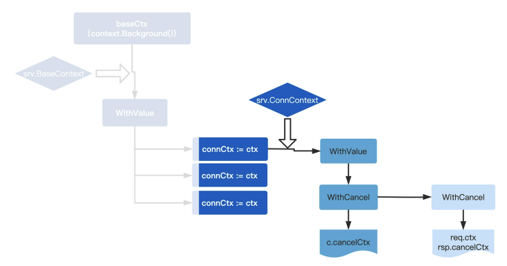

# Web Framework Document

> Web 框架文档

## 从零开发框架？

### web 框架与业务环境

如何选择或者打造一款称手的 Web 应用框架呢？这是在日常工作中经常遇到的问 题。 

因为不管什么语言，在 Web 领域，总有很多款开发框架，真的可以说是日新月异， GitHub 上的 Go Web 框架现在已经有 41 款了。


进入了一个思维误区：没有把框架放到特定场景上讨论，这个特定场景，就是**开发团队的业务环境**。 

- 比如，如果一个人负责一个小的外包项目，那可以说所有框架都差不多；
- 如果是 2～3 个服务端人员的初创团队，用的框架要承担的工作大概率是提升开发效率，那就要选择功能更强大、易用性更好的框架；
- 等团队再大一些，框架所承担的职责就更多了，往往得更多考虑性能、扩展性，或者定制自己的框架。

### 聊聊 Web 框架 

所有框架都有倾向性，基本可以分为两个大类：一类是**追求运行性能**，一类是**追求开发效率**。 

- 追求性能的框架往往很简洁，包含的东西也很少，一个路由一个 MVC 就完事了，比如 Gin 框架；
- 另外一类框架追求开发效率，封装得非常好，很多功能会让你惊叹，能省很多事，最典型的就是 Beego 框架。 

在 Web 领域，特别是中小型项目，开发效率往往才是业务的第一需求。一个产品拥有的市场机会总是转瞬即逝的，抢占市场都是靠更快的开发速度和迭代速 度。

所以，在任何领域做到第一名的产品基本上都有一个共性：**开发、迭代速度快**。

所以作为开发必备的框架，在提效上尤为重要。这就要求好的框架要能**区分清楚业务团队和架构团队的边界**，什么应该是写业务的人负责的？什么应该是做架构的人负责的? 

写架构的同学，做好框架的底层封装。而写业务的同学可以从底层实现中释放出来，专注于业务逻辑，遇到任何底层问题，在框架中都有简单易用的封装可用，框架中的每一个类、每一个服务接口都在告诉你，要完成这个功能，只需要这样使用，无需更多的操作。 

总而言之，框架是为加速业务发展而生的，它需要兼顾业务的开发效率和底层的性能效率，而这两者在 Go 这门语言出现后得到了很好地结合。

### Go Web 框架 

在 Go 出现之前，PHP 和 Java 基本上是 Web 领域的主流，特别是 PHP， 是当时各种公司建站的首选。

其实 PHP 和 HTML 的契合性是好于 Go 的，尤其在快速编写动态网页的时候，因为它可嵌入 HTML 的特性，于是建立 Web 站就变成了一件非常容易的事。

但是这几年，Web 领域越来越流行前后端分离，Web 后端开发慢慢从繁杂的 HTML 渲染中解放出来了，开始把研发注意力放在如何建立数据模型（接口设计）、如何搭建更稳定可扩展的服务（分布式）上。

在这个大趋势下，Go 在 Web 领域可以说是大放异彩。 Go 真的很好地平衡了开发和性能。 

- 比方说，Go 语言中的 Goroutine 设计，提供了“一个请求一个协程”的请求模型，对比 PHP 的“一个请求一个进程”的模型，能有效提升后端的资源占用和调度负载；
- 另外，Go 的 Runtime 机制让运行程序不再依赖各种的环境和库，将 Web 服务的部署和搭建变得简单高效；
- 而 Go 提供的交叉编译、数据结构、channel 等语言级别特性，都让“处理 Web 请求”这个事情变得非常简单。 

所以这几年，Go 在各个领域，比如云原生、游戏、微服务、区块链等等，优势也越发明显。 

这也是为什么选择 Golang 来搭建 Web 框架的原因，一方面看好 Golang 的市场前 景，另一方面 Golang 确实让 Web 开发变得越来越有效率。

### 为什么要从零开发 

决定好用什么语言了，就得关注怎么学了。

好框架能提升开发效率，那要了解 Web 框 架，为什么又鼓励从零开发呢？这不是自相矛盾了，自己造轮子能比用现成的快吗？ 

首先，对程序员来说，了解一个东西最好的办法就是去实现它。只有自己搭建一个新的框架，才能掌握 Web 服务的本质。 可选框架这么多，新框架也层出不穷，不可能也没有必要完全掌握所有框架。

如果只学怎么用框架，按照文档“按部就班”，是永远不可能真正做到掌握框架的。 但是只要开始动手做一个框架，就能站在框架作者的角度，遇到作者开发时遇到的问题，思考作者开发时选择的方案，从本质上理解清楚这些框架都在做些什么、为什么这么设计，之后在工作中遇到类似问题的时候，也会清楚这个问题为什么会出现，解决也就不在话下了。 

其次，从零开发作为一种学习方法，并不意味着在工作中要从零搭建框架。 从作者的角度了解清楚框架本质后，再思考工作中实际要用的框架，就会发现，它有自己的倾向性，有自己的设计感，并不是每个设计都能满足需求。

那么框架用久 了，就要思考，如果需要一个能满足想法的框架，它应该是什么样子的？有怎样的设计？ 

举个例子，框架就像大楼的地基，而业务就像是房子。房子的形态可以是各异的，随业务不同任由发挥，但建房子之前必须打造好自己的地基，这期间当然可以参考前人的方案、经验、实施策略，让自己的框架地基更牢靠。 这样，新的业务需求来了，就能快速搭出房子解决问题，而要讲的就是在 Web 领域所打造的地基，也是可以深度参与的一个实战项目。 

### 学习路径 

最终目标是使用 Golang 开发出一个属于自己的工业级 Web 框架，而在具体的学习上， 设置了四个关卡。


- 实战第一关：会分析 Web 框架的本质，从最底层的 Go 的 HTTP 库开始讲起，如 何基于 HTTP 库建立 server、如何搭建路由、如何增加中间件等等，从而搭建出一个 Web 框架最核心的设计部分。 
- 实战第二关：框架核心搭建好了，会基于具体业务场景重新思考：设计框架的目标到底是什么? 框架的设计感和要解决的问题在哪里? 框架的倾向性是什么? 如果要搭建出一个“一切皆服务”的框架应该如何设计。 思考清楚后，会用 Gin 框架集成实战第一关自研的 Web 框架的核心，要知道，站在 巨人的肩膀上，才能有更广阔的视野，然后一步步实现框架核心的功能服务。 
- 实战第三关：将为这个框架增加不同的周边功能，在添加功能时，会先讨论目前社区中的标准做法是什么样的，有没有更好的设计，最终把这些标准做法融合到框架中。 
- 实战第四关：现在框架已经基本搭建完成了，会用这个框架应用开发一个统计管理后台，使用 vue-element-admin 来做前端封面，再结合框架开发具体的统计展示和计算业务。 

通关不易，所以每一讲都会依次讲解实现过程和细节，阐述每个设计的思路和原 理，同时也会将个人在 Golang 领域的一些学习技巧和小方法分享。

最后，解说代码的时候，可能会有些枯燥，会画图帮助理解。关键代码也都增加了注释。


## net/http：Server 结构

之前介绍了整个课程的设计思路，也是搭建 Web 框架的学习路径，会先基于标 准库搭建起 Server，然后一步一步增加控制器、路由、中间件，最后完善封装和重启，在整章学完后，就能建立起一套自己的 Web 框架了。 

用官方提供的 net/http 标准库搭建一个 Web Server，是一件非常简单的事。

在面试的时候也发现，不少同学，在怎么搭怎么用的问题上，回答的非常溜，但是再追问一句为什么这个 Server 这么设计，涉及的 net/http 实现原理是什么? 一概不知。

这其实是非常危险的。实际工作中，会因为不了解底层原理，想当然的认为它的使用方式，直接导致在代码编写、应用调优的时候出现各种问题。 

所以今天，想从最底层的 HTTP 协议开始，搞清楚 Web Server 本质，通过 net/http 代码库梳理 HTTP 服务的主流程脉络，先知其所以然，再搭建框架的 Server 结构。 

之后，会基于分析的整个 HTTP 服务主流程原理继续开发。

### Web Server 的本质 

既然要搭 Web Server，那也先简单介绍一下，维基百科上是这么解释的，Web Server 是一个通过 HTTP 协议处理 Web 请求的计算机系统。

HTTP 协议，在 OSI 网络体系结构中，是基于 TCP/IP 之上第七层应用层的协议，全称叫做超文本传输协议。

啥意思？就是说 HTTP 协议传输的都是文本字符，只是这些字符是有规则排列的。这些字符的排列规则，就是一种约定，也就是协议。这个协议还有一个专门 的描述文档，就是 **RFC 2616**。 

对于 HTTP 协议，无论是请求还是响应，传输的消息体都可以分为两个部分：HTTP 头部 和 HTTP Body 体。头部描述的一般是和业务无关但与传输相关的信息，比如请求地址、 编码格式、缓存时长等；Body 里面主要描述的是与业务相关的信息。


Web Server 的本质，实际上就是接收、解析 HTTP 请求传输的文本字符，理解这些文本字符的指令，然后进行计算，再将返回值组织成 HTTP 响应的文本字符，通过 TCP 网络传输回去。 

理解了 Web Server 干的事情，接下来继续看看在语言层面怎么实现。

### 一定要用标准库吗 

对 Web Server 来说，**Golang 提供了 net 库和 net/http 库，分别对应 OSI 的 TCP 层和 HTTP 层**，它们两个负责的就是 HTTP 的接收和解析。 

一般会使用 net/http 库解析 HTTP 消息体。但是可能会有人问，如果想实现 Web 服务，可不可以不用 net/http 库呢？比如直接用 net 库，逐字读取消息体，然后自己解析获取的传输字符。 

答案是可以的，如果有兼容其它协议、追求极致性能的需求，而且有把握能按照 HTTP 的 RFC 标准进行解析，那完全可以自己封装一个 HTTP 库。 

其实在一些大厂中确实是这么做的，每当有一些通用的协议需求，比如一个服务既要支持 HTTP，又要支持 Protocol Buffers，又或者想要支持自定义的协议，那么他们就可能抛弃 HTTP 库，甚至抛弃 net 库，直接自己进行网络事件驱动，解析 HTTP 协议。

有个开源库，叫 FastHTTP，它就是抛弃标准库 net/http 来实现的。作者为了追求极高的 HTTP 性能，自己封装了网络事件驱动，解析了 HTTP 协议。

但是现在绝大部分的 Web 框架，都是基于 net/http 标准库的。原因主要有两点：

- 第一是**相信官方开源的力量**。自己实现 HTTP 协议的解析，不一定会比标准库实现得更好，即使当前标准库有一些不足之处，也都相信，随着开源贡献者越来越多，标准库也会最终达到完美。 
- 第二是 **Web 服务架构的变化**。随着容器化、Kubernetes 等技术的兴起，业界逐渐达成共识，单机并发性能并不是评判 Web 服务优劣的唯一标准了，易用性、扩展性也是底层库需要考量的。

所以总体来说，net/http 标准库，作为官方开源库，其易用性和扩展性都经过开源社区和 Golang 官方的认证，是目前构建 Web Server 首选的 HTTP 协议库。 

用 net/http 来创建一个 HTTP 服务，其实很简单，下面是官方文档里的例子。做了些注释，帮助理解。

```go
package main

import (
	"fmt"
	"html"
	"log"
	"net/http"
)

func main() {
	// 创建一个Foo路由和处理函数
	http.Handle("/foo", fooHandler)

	// 创建一个bar路由和处理函数
	http.HandleFunc("/bar", func(w http.ResponseWriter, r *http.Request) {
		fmt.Fprintf(w, "Hello, %q", html.EscapeString(r.URL.Path))
	})

	// 监听8080端口
	log.Fatal(http.ListenAndServe(":8080", nil))
}
```

是不是代码足够简单？一共就 5 行，但往前继续推进之前，想先问几个问题，这五行代码做了什么，为什么就能启动一个 HTTP 服务，具体的逻辑是什么样的？ 

要回答这些问题，就要深入理解 net/http 标准库。要不然，只会简单调用，却不知道原理，后面哪里出了问题，或者想调优，就无从下手了。

所以，先来看看 net/http 标准库，从代码层面搞清楚整个 HTTP 服务的主流程原理， 最后再基于原理讲实现。 

### net/http 标准库怎么学

想要在 net/http 标准库纷繁复杂的代码层级和调用中，弄清楚主流程不是一件容易事。要快速熟悉一个标准库，就得找准方法。 

这里教一个快速掌握代码库的技巧：库函数 > 结构定义 > 结构函数。 简单来说，就是在阅读一个代码库的时候，不应该从上到下阅读整个代码文档，而应该先阅读整个代码库提供的对外库函数（function），再读这个库提供的结构 （struct/class），最后再阅读每个结构函数（method）。


为什么要这么学呢？因为这种阅读思路和代码库作者的思路是一致的。 首先搞清楚这个库要提供什么功能（提供什么样的对外函数），然后为了提供这些功能， 要把整个库分为几个核心模块（结构），最后每个核心模块，应该提供什么样的能力 （具体的结构函数）来满足需求。 

#### 库函数（功能）

按照这个思路，来阅读 net/http 库，先看提供的对外库函数是为了实现哪些功能。这 里顺带补充说明一下，课程对应的 Golang 源码的版本是 1.15.5，可以在 01 分支 的 coredemo/go.mod里看到。 

直接通过 `go doc net/http | grep "^func"` 命令行能查询出 net/http 库所有的 对外库函数：

```go
func CanonicalHeaderKey(s string) string
func DetectContentType(data []byte) string
func Error(w ResponseWriter, error string, code int)
func Get(url string) (resp *Response, err error)
func Handle(pattern string, handler Handler)
func HandleFunc(pattern string, handler func(ResponseWriter, *Request))
func Head(url string) (resp *Response, err error)
func ListenAndServe(addr string, handler Handler) error
func ListenAndServeTLS(addr, certFile, keyFile string, handler Handler) error
func MaxBytesReader(w ResponseWriter, r io.ReadCloser, n int64) io.ReadCloser
func NewRequest(method, url string, body io.Reader) (*Request, error)
func NewRequestWithContext(ctx context.Context, method, url string, body io.Re
func NotFound(w ResponseWriter, r *Request)
func ParseHTTPVersion(vers string) (major, minor int, ok bool)
func ParseTime(text string) (t time.Time, err error)
func Post(url, contentType string, body io.Reader) (resp *Response, err error)
func PostForm(url string, data url.Values) (resp *Response, err error)
func ProxyFromEnvironment(req *Request) (*url.URL, error)
func ProxyURL(fixedURL *url.URL) func(*Request) (*url.URL, error)
func ReadRequest(b *bufio.Reader) (*Request, error)
func ReadResponse(r *bufio.Reader, req *Request) (*Response, error)
func Redirect(w ResponseWriter, r *Request, url string, code int)
func Serve(l net.Listener, handler Handler) error
func ServeContent(w ResponseWriter, req *Request, name string, modtime time.Ti
func ServeFile(w ResponseWriter, r *Request, name string)
func ServeTLS(l net.Listener, handler Handler, certFile, keyFile string) error
func SetCookie(w ResponseWriter, cookie *Cookie)
func StatusText(code int) string
```

在这个库提供的方法中，**去掉一些 New 和 Set 开头的函数**，因为从命名上可以看 出，这些函数是对某个对象或者属性的设置。 

剩下的函数大致可以分成三类：

- 为服务端提供创建 HTTP 服务的函数，名字中一般包含 Serve 字样，比如 Serve、 ServeFile、ListenAndServe 等。 
- 为客户端提供调用 HTTP 服务的类库，与 HTTP 的 method 同名，比如 Get、Post、 Head 等。 
- 提供中转代理的一些函数，比如 ProxyURL、ProxyFromEnvironment 等。

现在研究的是，如何创建一个 HTTP 服务，所以关注包含 Serve 字样的函数就可以 了。

```go
// 通过监听的URL地址和控制器函数来创建HTTP服务
func ListenAndServe(addr string, handler Handler) error{}

// 通过监听的URL地址和控制器函数来创建HTTPS服务
func ListenAndServeTLS(addr, certFile, keyFile string, handler Handler) error{}

// 通过net.Listener结构和控制器函数来创建HTTP服务
func Serve(l net.Listener, handler Handler) error{}

// 通过net.Listener结构和控制器函数来创建HTTPS服务
func ServeTLS(l net.Listener, handler Handler, certFile, keyFile string) error{}
```

#### 结构定义（模块） 

然后，过一遍这个库提供的所有 struct，看看核心模块有哪些，同样使用 go doc:

```sh
go doc net/http | grep "^type"|grep struct
```

可以看到整个库最核心的几个结构：

```go
type Client struct{ ... }
type Cookie struct{ ... }
type ProtocolError struct{ ... }
type PushOptions struct{ ... }
type Request struct{ ... }
type Response struct{ ... }
type ServeMux struct{ ... }
type Server struct{ ... }
type Transport struct{ ... }
```

看结构的名字或者 go doc 查看结构说明文档，能逐渐了解它们的功能：

- Client 负责构建 HTTP 客户端； 
- Server 负责构建 HTTP 服务端； 
- ServerMux 负责 HTTP 服务端路由； 
- Transport、Request、Response、Cookie 负责客户端和服务端传输对应的不同模块。

现在通过库方法（function）和结构体（struct），对整个库的结构和功能有大致印象了。

整个库承担了两部分功能，一部分是构建 HTTP 客户端，一部分是构建 HTTP 服务 端。 

构建的 HTTP 服务端除了提供真实服务之外，也能提供代理中转服务，它们分别由 Client 和 Server 两个数据结构负责。除了这两个最重要的数据结构之外，HTTP 协议的每个部分，比如请求、返回、传输设置等都有具体的数据结构负责。 

#### 结构函数（能力）

下面从具体的需求出发，来阅读具体的结构函数（method）。 

当前的需求是创建 HTTP 服务，开头举了一个最简单的例子：

```go
// 创建一个Foo路由和处理函数
http.Handle("/foo", fooHandler)

// 创建一个bar路由和处理函数
http.HandleFunc("/bar", func(w http.ResponseWriter, r *http.Request) {
  fmt.Fprintf(w, "Hello, %q", html.EscapeString(r.URL.Path))
})

// 监听8080端口
log.Fatal(http.ListenAndServe(":8080", nil))
```

跟着 http.ListenAndServe 这个函数来理一下 net/http 创建服务的主流程逻辑。

阅读具体的代码逻辑用 go doc 命令明显就不够了，需要两个东西： 

- 一个是可以灵活进行**代码跳转的 IDE**，VS Code 和 GoLand 都是非常好的工具。以现在要查看的 http.ListenAndServe 这个函数为例，可以从上面的例子代码中，直接通过 IDE 跳转到这个函数的源码中阅读，有一个能灵活跳转的 IDE 工具是非常必要的。 
- 另一个是可以方便记录代码流程的笔记，这里是使用**思维导图**。 

具体方法是将要分析的代码从入口处一层层记录下来，每个函数，只记录其核心代 码，然后对每个核心代码一层层解析。记得把思维导图的结构设置为右侧分布，这样更直观。 

比如下面这张图，就是解析部分 HTTP 库服务端画的代码分析图。


这张图看上去层级复杂，不过不用担心，对照着思维导图，一层一层阅读，讲解每 一层的逻辑，看清楚代码背后的设计思路。 

先顺着 http.ListenAndServe 的脉络读。 

##### http.ListenAndServe

第一层，http.ListenAndServe 本质是通过创建一个 Server 数据结构，调用 server.ListenAndServe 对外提供服务，这一层完全是比较简单的封装，目的是，将Server 结构创建服务的方法 ListenAndServe ，直接作为库函数对外提供，增加库的易用 性。


##### server.ListenAndServe

进入到第二层，创建服务的方法 ListenAndServe 先定义了监听信息 net.Listen，然后调用 Serve 函数。 

##### Server.Serve

而在第三层 Serve 函数中，用了一个 for 循环，通过 l.Accept不断接收从客户端传进来 的请求连接。

当接收到了一个新的请求连接的时候，通过 srv.NewConn创建了一个连接结构（http.conn），并创建一个 Goroutine 为这个请求连接对应服务（c.serve）。 

##### go c.serve

从第四层开始，后面就是单个连接的服务逻辑了。


在第四层，c.serve函数先判断本次 HTTP 请求是否需要升级为 HTTPs，接着创建读文本的 reader 和写文本的 buffer，再进一步读取本次请求数据。

##### serverHandler

然后第五层调用最关键的方法 serverHandler{c.server}.ServeHTTP(w, w.req) ，来处理这次请求。 这个关键方法是为了实现自定义的路由和业务逻辑，调用写法是比较有意思的：

```go
serverHandler{c.server}.ServeHTTP(w, w.req)
```

**serverHandler 结构体**，是标准库封装的，代表“请求对应的处理逻辑”，它只包含了一 个指向总入口服务 server 的指针。 这个结构将总入口的服务结构 Server 和每个连接的处理逻辑巧妙联系在一起了。

##### ServeHTTP

接着的第六层逻辑：

```go
// serverHandler 结构代表请求对应的处理逻辑
type serverHandler struct {
	srv *Server
}

// 具体处理逻辑的处理函数
func (sh serverHandler) ServeHTTP(rw ResponseWriter, req *Request) {
  handler := sh.srv.Handler
  if handler == nil {
  handler = DefaultServeMux
  }
  ...
  handler.ServeHTTP(rw, req)
}
```

如果入口服务 server 结构已经设置了 Handler，就调用这个 Handler 来处理此次请求， 反之则使用库自带的 DefaultServerMux。 

这里的 serverHandler 设计，能同时保证这个库的扩展性和易用性：可以很方便使用默 认方法处理请求，但是一旦有需求，也能自己扩展出方法处理请求。 

##### DefaultServeMux.Handle

那么 DefaultServeMux 是怎么寻找 Handler 的呢，这就是思维导图的最后一部分第七 层。


DefaultServeMux.Handle 是一个非常简单的 map 实现，key 是路径（pattern）， value 是这个 pattern 对应的处理函数（handler）。

它是通过 mux.match(path) 寻找对应 Handler，也就是从 DefaultServeMux 内部的 map 中直接根据 key 寻找到 value 的。 

这种根据 map 直接查找路由的方式是不是可以满足路由需求呢？会在路由中详细解说。

好，HTTP 库 Server 的代码流程就梳理完成了，整个逻辑线大致是：

```sh
创建服务 -> 创建连接 -> 监听请求 -> 处理请求
```

##### 逻辑线各层关键点

如果觉得层次比较多，对照着思维导图多看几遍就顺畅了。这里整理了一下逻辑线各层的关键结论：

- 第一层，标准库创建 HTTP 服务是通过创建一个 Server 数据结构完成的； 
- 第二层，Server 数据结构在 for 循环中不断监听每一个连接； 
- 第三层，每个连接默认开启一个 Goroutine 为其服务； 
- 第四、五层，serverHandler 结构代表请求对应的处理逻辑，并且通过这个结构进行具 体业务逻辑处理； 
- 第六层，Server 数据结构如果没有设置处理函数 Handler，默认使用 DefaultServerMux 处理请求； 
- 第七层，DefaultServerMux 是使用 map 结构来存储和查找路由规则。

如果对上面几点关键结论还有疑惑的，可以再去看一遍思维导图。阅读核心逻辑代码是会有点枯燥，但是这条逻辑线是 HTTP 服务启动最核心的主流程逻辑，后面会基于这 个流程继续开发，要掌握到能背下来的程度。

千万不要觉得要背诵了，压力太大，其实对照着思维导图，顺几遍逻辑，理解了再记忆就很容易。 

### 创建框架的 Server 结构

现在原理弄清楚了，该下手搭 HTTP 服务了。 

刚刚分析了主流程代码，其中第一层的关键结论就是：net/http 标准库创建服务，实质上就是通过创建 Server 数据结构来完成的。

所以接下来，就来创建一个 Server 数据结构。 通过 go doc net/http.Server 可以看到 Server 的结构：

```go
type Server struct {
  // 请求监听地址
  Addr string
  // 请求核心处理函数
  Handler Handler
  ...
}
```

其中最核心的是 Handler 这个字段，从主流程中知道（第六层关键结论），当 Handler 这个字段设置为空的时候，它会默认使用 DefaultServerMux 这个路由器来填充这个值，但是一般都会使用自己定义的路由来替换这个默认路由。 

所以在框架代码中，要创建一个自己的核心路由结构，实现 Handler。 

先来理一下目录结构，在GitHub上创建一个项目 coredemo，这个项目是所有的代码集合，包含要实现的框架和使用框架的示例业务代码。 所有的框架代码都存放在 framework 文件夹中，而所有的示例业务代码都存放在 framework 文件夹之外。

这里为了后面称呼方便，就把 framework 文件夹叫框架文件夹，而把外层称为业务文件夹。 

当然 GitHub 上的这个 coredemo 是为了演示创建的，推荐跟着一步一步写。成品在hade 项目里，可以先看看，在最后发布的时候，会将整个项目进行发布。

在一个新的业务中，如果要使用到自己写好的框架，可以直接通过引用 “import 项目地址 /framework” 来引入，在最后一部分做实战项目的时候会具体演示。 

#### core.go

下面来一步步实现这个项目。 创建一个 framework 文件夹，新建 core.go，在里面写入。

```go
package framework

import "net/http"

// 框架核心结构
type Core struct {
}

// 初始化框架核心结构
func NewCore() *Core {
	return &Core{}
}

// 框架核心结构实现Handler接口
func (c *Core) ServeHTTP(response http.ResponseWriter, request *http.Request)

// TODO
}
```

#### main.go

而在业务文件夹中创建 main.go，其中的 main 函数就变成这样：

```go
package main

import (
	"github.com/Kate-liu/GoWebFramework/framework"
	"net/http"
)

func main() {
	server := &http.Server{
		// 自定义的请求核心处理函数
		Handler: framework.NewCore(),
		// 请求监听地址
		Addr: ":8080",
	}
	
	server.ListenAndServe()
}
```

整理下这段代码，通过自己创建了 Server 数据结构，并且在数据结构中创建了自定义 的 Handler（Core 数据结构）和监听地址，实现了一个 HTTP 服务。

这个服务的具体业务 逻辑都集中在自定义的 Core 结构中，后续要做的事情就是不断丰富这个 Core 数据结构的功能逻辑。 

后续都会把代码放在对应的 GitHub 的分支中。跟着敲完代码的过程中有不了解的地方，可以对比参考分支。 

### 小结 

以 net/http 标准库为例，分享了快速熟悉代码库的技巧，库函数 > 结构定义 > 结构函数。

在阅读代码库时，从功能出发，先读对外库函数，再细读这个库提供的结构，搞清楚功能和对应结构之后，最后基于实际需求看每个结构函数。 

读每个结构函数的时候，使用思维导图梳理了 net/http 创建 HTTP 服务的主流程逻辑，基于主流程原理，创建了一个框架的 Server 结构，可以回顾一下这张图。


主流程的链条比较长，但是先理顺逻辑，记住几个关键的节点，再结合思维导图，就能记住整个主流程逻辑了，之后所有关于 HTTP 的细节和问题，都会基于这个主流程逻辑来思考和回答。 

### 思考题

HTTP 库提供 FileServer 来封装对文件读取的 HTTP 服务。实现代码也非常简单：

```sh
fs := http.FileServer(http.Dir("/home/bob/static"))
http.Handle("/static/", http.StripPrefix("/static", fs))
```

请问它的主流程逻辑是什么？其中最关键的节点是什么？


## Context：超时控制器

使用 net/http 搭建了一个最简单的 HTTP 服务。 

将进一步丰富框架，添加上下文 Context 为请求设置超时时间。 

从主流程中知道（第三层关键结论），HTTP 服务会为每个请求创建一个 Goroutine 进行服务处理。在服务处理的过程中，有可能就在本地执行业务逻辑，也有可能再去下游服务获取数据。

如下图，本地处理逻辑 A/B、下游服务 a/b/c，会形成一个标准的树形逻 辑链条。


在这个逻辑链条中，每个本地处理逻辑，或者下游服务请求节点，都有可能存在超时问 题。

而对于 HTTP 服务而言，超时往往是造成服务不可用、甚至系统瘫痪的罪魁祸首。 

系统瘫痪也就是俗称的雪崩，某个服务的不可用引发了其他服务的不可用。比如上图 中，如果服务 a 超时，导致请求处理缓慢甚至不可用，加剧了 Goroutine 堆积，同时也造成了服务 b 和服务 c 的瞬时请求加大，导致 b 和 c 的服务都不可用，整个系统瘫痪。

怎么办？ 

最有效的方法就是从源头上控制一个请求的“最大处理时长”，所以，对于一个 Web 框架而言，**“超时控制”能力**是必备的。就用 Context 为框架增加这个能力。 

### context 标准库设计思路 

如何控制超时，官方是有提供 context 标准库作为解决方案的，但是由于标准库的功能并 不够完善，会基于标准库，来根据需求自定义框架的 Context。

所以理解其背后的设计思路就可以了。 

为了防止雪崩，context 标准库的解决思路是：在整个树形逻辑链条中，用上下文控制器 Context，实现每个节点的信息传递和共享。

具体操作是：用 Context 定时器为整个链条设置超时时间，时间一到，结束事件被触发， 链条中正在处理的服务逻辑会监听到，从而结束整个逻辑链条，让后续操作不再进行。 

明白操作思路之后，深入 context 标准库看看要对应具备哪些功能。 按照上一讲介绍的了解标准库的方法，先通过 `go doc context | grep "^func"` 看提供了哪些库函数（function）：

```go
// 创建退出 Context
func WithCancel(parent Context) (ctx Context, cancel CancelFunc){}

// 创建有超时时间的 Context
func WithTimeout(parent Context, timeout time.Duration) (Context, CancelFunc){}

// 创建有截止时间的 Context
func WithDeadline(parent Context, d time.Time) (Context, CancelFunc){}
```

其中，WithCancel 直接创建可以操作退出的子节点，WithTimeout 为子节点设置了超时 时间（还有多少时间结束），WithDeadline 为子节点设置了结束时间线（在什么时间结 束）。 

但是这只是表层功能的不同，其实这三个库函数的本质是一致的。怎么理解呢？ 

先通过 `go doc context | grep "^type"` ，搞清楚 Context 的结构定义和函数句柄，再来解答这个问题。

```go
type Context interface {
  // 当 Context 被取消或者到了 deadline，返回一个被关闭的 channel
  Done() <-chan struct{}
  ...
}

//函数句柄
type CancelFunc func()
```

这个库虽然不大，但是设计感强，比较抽象，并不是很好理解。所以这里，把 Context 的其他字段省略了。现在，只理解核心的 Done() 方法和 CancelFunc 这两个函数就可以了。 

在树形逻辑链条上，一个节点其实有两个角色：一是下游树的管理者；二是上游树的被管 理者，那么就对应需要有两个能力：

- 一个是能让整个下游树结束的能力，也就是函数句柄 CancelFucnc； 
- 另外一个是在上游树结束的时候被通知的能力，也就是 Done() 方法。同时因为通知是 需要不断监听的，所以 Done() 方法需要通过 channel 作为返回值让使用方进行监听。

看官方代码示例：

```go
package main

import (
	"context"
	"fmt"
	"time"
)

const shortDuration = 1 * time.Millisecond

func main() {
	// 创建截止时间
	d := time.Now().Add(shortDuration)
	// 创建有截止时间的 Context
	ctx, cancel := context.WithDeadline(context.Background(), d)
	defer cancel()
  
	// 使用 select 监听 1s 和有截止时间的 Context 哪个先结束
	select {
	case <-time.After(1 * time.Second):
		fmt.Println("overslept")
	case <-ctx.Done():
		fmt.Println(ctx.Err())
	}
}
```

主线程创建了一个 1 毫秒结束的定时器 Context，在定时器结束的时候，主线程会通过 Done() 函数收到事件结束通知，然后主动调用函数句柄 cancelFunc 来通知所有子 Context 结束（这个例子比较简单没有子 Context）。

打个更形象的比喻，CancelFunc 和 Done 方法就像是电话的话筒和听筒，话筒 CancelFunc，用来告诉管辖范围内的所有 Context 要进行自我终结，而通过监听听筒 Done 方法，就能听到上游父级管理者的终结命令。 

总之，**CancelFunc 是主动让下游结束，而 Done 是被上游通知结束**。 

搞懂了具体实现方法，回过头来看这三个库函数 WithCancel / WithDeadline / WithTimeout 就很好理解了。 它们的本质就是“通过定时器来自动触发终结通知”，WithTimeout 设置若干秒后通知触发终结，WithDeadline 设置未来某个时间点触发终结。 

对应到 Context 代码中，它们的功能就是：为一个父节点生成一个带有 Done 方法的子节 点，并且返回子节点的 CancelFunc 函数句柄。


用一张图来辅助解释一下，Context 的使用会形成一个树形结构，下游指的是树形结构中的子节点及所有子节点的子树，而上游指的是当前节点的父节点。

比如图中圈起来的 部分，当 WithTimeout 调用 CancelFunc 的时候，所有下游的 With 系列产生的 Context 都会从 Done 中收到消息。 

### Context 是怎么产生的

现在已经了解标准库 context 的设计思路了，在开始写代码之前，还要把 Context 放到 net/http 的主流程逻辑中，其中有两个问题要搞清楚：Context 在哪里产生？它的上下游逻辑是什么？ 

要回答这两个问题，可以用思维导图方法，因为主流程已经拎清楚了，现在只需要把其中 Context 有关的代码再详细过一遍，然后在思维导图上标记出来就可以了。 

这里，已经把 Context 的关键代码都用蓝色背景做了标记，可以检查一下有没有标漏。


照旧看图梳理代码流程，来看蓝色部分，从前到后的层级梳理就不再重复讲了，看关键位置。 从图中最后一层的代码 req.ctx = ctx 中看到，每个连接的 Context 最终是放在 request 结构体中的。 

而且这个时候， Context 已经有多层父节点。因为，在代码中，每执行一次 WithCancel、WithValue，就封装了一层 Context，通过这一张流程图能清晰看到最终 Context 的生成层次。


发现了吗，其实每个连接的 Context 都是基于 baseContext 复制来的。对应到代码中 就是，在为某个连接开启 Goroutine 的时候，为当前连接创建了一个 connContext，这 个 connContext 是基于 server 中的 Context 而来，而 server 中 Context 的基础就是 baseContext。 

所以，Context 从哪里产生这个问题，就解决了，但是如果想要对 Context 进行 必要的修改，还要从上下游逻辑中，找到它的修改点在哪里。 

生成最终的 Context 的流程中，net/http 设计了两处可以注入修改的地方，都在 Server 结构里面，一处是 BaseContext，另一处是 ConnContext。

- BaseContext 是整个 Context 生成的源头，如果不希望使用默认的 context.Backgroud()，可以替换这个源头。 
- 而在每个连接生成自己要使用的 Context 时，会调用 ConnContext ，它的第二个参数 是 net.Conn，能对某些特定连接进行设置，比如要针对性设置某个调用 IP。

这两个函数的定义在下面的代码里了，可以看看。

```go
type Server struct {
  ...
  // BaseContext 用来为整个链条创建初始化 Context
  // 如果没有设置的话，默认使用 context.Background()
  BaseContext func(net.Listener) context.Context{}
  
  // ConnContext 用来为每个连接封装 Context
  // 参数中的 context.Context 是从 BaseContext 继承来的
  ConnContext func(ctx context.Context, c net.Conn) context.Context{}
  ...
}
```

最后，回看一下 req.ctx 是否能**感知连接异常**。



其实是可以的，因为链条中一个父节点为 CancelContext，其 cancelFunc 存储在代表连接的 conn 结构中，连接异常的时候，会触发这个函数句柄。 

讲完 context 库的核心设计思想，以及在 net/http 的主流程逻辑中嵌入 context 库的关键实现，现在心中有图了，就可以撸起袖子开始写框架代码了。 

是不是有点疑惑，为啥要自己先理解一遍 context 标准库的生成流程，咱们直接动手干 不是更快？有句老话说得好，磨刀不误砍柴功。

确实是要自定义，不是想直接使用标准库的 Context，因为它完全是标准库 Context 接口的实现，只能控制链条结束，封装性并不够。但是只有先搞清楚了 context 标准库的 设计思路，才能精准确定自己能怎么改、改到什么程度合适，下手的时候才不容易懵。 

下面就基于设计思路，从封装自己的 Context 开始，写核心逻辑，也就是为单个请求设置超时，最后考虑一些边界场景，并且进行优化。 

还是再拉一个分支 geekbang/02，接着上一节课的代码结构，在框架文件夹中封装 一个自己的 Context。 

### 封装一个自己的 Context

在框架里，需要有更强大的 Context，除了可以控制超时之外，常用的功能比如获取 请求、返回结果、实现标准库的 Context 接口，也都要有。 

#### 获取请求、返回结果功能

首先来设计提供获取请求、返回结果功能。 

先看一段**未封装自定义 Context 的控制器代码**：

```go
package contextnopackage

import (
	"encoding/json"
	"net/http"
	"strconv"
)

// 控制器
func Foo1(request *http.Request, response http.ResponseWriter) {
	obj := map[string]interface{}{
		"data": nil,
	}
  
	// 设置控制器 response 的 header 部分
	response.Header().Set("Content-Type", "application/json")
  
	// 从请求体中获取参数
	foo := request.PostFormValue("foo")
	if foo == "" {
		foo = "10"
	}
	fooInt, err := strconv.Atoi(foo)
	if err != nil {
		response.WriteHeader(500)
		return
	}
  
	// 构建返回结构
	obj["data"] = fooInt
	byt, err := json.Marshal(obj)
	if err != nil {
		response.WriteHeader(500)
		return
	}
  
	// 构建返回状态，输出返回结构
	response.WriteHeader(200)
	response.Write(byt)
	return
}
```

这段代码重点是操作调用了 http.Request 和 http.ResponseWriter ，实现 WebService 接收和处理协议文本的功能。

但这两个结构提供的接口粒度太细了，需要使用者非常熟悉这两个结构的内部字段，比如 response 里设置 Header 和设置 Body 的函数，用起来肯定体验不好。 

如果能将这些内部实现封装起来，对外暴露语义化高的接口函数，那么这个框架的易用性肯定会明显提升。

什么是好的封装呢？再看这段**有封装的代码**：

```go
package contextpackage

import (
	"github.com/Kate-liu/GoWebFramework/framework"
	"net/http"
)

// 控制器
func Foo2(ctx *framework.Context) error {
	obj := map[string]interface{}{
		"data": nil,
	}

	// 从请求体中获取参数
	fooInt := ctx.FormInt("foo", 10)

	// 构建返回结构
	obj["data"] = fooInt
	
	// 输出返回结构
	return ctx.Json(http.StatusOK, obj)
}
```

可以明显感受到封装性高的 Foo2 函数，更优雅更易读了。

首先它的代码量更少，而且语义性也更好，近似对业务的描述：从请求体中获取 foo 参数，并且封装为 Map，最后 JSON 输出。 

思路清晰了，所以这里可以将 request 和 response 封装到自定义的 Context 中，对外提供请求和结果的方法，把这个 Context 结构写在框架文件夹的 context.go 文件中：

```go
// 自定义 Context
type Context struct {
  request *http.Request
  responseWriter http.ResponseWriter
  ...
}
```

对 request 和 response 封装的具体实现，到封装的时候再仔细说。 

#### 标准库的 Context 接口

然后是第二个功能，标准库的 Context 接口。 

标准库的 Context 通用性非常高，基本现在所有第三方库函数，都会根据官方的建议，将 第一个参数设置为标准 Context 接口。

所以封装的结构只有实现了标准库的 Context，才能方便直接地调用。 到底有多方便，看使用示例：

```go
// 封装调用
func Foo3(ctx *framework.Context) error {
	rdb := redis.NewClient(&redis.Options{
		Addr:     "localhost:6379",
		Password: "", // no password set
		DB:       0,  // use default DB
	})
	
	return rdb.Set(ctx, "key", "value", 0).Err()
}
```

这里使用了 go-redis 库，它每个方法的参数中都有一个标准 Context 接口，这能将自定义的 Context 直接传递给 rdb.Set。 

所以在框架上实现这一步，只需要调用刚才封装的 request 中的 Context 的标准接口就行了，很简单，继续在 context.go 中进行补充：

```go
func (ctx *Context) BaseContext() context.Context {
	return ctx.request.Context()
}

func (ctx *Context) Done() <-chan struct{} {
	return ctx.BaseContext().Done()
}
```

这里举例了两个 method 的实现，其他的都大同小异就不在文稿里展示，可以先自己 写，然后对照GitHub上的完整代码检查一下。 

自己封装的 Context 最终需要提供四类功能函数：

- base 封装基本的函数功能，比如获取 http.Request 结构 
- context 实现标准 Context 接口 
- request 封装了 http.Request 的对外接口 
- response 封装了 http.ResponseWriter 对外接口

完成之后，使用 IDE 里面的结构查看器（每个 IDE 显示都不同），就能查看到如下的函数列表：


有了自己封装的 Context 之后，控制器就非常简化了。把框架定义的 ControllerHandler 放在框架目录下的 controller.go 文件中：

```go
 type ControllerHandler func(c *Context) error
```

把处理业务的控制器放在业务目录下的 controller.go 文件中：

```go
func FooControllerHandler(ctx *framework.Context) error {
	return ctx.Json(200, map[string]interface{}{
		"code": 0,
	})
}
```

参数只有一个 framework.Context，是不是清爽很多，这都归功于刚完成的自定义 Context。

### 为单个请求设置超时

上面封装了自定义的 Context，从设计层面实现了标准库的 Context。下面回到核心要解决的问题，为单个请求设置超时。 

如何使用自定义 Context 设置超时呢？结合前面分析的标准库思路，三步走完成：

- 继承 request 的 Context，创建出一个设置超时时间的 Context； 
- 创建一个新的 Goroutine 来处理具体的业务逻辑； 
- 设计事件处理顺序，当前 Goroutine 监听超时时间 Contex 的 Done() 事件，和具体的 业务处理结束事件，哪个先到就先处理哪个。

理清步骤，就可以在业务的 controller.go 文件中完成业务逻辑了。

#### 生成超时的 Context

第一步生成一个超时的 Context：

```go
durationCtx, cancel := context.WithTimeout(c.BaseContext(), time.Duration(1*time.Second))
// 这里记得当所有事情处理结束后调用 cancel，告知 durationCtx 的后续 Context 结束
defer cancel()
```

这里为了最终在浏览器做验证，设置超时事件为 1s，这样最终验证的时候，最长等待 1s 就可以知道超时是否生效。 

#### 创建新的 Goroutine 处理业务逻辑

第二步创建一个新的 Goroutine 来处理业务逻辑：

```go
finish := make(chan struct{}, 1)
go func() {
  ...
  // 这里做具体的业务
  // Do real action
  time.Sleep(10 * time.Second)
  c.Json(200, "ok")
  ...
  
  // 新的 goroutine 结束的时候通过一个 finish 通道告知父 goroutine
  finish <- struct{}{}
}()
```

为了最终的验证效果，使用 time.Sleep 将新 Goroutine 的业务逻辑事件人为往后延迟了 10s，再输出“ok”，这样最终验证的时候，效果比较明显，因为前面的超时设置会在 1s 生效了，浏览器就有表现了。 

到这里先不急着进入第三步，还有**错误处理情况**没有考虑到位。这个新创建的 Goroutine 如果出现未知异常怎么办？需要额外捕获吗？ 

其实在 Golang 的设计中，每个 Goroutine 都是独立存在的，父 Goroutine 一旦使用 Go 关键字开启了一个子 Goroutine，父子 Goroutine 就是平等存在的，他们互相不能干扰。 而在异常面前，所有 Goroutine 的异常都需要自己管理，不会存在父 Goroutine 捕获子 Goroutine 异常的操作。 

所以切记：在 Golang 中，每个 Goroutine 创建的时候，要**使用 defer 和 recover 关键字为当前 Goroutine 捕获 panic 异常，并进行处理**，否则，任意一处 panic 就会导致整 个进程崩溃！ 

这里可以标个重点，面试会经常被问到。 

搞清楚这一点，回看第二步，做完具体业务逻辑就结束是不行的，还需要处理 panic。所以这个 Goroutine 应该要有两个 channel 对外传递事件：

```go
// 这个 channal 负责通知结束
finish := make(chan struct{}, 1)
// 这个 channel 负责通知 panic 异常
panicChan := make(chan interface{}, 1)
go func() {
  // 这里增加异常处理
  defer func() {
    if p := recover(); p != nil {
      panicChan <- p
    }
  }()
  // 这里做具体的业务
  // Do real action
  time.Sleep(10 * time.Second)
  c.Json(200, "ok")
  ...
  
  // 新的 goroutine 结束的时候通过一个 finish 通道告知父 goroutine
  finish <- struct{}{}
}()
```

现在第二步才算完成了，继续写第三步监听。

#### 监听：异常事件、结束事件、超时事件

使用 select 关键字来监听三个事件：异常事件、结束事件、超时事件。

```go
select {
// 监听 panic
case p := <-panicChan:
  ...
  c.Json(500, "panic")
// 监听结束事件
case <-finish:
  ...
  fmt.Println("finish")
// 监听超时事件
case <-durationCtx.Done():
  ...
  c.Json(500, "time out")
}
```

接收到结束事件，只需要打印日志，但是，在接收到异常事件和超时事件的时候，希 望告知浏览器前端“异常或者超时了”，所以会使用 c.Json 来返回一个字符串信息。 

三步走到这里就完成了对某个请求的超时设置，可以通过 go build、go run 尝试启动下这个服务。如果在浏览器开启一个请求之后，浏览器不会等候事件处理 10s，而在等待设置的超时事件 1s 后，页面显示“time out”就结束这个请求了，就说明为某个事件设置的超时生效了。 

### 边界场景

到这里，超时逻辑设置就结束且生效了。但是，这样的代码逻辑只能算是及格，为 什么这么说呢？因为它并没有覆盖所有的场景。 

代码逻辑要再严谨一些，把边界场景也考虑进来。这里有两种可能：

- 异常事件、超时事件触发时，需要往 responseWriter 中写入信息，这个时候如果有其 他 Goroutine 也要操作 responseWriter，会不会导致 responseWriter 中的信息出现 乱序？
- 超时事件触发结束之后，已经往 responseWriter 中写入信息了，这个时候如果有其他 Goroutine 也要操作 responseWriter， 会不会导致 responseWriter 中的信息重复写 入？

#### 增加锁机制

先分析第一个问题，是很有可能出现的。方案不难想到，要保证在事件处理结束之 前，不允许任何其他 Goroutine 操作 responseWriter，这里可以**使用一个锁 （sync.Mutex）对 responseWriter 进行写保护**。 

在框架文件夹的 context.go 中对 Context 结构进行一些设置：

```go
type Context struct {
  // 写保护机制
  writerMux *sync.Mutex
}

// 对外暴露锁
func (ctx *Context) WriterMux() *sync.Mutex {
	return ctx.writerMux
}
```

在刚才写的业务文件夹 controller.go 中也进行对应的修改：

```go
func FooControllerHandler(c *framework.Context) error {
	...
	// 请求监听的时候增加锁机制
	select {
	case p := <-panicChan:
		c.WriterMux().Lock()
		defer c.WriterMux().Unlock()
		...
		c.Json(500, "panic")
	case <-finish:
		...
		fmt.Println("finish")
	case <-durationCtx.Done():
		c.WriterMux().Lock()
		defer c.WriterMux().Unlock()
		c.Json(500, "time out")
		c.SetTimeout()
	}
	return nil
}
```

#### 设计标记

那第二个问题怎么处理，提供一个方案。可以**设计一个标记**，当发生超时的时候， 设置标记位为 true，在 Context 提供的 response 输出函数中，先读取标记位；当标记位为 true，表示已经有输出了，不需要再进行任何的 response 设置了。 

同样在框架文件夹中修改 context.go：

```go
type Context struct {
  ...
  // 是否超时标记位
  hasTimeout bool
  ...
}

func (ctx *Context) SetHasTimeout() {
  ctx.hasTimeout = true
}

func (ctx *Context) Json(status int, obj interface{}) error {
  if ctx.HasTimeout() {
    return nil
  }
  ...
}
```

在业务文件夹中修改 controller.go：

```go
func FooControllerHandler(c *framework.Context) error {
	...
	select {
	case p := <-panicChan:
		...
	case <-finish:
		fmt.Println("finish")
	case <-durationCtx.Done():
		c.WriterMux().Lock()
		defer c.WriterMux().Unlock()
		c.Json(500, "time out")
		// 这里记得设置标记为
		c.SetHasTimeout()
	}
	return nil
}
```

好了，到了这里，就完成了请求超时设置，并且考虑了边界场景。 

### 验证

剩下的验证部分，写一个简单的路由函数，将这个控制器路由在业务文件夹中创建一 个 route.go:

```go
func registerRouter(core *framework.Core) {
  // 设置控制器
  core.Get("foo", FooControllerHandler)
}
```

并修改 main.go：

```go
func main() {
  ...
  // 设置路由
  registerRouter(core)
  ...
}
```

就可以运行了。完整代码照旧放在 GitHub 的 geekbang/02 分支上了。

### 小结 

定义了一个属于自己框架的 Context，它有两个功能：在各个 Goroutine 间传递数据；控制各个 Goroutine，也就是是超时控制。 

这个自定义 Context 结构封装了 net/http 标准库主逻辑流程产生的 Context，与主逻辑 流程完美对接。它除了实现了标准库的 Context 接口，还封装了 request 和 response 的请求。

实现好了 Context 之后，就会发现它跟百宝箱一样，在处理具体的业务逻辑的时候，如果需要获取参数、设置返回值等，都可以通过 Context 获取。 

封装后，通过三步走为请求设置超时，并且完美地考虑了各种边界场景。

是不是觉得这一路要思考的点太多了，又是异常，又是边界场景。但是这里要特别说明，其实真正要衡量框架的优劣，要看什么？就是看细节。 所有框架的基本原理和基本思路都差不多，但是在细节方面，各个框架思考的程度是不一 样的，才导致使用感天差地别。所以如果想完成一个真正生产能用得上的框架，这些边界场景、异常分支，都要充分考虑清楚。 

### 思考题 

在 context 库的官方文档中有这么一句话：

>Do not store Contexts inside a struct type; instead, pass a Context explicitly to each function that needs it. The Context should be the first parameter.

大意是说建议设计函数的时候，将 Context 作为函数的第一个参数。


## 路由：匹配规则

封装了框架的 Context， 将请求结构 request 和返回结构 responseWriter 都封装在 Context 中。

利用这个 Context， 将控制器简化为带有一个参数的函数 FooControllerHandler，这个控制器函数的输入和输出都是固定的。在框架层面，也定义了对应关于控制器的方法结构 ControllerHandler 来代表这类控制器的函数。 

每一个请求逻辑，都有一个控制器 ControllerHandler 与之对应。那么一个请求，如何查找到指定的控制器呢？

这就是要研究的内容：路由，理解路由，并且实现一个高效、易用的路由模块。 

### 路由设计思路

相信对路由是干啥的已经有大致了解，具体来说就是让 Web 服务器根据规则，理解 HTTP 请求中的信息，匹配查找出对应的控制器，再将请求传递给控制器执行业务逻辑， 简单来说就是制定匹配规则。


但是就是这么简单的功能，路由的设计感不同，可用性有天壤之别。为什么这么说呢，带着这个问题，先来梳理一下制定路由规则需要的信息。 

路由可以使用 HTTP 请求体中的哪些信息，回顾 HTTP 的内容。 

一个 HTTP 请求包含请求头和请求体。

- 请求体内一般存放的是请求的业务数据，是基于具体控制业务需要的，所以，不会用来做路由。 
- 而请求头中存放的是和请求状态有关的信息，比如 User-Agent 代表的是请求的浏览器信息，Accept 代表的是支持返回的文本类型。

以下是一个标准请求头的示例：

```go
GET /home.html HTTP/1.1
Host: developer.mozilla.org
User-Agent: Mozilla/5.0 (Macintosh; Intel Mac OS X 10.9; rv:50.0) Gecko/20100101 Firefox/50.0
Accept: text/html,application/xhtml+xml,application/xml;q=0.9,*/*;q=0.8
Accept-Language: en-US,en;q=0.5
Accept-Encoding: gzip, deflate, br
Referer: https://developer.mozilla.org/testpage.html
```

每一行的信息和含义都是非常大的课题，这里要关注的是 HTTP 请求的第一行，叫做 Request Line，由三个部分组成：Method、Request-URI 和 HTTP-Version（RFC2616）。


Method 是 HTTP 的方法，标识对服务端资源的操作属性。它包含多个方法，每个方法都代表不同的操作属性。

```go
Method = "OPTIONS" ; Section 9.2
        | "GET" ; Section 9.3
        | "HEAD" ; Section 9.4
        | "POST" ; Section 9.5
        | "PUT" ; Section 9.6
        | "DELETE" ; Section 9.7
        | "TRACE" ; Section 9.8
        | "CONNECT" ; Section 9.9
        | extension-method
extension-method = token
```

Request-URI 是请求路径，也就是浏览器请求地址中域名外的剩余部分。


HTTP-Version 是 HTTP 的协议版本，目前常见的有 1.0、1.1、2.0。 

Web Service 在路由中使用的就是 Method 和 Request-URI 这两个部分。

了解制定路由规则时，请求体中可以使用的元素之后，再回答刚才的问题，**什么是路由的设计感**。 

这里说的设计感指的是：框架设计者希望使用者如何用路由模块。 

- 如果框架支持 REST 风格的路由设计，那么使用者在写业务代码的时候，就倾向于设计 REST 风格的接口；
- 如果框架支持前缀匹配，那么使用者在定制 URI 的时候，也会倾向于把同类型的 URI 归为一类。 

这些设计想法通通会体现在框架的路由规则上，最终影响框架使用者的研发习惯，这个就 是设计感。

所以其实，设计感和框架设计者偏好的研发风格直接相关，也没有绝对的优 劣。 这里很容易走入误区，很多同学认为设计感的好坏体现在路由规则的多少上，其实不是。 

路由规则，是根据路由来查找控制器的逻辑，它本身就是一个框架需求。可以天马行空设想 100 条路由规则，并且全部实现它，也可以只设计 1、2 个最简单的路由规则。很多或者很少的路由规则，都不会根本性影响使用者，所以，并不是衡量一个框架好坏的 准。 

### 路由规则的需求

回到框架，开头说过希望使用者高效、易用地使用路由模块，那出于这一点考虑，基本需求可以有哪些呢？ 按照从简单到复杂排序，路由需求整理成下面四点：

#### 需求 1：HTTP 方法匹配

早期的 WebService 比较简单，HTTP 请求体中的 Request Line 或许只会使用到 Request-URI 部分，但是随着 REST 风格 WebService 的流行，为了让 URI 更具可读性， 在现在的路由输入中，HTTP Method 也是很重要的一部分了，所以，框架也需要支持多种 HTTP Method，比如 GET、POST、PUT、DELETE。

#### 需求 2：静态路由匹配

静态路由匹配是一个路由的基本功能，指的是路由规则中没有可变参数，即路由规则地址是固定的，与 Request-URI 完全匹配。 

提到的 DefaultServerMux 这个路由器，从内部的 map 中直接根据 key 寻找 value ，这种查找路由的方式就是静态路由匹配。

#### 需求 3：批量通用前缀

因为业务模块的划分，会同时为某个业务模块注册一批路由，所以在路由注册过程中，为了路由的可读性，一般习惯统一定义这批路由的通用前缀。

比如 /user/info、/user/login 都是以 /user 开头，很方便使用者了解页面所属模块。 所以如果路由有能力统一定义批量的通用前缀，那么在注册路由的过程中，会带来很大的便利。

#### 需求 4：动态路由匹配

这个需求是针对需求 2 改进的，因为 URL 中某个字段或者某些字段并不是固定的，是按照 一定规则（比如是数字）变化的。

那么，希望路由也能够支持这个规则，将这个动态变化的路由 URL 匹配出来。所以需要，使用自己定义的路由来补充，只支持静态匹配 的 DefaultServerMux 默认路由。 

现在四个最基本的需求已经整理出来了，接下来通过一个**例子**来解释下，比如需要能够支持一个日志网站的这些功能：


接下来就是重头戏了，要匹配这样的路由列表，路由规则定义代码怎么写呢？

把最终的使用代码贴在这里，可以先看看，然后一步步实现，分析清楚每行代码背后的方法如何定义、为什么要这么定义。

> 这段代码会在最后补充到业务目录中的路由文件 router.go。

```go
package main

import "github.com/Kate-liu/GoWebFramework/framework"

// 注册路由规则
func registerRouter(core *framework.Core) {
	// 需求1+2:HTTP方法+静态路由匹配
	core.Post("/user/login", UserLoginController)

	// 需求3:批量通用前缀
	subjectApi := core.Group("/subject")
	{
		subjectApi.Post("/add", SubjectAddController)

		// 需求4:动态路由
		subjectApi.Delete("/:id", SubjectDelController)
		subjectApi.Put("/:id", SubjectUpdateController)
		subjectApi.Get("/:id", SubjectGetController)
		subjectApi.Get("/list/all", SubjectListController)
	}
}
```

### 实现 HTTP 方法和静态路由匹配 

首先看第一个需求和第二个需求。

由于有两个待匹配的规则，Request-URI 和 Method，所以自然联想到可以使用**两级哈希表**来创建映射。


第一级 hash 是请求 Method，第二级 hash 是 Request-URI。 

这个路由 map 会存放在定义的 Core 结构里（如下），并且在初始化 Core 结构的时候，初始化第一层 map。

所以还是拉出03 分支，更新框架文件夹中的 core.go 文件：

```go
// 框架核心结构
type Core struct {
}

// 初始化框架核心结构
func NewCore() *Core {
	return &Core{}
}

// 框架核心结构实现Handler接口
func (c *Core) ServeHTTP(response http.ResponseWriter, request *http.Request) {

	// TODO
}
```

接下来按框架使用者使用路由的顺序分成四步来完善这个结构：定义路由 map、注册路由、匹配路由、填充 ServeHTTP 方法。 

#### 定义路由map

首先，第一层 map 的每个 key 值都代表 Method，而且为了避免之后在匹配的时候，要转换一次大小写，将每个 key 都设置为大写。

继续在框架文件夹中的 core.go 文件里写：

```go
// Core 框架核心结构
type Core struct {
	router map[string]map[string]ControllerHandler // 二级map
}

// NewCore 初始化框架核心结构
func NewCore() *Core {
	// 定义二级map
	getRouter := map[string]ControllerHandler{}
	postRouter := map[string]ControllerHandler{}
	putRouter := map[string]ControllerHandler{}
	deleteRouter := map[string]ControllerHandler{}

	// 将二级map写入一级map
	router := map[string]map[string]ControllerHandler{}
	router["GET"] = getRouter
	router["POST"] = postRouter
	router["PUT"] = putRouter
	router["DELETE"] = deleteRouter

	return &Core{router: router}
}
```

#### 注册路由

下一步就是路由注册，将路由注册函数按照 Method 名字拆分为 4 个方法：Get、 Post、Put 和 Delete。

```go
// Get 对应 Method = Get
func (c *Core) Get(url string, handler ControllerHandler) {
	upperUrl := strings.ToUpper(url)
	c.router["GET"][upperUrl] = handler
}

// Post 对应 Method = POST
func (c *Core) Post(url string, handler ControllerHandler) {
	upperUrl := strings.ToUpper(url)
	c.router["POST"][upperUrl] = handler
}

// Put 对应 Method = PUT
func (c *Core) Put(url string, handler ControllerHandler) {
	upperUrl := strings.ToUpper(url)
	c.router["PUT"][upperUrl] = handler
}

// Delete 对应 Method = DELETE
func (c *Core) Delete(url string, handler ControllerHandler) {
	upperUrl := strings.ToUpper(url)
	c.router["DELETE"][upperUrl] = handler
}
```

这里将 URL 全部转换为大写了，在后续匹配路由的时候，也要记得把匹配的 URL 进行大写转换，这样路由就会是“大小写不敏感”的，对使用者的容错性就大大增加 了。 

#### 匹配路由

注册完路由之后，如何匹配路由就是第三步需要做的事情了。

首先实现匹配路由方法，这个匹配路由的逻辑用注释写在代码中了。继续在框架文件夹中的 core.go 文件里写入：

```go
// FindRouteByRequest 匹配路由，如果没有匹配到，返回nil
func (c *Core) FindRouteByRequest(request *http.Request) ControllerHandler {
	// uri 和 method 全部转换为大写，保证大小写不敏感
	uri := request.URL.Path
	method := request.Method
	upperMethod := strings.ToUpper(method)
	upperUri := strings.ToUpper(uri)
	
	// 查找第一层map
	if methodHandlers, ok := c.router[upperMethod]; ok {
		// 查找第二层map
		if handler, ok := methodHandlers[upperUri]; ok {
			return handler
		}
	}
	return nil
}
```

代码很容易看懂，匹配逻辑就是去二层哈希 map 中一层层匹配，先查找第一层匹配 Method，再查第二层匹配 Request-URI。 

#### 填充 ServeHTTP 方法

最后，就可以填充未实现的 ServeHTTP 方法了，所有请求都会进到这个函数中处理。 

继续在框架文件夹中的 core.go 文件里写：

```go
// 框架核心结构实现Handler接口
func (c *Core) ServeHTTP(response http.ResponseWriter, request *http.Request) {
	// 封装自定义context
	ctx := NewContext(request, response)
	
	// 寻找路由
	router := c.FindRouteByRequest(request)
	if router == nil {
		// 如果没有找到，这里打印日志
		ctx.Json(404, "not found")
		return
	}
	
	// 调用路由函数，如果返回err 代表存在内部错误，返回500状态码
	if err := router(ctx); err != nil {
		ctx.Json(500, "inner error")
		return
	}
}
```

这个函数先封装创建的自定义 Context，然后使用 FindRouteByRequest 函数寻找需要的路由，如果没有找到路由，返回 404状态码；如果找到了路由，就调用路由控制器，另外如果路由控制器出现内部错误，返回 500 状态码。 

### 实现批量通用前缀

对于第三个需求，可以通过一个 **Group 方法**归拢路由前缀地址。修正在业务文件夹下的 route.go 文件，使用方法改成这样：

```go
// 注册路由规则
func registerRouter(core *framework.Core) {
	// 设置控制器
	core.Get("foo", FooControllerHandler)

	// 需求1+2:HTTP方法+静态路由匹配
	core.Get("/user/login", UserLoginController)

	// 需求3:批量通用前缀
	subjectApi := core.Group("/subject")
	{
		subjectApi.Get("/list", SubjectListController)
	}
}
```

看下这个 Group 方法，它的参数是一个前缀字符串，返回值应该是包含 Get、Post、 Put、Delete 方法的一个结构，给这个结构命名 Group，在其中实现各种方法。 

在这里暂停一下，看看有没有优化点。 

这么设计直接返回 Group 结构，确实可以实现功能，但试想一下，随着框架发展，如果发现 Group 结构的具体实现并不符合要求了，需要引入实现另一个 Group2 结构，该怎么办？直接修改 Group 结构的具体实现么？


其实更好的办法是**使用接口来替代结构定义**。

在框架设计之初，要保证框架使用者， 在最少的改动中，就能流畅迁移到 Group2，这个时候，如果返回接口 IGroup，而不是直接返回 Group 结构，就不需要修改 core.Group 的定义了，只需要修改 core.Group 的具体实现，返回 Group2 就可以。


尽量使用接口来解耦合，是一种比较好的设计思路。

怎么实现呢，这里定义 IGroup 接口来作为 Group 方法的返回值。在框架文件夹下创建group.go 文件来存放分组相关的信息：

```go
// IGroup 代表前缀分组
type IGroup interface {
	Get(string, ControllerHandler)
	Post(string, ControllerHandler)
	Put(string, ControllerHandler)
	Delete(string, ControllerHandler)
}
```

并且继续搭好 Group 结构代码来实现这个接口：

```go
// Group struct 实现了IGroup
type Group struct {
	core   *Core
	prefix string
}

// NewGroup 初始化Group
func NewGroup(core *Core, prefix string) *Group {
	return &Group{
		core:   core,
		prefix: prefix,
	}
}

// Get 实现Get方法
func (g *Group) Get(uri string, handler ControllerHandler) {
	uri = g.prefix + uri
	g.core.Get(uri, handler)
}

....

// core.go
// Group 从core中初始化这个Group
func (c *Core) Group(prefix string) IGroup {
	return NewGroup(c, prefix)
}
```

这个 Group 结构包含自身的前缀地址和 Core 结构的指针。它的 Get、Put、Post、 Delete 方法就是把这个 Group 结构的前缀地址和目标地址组合起来，作为 Core 的Request-URI 地址。


讲到这里，有的同学可能不以为然，觉得这不就是个人代码风格的问题吗。

其实并不是， 希望能够意识到，这个选择并不仅仅是代码风格，而是关于框架设计、关于代码扩展性。 

接口是一种协议，它忽略具体的实现，定义的是两个逻辑结构的交互，因为两个函数之间定义的是一种约定，不依赖具体的实现。 

可以这么判断：如果觉得这个模块是完整的，而且后续希望有扩展的可能性，那么就应该尽量使用接口来替代实现。

在代码中，多大程度使用接口进行逻辑结构的交互，是评价框架代码可扩展性的一个很好的标准。这种思维会贯穿整个框架的设计中，后续会时不时再提起的。 

所以回到路由，使用 IGroup 接口后，core.Group 这个方法返回的是一个约定，而 不依赖具体的 Group 实现。 

### 实现动态路由匹配 

现在已经完成了前三个需求，下面考虑第四个需求，希望在写业务的时候能支持像下列这种动态路由：

```go
// 注册路由规则
func registerRouter(core *framework.Core) {
	// 设置控制器
	core.Get("foo", FooControllerHandler)

	// 需求1+2:HTTP方法+静态路由匹配
	core.Get("/user/login", UserLoginController)

	// 需求3:批量通用前缀
	subjectApi := core.Group("/subject")
	{
		// 需求4:动态路由
		subjectApi.Delete("/:id", SubjectDelController)
		subjectApi.Put("/:id", SubjectUpdateController)
		subjectApi.Get("/:id", SubjectGetController)
		subjectApi.Get("/list/all", SubjectListController)
	}
}
```

如何实现？

首先，要知道的是，一旦引入了动态路由匹配的规则，之前使用的哈希规则就无法使用了。因为有通配符，在匹配 Request-URI 的时候，请求 URI 的某个字符或者某些字符是动态变化的，无法使用 URI 做为 key 来匹配。

那么，就需要其他的算法来支持路由匹 配。 

如果对算法比较熟悉，会联想到这个问题**本质是一个字符串匹配**，而字符串匹配，比较通用的高效方法就是**字典树，也叫 trie 树**。 

这里，先简单梳理下 trie 树的数据结构。trie 树不同于二叉树，它是多叉的树形结构，根节点一般是空字符串，而叶子节点保存的通常是字符串，一个节点的所有子孙节点都有相同的字符串前缀。 

所以根据 trie 树的特性，结合前三条路由规则，可以构建出这样的结构：

```go
1 /user/login
2 /user/logout
3 /subject/name
4 /subject/name/age
5 /subject/:id/name
```

画成图更清晰一些：


这个 trie 树是按照路由地址的每个段 (segment) 来切分的，每个 segment 在 trie 树中都能找到对应节点，每个节点保存一个 segment。

树中，每个叶子节点都代表一个 URI，对于中间节点来说，有的中间节点代表一个 URI（比如上图中的 /subject/name），而有的 中间节点并不是一个 URI（因为没有路由规则对应这个 URI）。 

现在分析清楚了，开始动手实现 trie 树。还是照旧先明确下可以分为几步：

- 定义树和节点的数据结构 
- 编写函数：“增加路由规则” 
- 编写函数：“查找路由” 
- 将“增加路由规则”和“查找路由”添加到框架中

#### 定义数据结构（node 和 tree）

步骤非常清晰，一步一步来，首先定义对应的数据结构（node 和 tree）。

先在框架文件夹下创建 tree.go 文件，存储 trie 树相关逻辑：

```go
// 代表树结构
type Tree struct {
	root *node // 根节点
}

// 代表节点
type node struct {
	isLast  bool              // 代表这个节点是否可以成为最终的路由规则。该节点是否能成为一
	segment string            // uri中的字符串，代表这个节点表示的路由中某个段的字符串
	handler ControllerHandler // 代表这个节点中包含的控制器，用于最终加载调用
	childs  []*node           // 代表这个节点下的子节点
}
```

Tree 结构中包含一个根节点，只是这个根节点是一个没有 segment 的空的根节点。 node 的结构定义了四个字段。childs 字段让 node 组成了一个树形结构，handler 是具体 的业务控制器逻辑存放位置，segment 是树中的这个节点存放的内容，isLast 用于区别这 个树中的节点是否有实际的路由含义。 

#### 增加“路由规则”

有了数据结构后，第二步，就往 Tree 这个 trie 树结构中增加“路由规则”的逻辑。 

写之前，暂停一下想一想，会不会出现问题。之前提过会存在通配符，那直接加规则其实是有可能冲突的。比如：

```go
/user/name
/user/:id
```

这两个路由规则实际上就冲突了，如果请求地址是 /user/name，那么两个规则都匹配， 无法确定哪个规则生效。

所以在增加路由之前，需要判断这个路由规则是否已经在 trie 树中存在了。 

这里，可以用 **matchNode 方法**，寻找某个路由在 trie 树中匹配的节点，如果有匹配节点，返回节点指针，否则返回 nil。

matchNode 方法的参数是一个 URI，返回值是指向 node 的指针，它的实现思路是使用**函数递归**，简单说明一下思路： 

首先，将需要匹配的 URI 根据第一个分隔符 / 进行分割，只需要最多分割成为两个段。 

如果只能分割成一个段，说明 URI 中没有分隔符了，这时候再检查下一级节点中是否有匹配这个段的节点就行。

如果分割成了两个段，用第一个段来检查下一个级节点中是否有匹配这个段的节点。

- 如果没有，说明这个路由规则在树中匹配不到。 
- 如果下一级节点中有符合第一个分割段的（这里需要注意可能不止一个符合），就将所有符合的节点进行函数递归，重新应用于 matchNode 函数中，只不过这时候 matchNode 函数作用于子节点，参数变成了切割后的第二个段。

思路就讲完了，整个流程里，会频繁使用到“过滤下一层满足 segment 规则的子节点” ，所以也用一个**函数 filterChildNodes** 将它封装起来。

这个函数的逻辑就比较简单了：遍历下一层子节点，判断 segment 是否匹配传入的参数 segment。 

在框架文件夹中的 tree.go 中，完成 matchNode 和 filterChildNodes 完整代码实现，放在这里了，具体逻辑也加了详细的批注。

```go
// 判断一个segment是否是通用segment，即以:开头
func isWildSegment(segment string) bool {
	return strings.HasPrefix(segment, ":")
}

// 过滤下一层满足segment规则的子节点
func (n *node) filterChildNodes(segment string) []*node {
	if len(n.childs) == 0 {
		return nil
	}
	// 如果segment是通配符，则所有下一层子节点都满足需求
	if isWildSegment(segment) {
		return n.childs
	}
	nodes := make([]*node, 0, len(n.childs))
	// 过滤所有的下一层子节点
	for _, cnode := range n.childs {
		if isWildSegment(cnode.segment) {
			// 如果下一层子节点有通配符，则满足需求
			nodes = append(nodes, cnode)
		} else if cnode.segment == segment {
			// 如果下一层子节点没有通配符，但是文本完全匹配，则满足需求
			nodes = append(nodes, cnode)
		}
	}
	return nodes
}

// 判断路由是否已经在节点的所有子节点树中存在了
func (n *node) matchNode(uri string) *node {
	// 使用分隔符将uri切割为两个部分
	segments := strings.SplitN(uri, "/", 2)
	// 第一个部分用于匹配下一层子节点
	segment := segments[0]
	if !isWildSegment(segment) {
		segment = strings.ToUpper(segment)
	}
	// 匹配符合的下一层子节点
	cnodes := n.filterChildNodes(segment)
	// 如果当前子节点没有一个符合，那么说明这个uri一定是之前不存在, 直接返回nil
	if cnodes == nil || len(cnodes) == 0 {
		return nil
	}
	// 如果只有一个segment，则是最后一个标记
	if len(segments) == 1 {
		// 如果segment已经是最后一个节点，判断这些cnode是否有isLast标志
		for _, tn := range cnodes {
			if tn.isLast {
				return tn
			}
		}
		// 都不是最后一个节点
		return nil
	}
	// 如果有2个segment, 递归每个子节点继续进行查找
	for _, tn := range cnodes {
		tnMatch := tn.matchNode(segments[1])
		if tnMatch != nil {
			return tnMatch
		}
	}
	return nil
}
```

现在有了 matchNode 和 filterChildNodes 函数，就可以开始写第二步里最核心的增加路由的函数逻辑了。 

首先，**确认路由是否冲突**。

先检查要增加的路由规则是否在树中已经有可以匹配的节点了。如果有的话，代表当前待增加的路由和已有路由存在冲突，这里用到了刚刚定 义的 matchNode。更新刚才框架文件夹中的 tree.go 文件：

```go
// AddRouter 增加路由节点
func (tree *Tree) AddRouter(uri string, handler ControllerHandler) error {
	n := tree.root
	// 确认路由是否冲突
	if n.matchNode(uri) != nil {
		return errors.New("route exist: " + uri)
	}
	
	...
}
```

然后继续**增加路由规则**。

增加路由的每个段时，先去树的每一层中匹配查找，如果已 经有了符合这个段的节点，就不需要创建节点，继续匹配待增加路由的下个段；否则，需要创建一个新的节点用来代表这个段。

这里，用到了定义的 filterChildNodes。

```go
// AddRouter 增加路由节点
/*
/book/list
/book/:id (冲突)
/book/:id/name
/book/:student/age
/:user/name(冲突)
/:user/name/:age
*/
func (tree *Tree) AddRouter(uri string, handler ControllerHandler) error {
	n := tree.root
	// 确认路由是否冲突
	if n.matchNode(uri) != nil {
		return errors.New("route exist: " + uri)
	}

	segments := strings.Split(uri, "/")
	// 对每个segment
	for index, segment := range segments {
		// 最终进入Node segment的字段
		if !isWildSegment(segment) {
			segment = strings.ToUpper(segment)
		}

		isLast := index == len(segments)-1

		var objNode *node // 标记是否有合适的子节点

		childNodes := n.filterChildNodes(segment)
		// 如果有匹配的子节点
		if len(childNodes) > 0 {
			// 如果有segment相同的子节点，则选择这个子节点
			for _, cnode := range childNodes {
				if cnode.segment == segment {
					objNode = cnode
					break
				}
			}
		}

		if objNode == nil {
			// 创建一个当前node的节点
			cnode := newNode()
			cnode.segment = segment
			if isLast {
				cnode.isLast = true
				cnode.handler = handler
			}
			n.childs = append(n.childs, cnode)
			objNode = cnode
		}
		n = objNode
	}
	return nil
}
```

#### 查找路由的逻辑

到这里，第二步增加路由的规则逻辑已经有了，要开始第三步，编写“查找路由”的 逻辑。

这里会发现，由于之前已经定义过 matchNode（匹配路由节点），所以这 里只需要复用这个函数就行了。

```go
// FindHandler 匹配uri
func (tree *Tree) FindHandler(uri string) ControllerHandler {
	// 直接复用matchNode函数，uri是不带通配符的地址
	matchNode := tree.root.matchNode(uri)
	if matchNode == nil {
		return nil
	}
	return matchNode.handler
}
```

#### 添加到框架中

前三步已经完成了，最后一步，把“增加路由规则”和“查找路由”添加到框架中。 

还记得吗，在静态路由匹配的时候，在 Core 中使用哈希定义的路由，这里将哈希替换为 trie 树。还是在框架文件夹中的 core.go 文件，找到对应位置作修改：

```go
// Core 框架核心结构
type Core struct {
	router map[string]*Tree // all routers
}
```

对应路由增加的方法，也从哈希的增加逻辑，替换为 trie 树的“增加路由规则”逻辑。同样更新 core.go 文件中的下列方法：

```go
// NewCore 初始化Core结构
func NewCore() *Core {
	// 初始化路由
	router := map[string]*Tree{}
	router["GET"] = NewTree()
	router["POST"] = NewTree()
	router["PUT"] = NewTree()
	router["DELETE"] = NewTree()
	return &Core{router: router}
}

// Get 匹配GET 方法, 增加路由规则
func (c *Core) Get(url string, handler ControllerHandler) {
	if err := c.router["GET"].AddRouter(url, handler); err != nil {
		log.Fatal("add router error: ", err)
	}
}

// Post 匹配POST 方法, 增加路由规则
func (c *Core) Post(url string, handler ControllerHandler) {
	if err := c.router["POST"].AddRouter(url, handler); err != nil {
		log.Fatal("add router error: ", err)
	}
}

// Put 匹配PUT 方法, 增加路由规则
func (c *Core) Put(url string, handler ControllerHandler) {
	if err := c.router["PUT"].AddRouter(url, handler); err != nil {
		log.Fatal("add router error: ", err)
	}
}

// Delete 匹配DELETE 方法, 增加路由规则
func (c *Core) Delete(url string, handler ControllerHandler) {
	if err := c.router["DELETE"].AddRouter(url, handler); err != nil {
		log.Fatal("add router error: ", err)
	}
}
```

之前在 Core 中定义的匹配路由函数的实现逻辑，从哈希匹配修改为 trie 树匹配就可以 了。继续更新 core.go 文件：

```go
// FindRouteByRequest 匹配路由，如果没有匹配到，返回nil
func (c *Core) FindRouteByRequest(request *http.Request) ControllerHandler {
	// uri 和 method 全部转换为大写，保证大小写不敏感
	uri := request.URL.Path
	method := request.Method
	upperMethod := strings.ToUpper(method)
	
	// 查找第一层map
	if methodHandlers, ok := c.router[upperMethod]; ok {
		return methodHandlers.FindHandler(uri)
	}
	return nil
}
```

动态匹配规则就改造完成了。 

### 验证 

现在，四个需求都已经实现了。

验证一下：定义包含有静态路由、批量通用前缀、动 态路由的路由规则，每个控制器直接输出控制器的名字，然后启动服务。 

这个时候就可以去修改业务文件夹下的路由文件 route.go：

```go
// 注册路由规则
func registerRouter(core *framework.Core) {
	// 需求1+2:HTTP方法+静态路由匹配
	core.Get("/user/login", UserLoginController)

	// 需求3:批量通用前缀
	subjectApi := core.Group("/subject")
	{
		// 需求4:动态路由
		subjectApi.Delete("/:id", SubjectDelController)
		subjectApi.Put("/:id", SubjectUpdateController)
		subjectApi.Get("/:id", SubjectGetController)
		subjectApi.Get("/list/all", SubjectListController)
	}
}
```

同时在业务文件夹下创建对应的业务控制器 user_controller.go 和 subject_controller.go。具体里面的逻辑代码就是打印出对应的控制器名字，比如

```go
func UserLoginController(c *framework.Context) error {
	// 打印控制器名字
	c.Json(200, "ok, UserLoginController")
	return nil
}
```

来看服务启动情况：访问地址 /user/login 匹配路由 UserLoginContorller。


访问地址 /subject/list/all 匹配路由 SubjectListController。


访问地址 /subject/100 匹配动态路由 SubjectGetController。


路由规则符合要求！ 

### 小结 

在这一讲，一步步实现了满足四个需求的路由：HTTP 方法匹配、批量通用前缀、静态路由匹配和动态路由匹配。

使用 IGroup 结构和在 Core 中定义 key 为方法的路由，实现了 HTTP 方法匹配、批 量通用前缀这两个需求，并且用哈希来实现静态路由匹配，之后使用 trie 树算法替代哈希算法，实现了动态路由匹配的需求。 

所以，其实所谓的实现功能，写代码只是其中一小部分，如何思考、如何 考虑容错性、扩展性和复用性，这个反而是更大的部分。 

以实现的路由这个功能为例，是否考虑到了 URI 的容错性，在 Group 返回时候是否使用接口增加扩展性，在实现动态匹配的时候是否考虑函数复用性。要记住的是， 思路比代码实现更重要。 

### 思考题 

针对第三个需求“批量通用前缀”，扩展一下变成：需要能多层嵌套通用前缀，这么定义路由：

```go
// 注册路由规则
func registerRouter(core *framework.Core) {
	// 静态路由+HTTP方法匹配
	core.Get("/user/login", UserLoginController)
	
	// 批量通用前缀
	subjectApi := core.Group("/subject")
	{
		subjectInnerApi := subjectApi.Group("/info")
		{
			subjectInnerApi.Get("/name", SubjectNameController)
		}
	}
}
```

结合刚才说的考虑代码的设计感，想一想如何实现呢？


## 中间件


